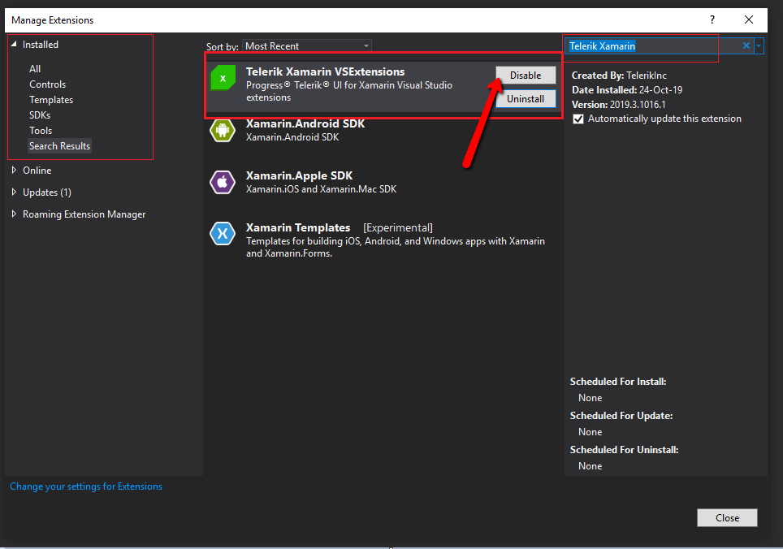

## Environment
<table>
	<tr>
		<td>Product Version</td>
		<td>2019.3.1023.1</td>
	</tr>
	<tr>
		<td>Product</td>
		<td>Installer and VS Extentions for Telerik UI for Xamarin</td>
	</tr>
</table>

## Description

This article shows how to resolve the issue with the Visual Studio 2019 hangs on loading Xamarin projects when Tekerik Xamarin VS extensions are installed. 

## Solution

>important Note that our team is working on this and fix will be provided as soon as possible.

In order to solve this issue you should disable the Telerik Xamarin VS Extentions from the Visual Studio 2019

1. Open **Manage Extentions** dialog box 

2. Select **Installed** and then in the search field search for *Telerik Xamarin* and click *Disable*

