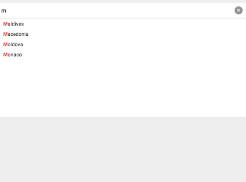
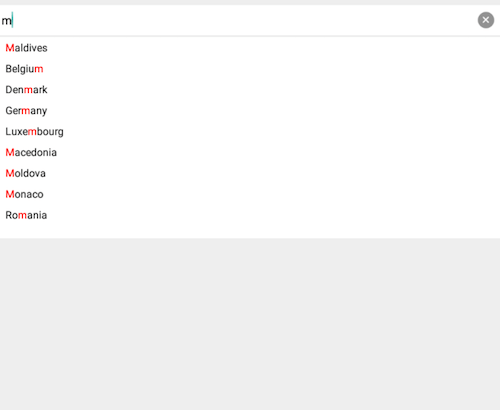

# RadAutoCompleteTextView: Completion modes

**RadAutoCompleteTextView** has two modes for filtering suggestions. 

- Starts with
- Contains

The completion mode can be changed with the `setCompletionMode` method of the TKAutoCompleteTextView's adapter. The default value is `CompletionMode.STARTS_WITH`.


```C#
this.adapter.CompletionMode = CompletionMode.StartsWith;
```

## Starts_With Mode

In `CompletionMode.STARTS_WITH` mode the autocomplete shows only suggestions that start with the typed phrase.



## Contains Mode
In `CompletionMode.CONTAINS` mode the autocomplete shows only suggestions that contain the typed phrase.

`Contains Mode` is not intended to work with the `APPEND` and  `SUGGEST_APPEND` modes. Since both these modes append the rest of the suggestion to the typed text, the combination between these modes won't be helpfull, it will be rather confusing. 


