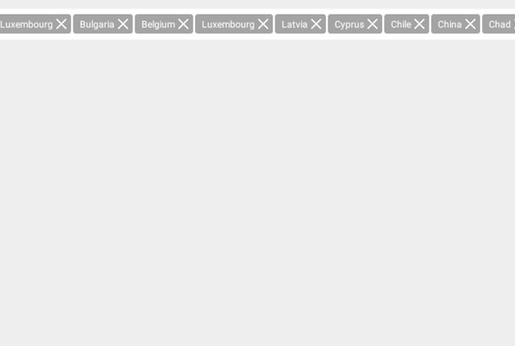

#RadAutoCompleteTextView: Display Modes

**RadAutoCompleteTextView** has two predefined display modes.

- Plain
- Tokens

Display mode can be changed with the `setDisplayMode` method of the **RadAutoCompleteTextView**. The default value is `DisplayMode.PLAIN`.

```Java
autocomplete.setDisplayMode(DisplayMode.TOKENS);
```
```C#
this.autocomplete.DisplayMode = DisplayMode.Tokens;
```

##Plain mode
In plain mode **RadAutoCompleteTextView** displays chosen item as plain text. When this mode only one item can be chosen.


##Tokens mode
Tokens mode allows multiple choice of items. Chosen items are displayed as tokens which can be modified or completely changed with custom ones.


When **RadAutoCompleteTextView** is working in DisplayMode.TOKENS, you can apply two different behaviors for token arrangment.

- Wrap
- Horizontal

The layout mode of the tokens can be changed with the `setLayoutMode` method of the **RadAutoCompleteTextView**.
The default value is `DisplayMode.WRAP`.

```Java
autocomplete.setTokensLayoutMode(LayoutMode.HORIZONTAL);
```
```C#
this.autocomplete.TokensLayoutMode = LayoutMode.Horizontal;
```

##Wrap layout
In wrap mode tokens are arranged on multiple lines. Every  time a new line is started the **RadAutoCompleteTextView** is expanding in order to show all tokens. When expand limit is reached the **RadAutoCompleteTextView** stops exapding and allows only scrolling. The expand limit can be set with the `setMaximumWrapHeight` method of the autocomplete. Default value is three times the initial height of the **RadAutoCompleteTextView**.


##Horizontal layout
In horizontal layout tokens are displayed on single line which can be scrolled horizontally in order to display all tokens.

