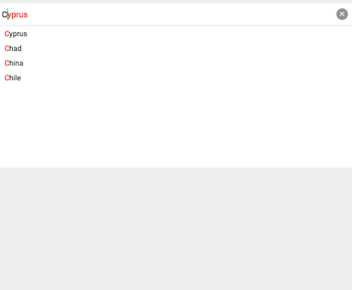

#RadAutoCompleteTextView: Suggest modes

**RadAutoCompleteTextView** has three different modes for providing suggestions. 

- Suggest
- Append
- Suggest-Append

The suggest mode can be changed with the `setSuggestionMode` method of the TKAutoCompleteTextView. The default value is `SuggestMode.SUGGEST`.


```C#
this.autocomplete.SuggestMode = SuggestMode.Suggest;
```

##Suggest Mode

In `SuggestMode.SUGGEST` mode the autocomplete represents the filtered suggestions, matching the typed text, in a pop-up view, which contains list of the suggestions.


##Append Mode
In `SuggestMode.APPEND` mode the autocomplete shows only the first suggestion matching the typed text, which is represented as direct suffix of the typed text.


##Suggest-Append Mode
In `SuggestMode.SUGGEST_APPEND` mode the autocomplete combines both upper-mentioned modes. It shows all matching suggestions in a pop-up view and the first of them is appened to the typed text.

