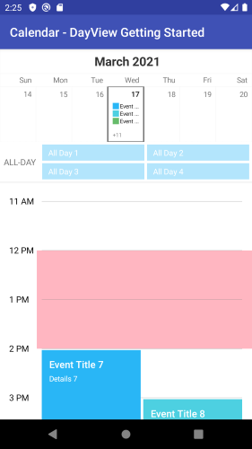

## CalendarView for Xamarin.Android: Special Slots

With R3 2019 release of Telerik UI for Xamarin RadCalendarView for Xamarin.Android provides the option to define a collection of special and restricted time slots in order to make them noticeable across the timeline of the Day and MultiDay views. 

You just need to prepare a collection of `Com.Telerik.Widget.Calendar.Slots.SpecialSlot` objects, create a `Com.Telerik.Widget.Calendar.Slots.SlotAdapter` object and assign the SpecialSlots collection to its **Slots** property.

Every SpecialSlot has the following properties:

* **StartDate**;
* **EndDate**;
* **IsReadOnly**: When set to **True** the slot is disabled (restricted), meaning the end user wouldn't be able to create or modify appointments at that slot;
* **SlotColor**: the background color applied to the defined slot;

Below you can find a quick example how to create special slots.

```C#
RadCalendarView calendarView = new RadCalendarView(Activity);
calendarView.DisplayMode = CalendarDisplayMode.Day;

Calendar calendar = Calendar.Instance;
calendar.TimeInMillis = calendarView.DisplayDate;

calendar.Add(CalendarField.Hour, 12);
long startTime = calendar.TimeInMillis;
calendar.Add(CalendarField.Hour, 2);
long endTime = calendar.TimeInMillis;

SpecialSlot lunchSlot = new SpecialSlot(startTime, endTime) { SlotColor = Color.LightPink  };
var slotAdapter = new SlotAdapter(calendarView);
slotAdapter.Slots = new List<SpecialSlot>() { lunchSlot };
calendarView.SlotAdapter = slotAdapter;
```

Here is the result:


