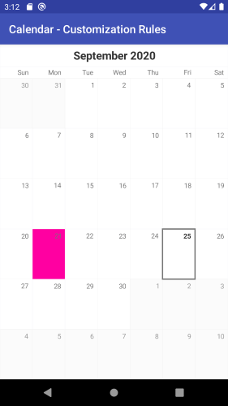
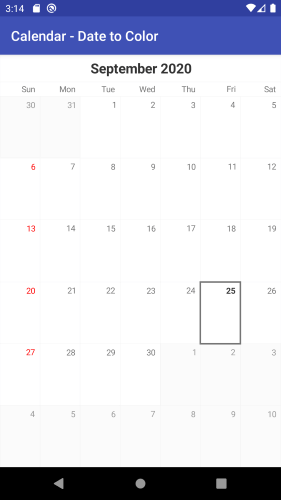
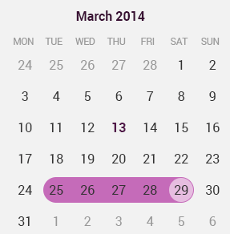

# RadCalendarView: Customizations

**RadCalendarView** provides various ways to alter its look. It allows you to define dates which use special visuals, additional decorations and coloring, etc. Another customization option is to
define which of its elements should be visible and even alter their appearance.

## Special Dates

The special dates are these dates which require special decoration to mark something important, for example birthdays or holidays. You can perform a set of rules that should be applied for a cell or simply define the color that should be used for the text of a date depending on its value.

### Defining set of cell styles

You can define styles that are applied to all cells that meet a certain critiria. For example style which is applied for cells that contain a date or cells that contain weekend dates (Saturday and Sunday) or cells that contain today, etc. Using this approach you can customize borders, background, text, etc. 

Here are the methods for the **CalendarDayCellFilter** which allow you to filter the cells that use a certain style:

* **setCellType** - to apply style to dates, dayNames, weekNumbers or titles; default is `Date`
* **setIsSelected** - to apply style only to cells which are selected
* **setIsFromCurrentMonth** - to apply style only to cells from the current month and not to the visible cells from the previous and the next months
* **setIsToday** - to apply the style only to the today cell
* **setIsWeekend** - to apply the style only to cells used to display Saturdays and Sundays
* **setCustom** - if none of the above works for you, you can add a custom function which based on a passed cell, returns true or false, depending on whether the cell should be customized.

And here's what you can customize with a CalendarDayCellStyle:

* **setBorderColor**
* **setBorderWidth**
* **setBackgroundColor**
* **setTextColor**
* **setTextSize**
* **setFontStyle** - must be one of: Typeface.NORMAL, Typeface.BOLD, Typeface.ITALIC, Typeface.BOLD_ITALIC
* **setFontName** - must be one of: sans-serif, sans-serif-light, sans-serif-condensed, sans-serif-thin, sans-serif-medium
* **setPaddingHorizontal**
* **setPaddingVertical**
* **setTextPosition** - must be one of or a combination of: CalendarElement.TOP, CalendarElement.BOTTOM, CalendarElement.CENTER_VERTICAL, CalendarElement.LEFT, CalendarElement.RIGHT, CalendarElement.CENTER_HORIZONTAL

Here's an example that changes the text color for weekends to `RED` and the border for today to `GREEN`, 4 dps wide:

```Java
CalendarDayCellFilter weekendCellFilter = new CalendarDayCellFilter();
weekendCellFilter.setIsWeekend(true);
CalendarDayCellStyle weekendCellStyle = new CalendarDayCellStyle();
weekendCellStyle.setFilter(weekendCellFilter);
weekendCellStyle.setTextColor(Color.RED);
calendarView.addDayCellStyle(weekendCellStyle);

CalendarDayCellFilter todayCellFilter = new CalendarDayCellFilter();
todayCellFilter.setIsToday(true);
CalendarDayCellStyle todayCellStyle = new CalendarDayCellStyle();
todayCellStyle.setFilter(todayCellFilter);
todayCellStyle.setBorderColor(Color.GREEN);
float widthInDp = 4;
float widthInPixels = (int) TypedValue.applyDimension(TypedValue.COMPLEX_UNIT_DIP,
        widthInDp, getResources().getDisplayMetrics());
todayCellStyle.setBorderWidth(widthInPixels);
calendarView.addDayCellStyle(todayCellStyle);
```
```C#
CalendarDayCellFilter weekendCellFilter = new CalendarDayCellFilter();
weekendCellFilter.IsWeekend = new Java.Lang.Boolean(true);
CalendarDayCellStyle weekendCellStyle = new CalendarDayCellStyle();
weekendCellStyle.Filter = weekendCellFilter;
weekendCellStyle.TextColor = new Java.Lang.Integer(Color.Red.ToArgb());
calendarView.AddDayCellStyle(weekendCellStyle);

CalendarDayCellFilter todayCellFilter = new CalendarDayCellFilter();
todayCellFilter.IsToday = new Java.Lang.Boolean(true);
CalendarDayCellStyle todayCellStyle = new CalendarDayCellStyle();
todayCellStyle.Filter = todayCellFilter;
todayCellStyle.BorderColor = new Java.Lang.Integer(Color.Green.ToArgb());
float widthInDp = 4;
float widthInPixels = (int) TypedValue.ApplyDimension(ComplexUnitType.Dip,
    widthInDp, Resources.DisplayMetrics);
todayCellStyle.BorderWidth = new Java.Lang.Float(widthInPixels);
calendarView.AddDayCellStyle(todayCellStyle);
```

And this is the result:


Similarly, you can use **CalendarMonthCellStyle** and **CalendarMonthCellFilter** to apply styles for the month cells that are used while calendar is is Year mode.

While the styles for the month cells are very similar to the day cell style, the filtering differs in order to allow you to change color, size and/or fonts for a specific text inside the month cell. Here are the filtering options for **CalendarMonthCellFilter**:

* **setTextIsDate** - to apply the style only to the text of the dates
* **setTextIsDayName** - to apply the style only to the text of the day names
* **setTextIsMonthName** - to apply the style only to the text of the month names
* **setTextIsToday** - to apply the style only to the text of the date that is today
* **setTextIsWeekend** - to apply the style only to the text of the weekends (saturday and sunday)
* **setMonthIsCurrent** - to apply the style only to the cell that holds the current month
* **setMonthIsCompact** - to apply special style to cells when year mode of the calendar is compact
* **setMonthIsCustomDate** - in none of the above fits your needs, you can add a custom function so that based on the value of the month returns true or false to determine whether the style should be applied
* **setTextIsCustomDate** - similar to the previous but can be used for the text of specific dates

Here's an example that changes the text color of the month names for all month cells to `BLUE`:

```Java
CalendarMonthCellFilter monthCellTitleFilter = new CalendarMonthCellFilter();
monthCellTitleFilter.setTextIsMonthName(true);
CalendarMonthCellStyle monthCellTitleStyle = new CalendarMonthCellStyle();
monthCellTitleStyle.setFilter(monthCellTitleFilter);
monthCellTitleStyle.setTextColor(Color.BLUE);
calendarView.addMonthCellStyle(monthCellTitleStyle);
```
```C#
CalendarMonthCellFilter monthCellTitleFilter = new CalendarMonthCellFilter();
monthCellTitleFilter.TextIsMonthName = new Java.Lang.Boolean(true);
CalendarMonthCellStyle monthCellTitleStyle = new CalendarMonthCellStyle();
monthCellTitleStyle.Filter = monthCellTitleFilter;
monthCellTitleStyle.TextColor = new Java.Lang.Integer(Color.Blue.ToArgb());
calendarView.AddMonthCellStyle(monthCellTitleStyle);
```

And this is the result:


> Please note that the more styles you add, the more checks before rendering each date will be performed to determine whether this date meets the style's filter, so you should use these styles sparingly.

### Defining set of customization rules

You can define a customization rule which contains a list of operations that should be performed on a calendar cell if it meets certain requirements and apply it to the calendar
through the method **setCustomizationRule(Procedure<CalendarCell>)**. For example, if we want to mark a specific important date with custom background,
here's how we can do it:

```Java
final Calendar calendar = Calendar.getInstance();
calendarView.setCustomizationRule(new Procedure<CalendarCell>() {
    @Override
    public void apply(CalendarCell calendarCell) {
        if(calendarCell.getCellType() != CalendarCellType.Date) {
            return;
        }
        calendar.setTimeInMillis(calendarCell.getDate());
        if(calendar.get(Calendar.DAY_OF_MONTH) == 21 &&
                calendar.get(Calendar.MONTH) ==
                        Calendar.getInstance().get(Calendar.MONTH)) {
            calendarCell.setBackgroundColor(
                    Color.parseColor("#FF00A1"),
                    Color.parseColor("#F988CF"));
        }
    }
});
```
```C#
    Calendar calendar = Calendar.GetInstance(Java.Util.TimeZone.Default);
    calendarView.CustomizationRule = new CustomizationRuleExample ();
    // ...

class CustomizationRuleExample : Java.Lang.Object, IProcedure
{
    private Java.Util.Calendar calendar = Java.Util.Calendar.Instance;
    public void Apply (Java.Lang.Object p0)
    {
        CalendarCell calendarCell = p0.JavaCast<CalendarCell>();
        if (calendarCell.CellType != CalendarCellType.Date) {
            return;
        }
        calendar.TimeInMillis = calendarCell.Date;
        if (calendar.Get (Java.Util.CalendarField.DayOfMonth) == 21 &&
            calendar.Get (Java.Util.CalendarField.Month) == 
            Java.Util.Calendar.Instance.Get(Java.Util.CalendarField.Month)) 
        {
            calendarCell.SetBackgroundColor (
                Android.Graphics.Color.ParseColor("#FF00A1"),
                Android.Graphics.Color.ParseColor("#F988CF"));
        } 
    }
}
```

This example changes the background of the cell which contains the 21st day of the current month:



### Changing the color of a date

If the required change for marking a cell as special is simply changing the text color you can use the method **setDateToColor(Function<Long, Integer>)** to define a color that is used for a date. Here's an example, which marks
all Sundays in Red:

```Java
final Calendar calendar = Calendar.getInstance();
calendarView.setDateToColor(new Function<Long, Integer>() {
    @Override
    public Integer apply(Long aLong) {
        calendar.setTimeInMillis(aLong);
        if(calendar.get(Calendar.DAY_OF_WEEK) == Calendar.SUNDAY) {
            return Color.RED;
        }
        return null;
    }
});
```
```C#
    Calendar calendar = Calendar.GetInstance(Java.Util.TimeZone.Default);
    calendarView.DateToColor = new DateToColorExample ();
    // ...
class DateToColorExample : Java.Lang.Object, IFunction
{
    private Java.Util.Calendar calendar = Java.Util.Calendar.Instance;

    public Java.Lang.Object Apply (Java.Lang.Object timeInMillis)
    {
        calendar.TimeInMillis = (long)timeInMillis;
        if(calendar.Get(CalendarField.DayOfWeek) == Calendar.Sunday) {
            return Color.Red.ToArgb();
        } 
        return null;
    }
}
```
<snippet id='calendar-customizations-date-to-color-class'/>

When the returned value is `null` the default value is used:



## Editing the visible elements

### Title and DayNames

The Week and the Month views of **RadCalendarView** contain three visual elements: title, a row with the names of the days and the actual dates from the month. The Year view contains two elements: title and months. You can disable
the title that is presented in all of the modes by using the **setShowTitle(boolean)** method and check the current state by using **getShowTitle()**. Similarly you can remove the row with the names of the days which is present
in both week and month views by using **setShowDayNames(boolean)**. You can get a value which represents whether the day names are shown by calling the method **getShowDayNames()**.
You can also use XML attributes for setting whether the title and the day names are visible. Their names are **showTitle** and **showDayNames**.

### Grid Lines

Another visual element of **RadCalendarView** is the layer which is responsible for drawing grid lines. You can easily remove the grid lines by using the method **setShowGridLines(boolean)** and get the current state with
**getShowGridLines()**. The XML attribute which can be used to control whether the grid lines are visible is **showGridLines**. The default **GridLinesLayer** provides method for changing the color that is used for the grid lines, as well as their width. These methods are **setColor(int)** and **setStrokeWidth(float)**.
These methods are implemented in the layer, whose instance you can take with calendar's **getGridLinesLayer()**. This means that this way you can change the lines to `Green`, for example:

```Java
	calendarView.getGridLinesLayer().setColor(Color.GREEN);
```
```C#
	calendarView.GridLinesLayer.Color = Color.Green;
```

If you are not happy with the default implementation of this layer, you can create your own layer which extends **GridLinesLayer** and overrides its methods. After you create your implementation, you can set an instance of your layer to the
calendar by using its **setGridLinesLayer(GridLineLayer)** method.

### Cell Decorations

When a cell in **RadCalendarView** is selected it can get additional decoration. This decoration is provided by the **CellDecorationLayer**. The default implementation provides a border around the cells that are selected.
You can easily remove this decoration by using calendar's **setShowCellDecorations(boolean)** or check the current state through **getShowCellDecorations()**.
The XML attribute which can be used to control whether the grid lines are visible is **showCellDecorations**. You can also easily change the color or the width of the decorations
with **CellDecorationLayer**'s **setColor(int)** and **setStrokeWidth(float)**. Here's how you can change the decorations around the selected cells to `Green`, for example:

```Java
	calendarView.getCellDecorationsLayer().setColor(Color.GREEN);
```
```C#
	calendarView.CellDecorationsLayer.Color = Color.Green;
```

You can see a custom implementation of the decoration layer in our <a href="https://github.com/telerik/Android-samples/" target="_blank">examples solution</a>, which provides this type of decorations:



It is achieved by creating a new decorations layer which extends **CellDecorationLayer** and overrides its methods: **addDecorationForCell(int,int,int,int)**, **removeDecorationForCell(int,int,int,int)** and **render(Canvas)**. An instance
of the new implementation is applied to the calendar by using its **setDecorationLayer(CellDecorationLayer)** method.

## Further customizations
For more sophisticated customizations and scenarios it is recommended to use the calendar adapter, which can be obtained by calling **getAdapter()** method if the calendar. It provides various customization features, that can be applied and preserved
over the recreation of the calendar. Customizations applied by using the adapter will be stored in the current calendar style and will not be lost after calendar recreation, for example when switching between display modes.
