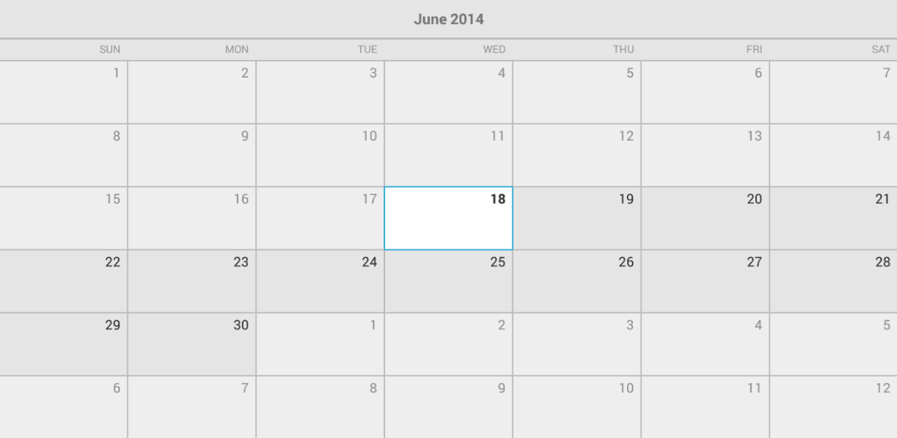

## CalendarView for Xamarin.Android: Disabled Dates

**RadCalendarView** allows you to restrict the dates that can be displayed and selected by the users. This can be achieved by setting minimum date and maximum date for the calendar. The default values for these properties are `0`.
This means that there are no restrictions. If you would like to use the calendar for hotel/flight reservation, you wouldn't want the selection to be possible for dates that are in the past. In this scenario the minimum date
comes useful. Here's the example:


```C#
	Calendar calendar = Calendar.Instance;
	calendarView.MinDate = calendar.TimeInMillis;
```

And here's how the calendar looks when the dates before today are disabled:



As you can see today is still selectable even though formally the time that we have set is at some point during today and not strictly in the beginning of day. However when using **setMinDate(long)** and **setMaxDate(long)** you don't
need to worry about the exact period of the day that you set, since it is not taken into consideration. This means that if you use the same value for both min and max, the date that is represented by this value will still be selectable.
In order to get the current value for min and max dates, you can use the methods **getMinDate()** and **getMaxDate()** respectively.
