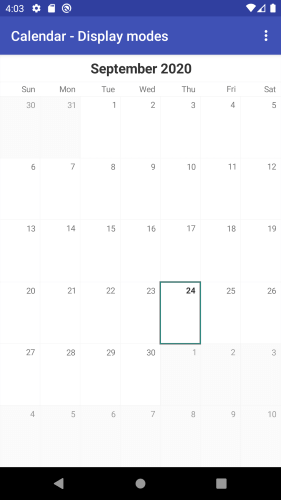
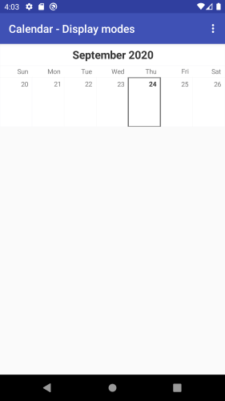
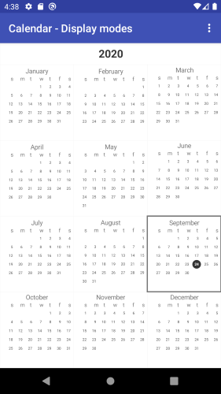
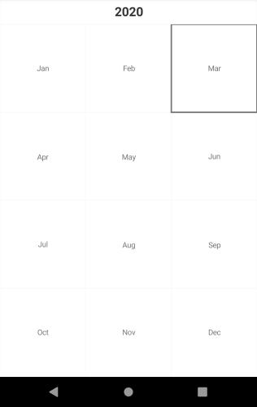
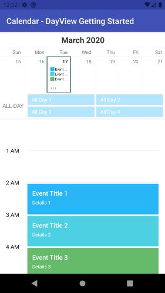
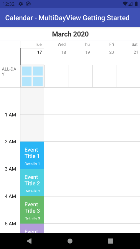
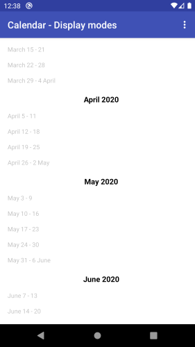

## CalendarView for Xamarin.Android: DisplayMode

**RadCalendarView** provides various modes for displaying dates. They are `Month`, `Week`, `Year`, `Day`, `MultiDay`and `Agenda` and are included in the `CalendarDisplayMode` enumeration.
These modes represent the period that is displayed at once by the control. 
To change the current mode use the CalendarView **DisplayMode** property. If there is no DisplayMode set, the default value is **Month**

## Month

This is the default display mode for **RadCalendarView** and means that the control displays a representation of one month. 

```C#
RadCalendarView calendarView = new RadCalendarView();
```

This is the result:



## Week

This mode represents the dates from one week and they look as one of the rows that are displayed while the control is in Month display mode. Let's set the display mode of our **RadCalendarView** instance to `Week`:

```C#
RadCalendarView calendarView = new RadCalendarView();
calendarView.DisplayMode = CalendarDisplayMode.Week;
```

Here's the result:



## Year

This mode represents all dates from one year grouped in months in a way similar to a calendar that stands on the wall. Here's how it looks:

```C#
RadCalendarView calendarView = new RadCalendarView();
calendarView.DisplayMode = CalendarDisplayMode.Year;
```

How the Year Mode looks:



Since the default look of the year view contains a lot of dates it may seem too overcrowded on smaller devices. This is why this view also has a compact mode, where the months are represented only by their names and the exact dates are not drawn.
Whether the Year view is in compact mode can be changed through the **YearCompactMode**(*bool*) property. 

```C#
RadCalendarView calendarView = new RadCalendarView();
calendarView.DisplayMode = CalendarDisplayMode.Year;
calendarView.YearModeCompact = true;
```



## Day

Day ViewMode allows you to display the schedule for a specific day in RadCalendarView. 

```C#
RadCalendarView calendarView = new RadCalendarView();
calendarView.DisplayMode = CalendarDisplayMode.Day;
```

Here is how the DisplayMode **Day** looks:



>tip Sample Day View example can be found in our [Xamarin.Android Samples](#native-only-examples) inside the /Calendar/DayView folder.

## MultiDay

RadCalendarView comes with MultiDay view mode which enables you to create a detailed view of the schedule for a specific day (or days). 

```C#
RadCalendarView calendarView = new RadCalendarView();
calendarView.DisplayMode = CalendarDisplayMode.MultiDay;
```

Here is how the **MultiDay** DisplayMode looks:



>tip Sample MultiDay GettingStarted example can be found in our [Xamarin.Android Samples](#native-only-examples) inside the /Calendar/MultiDayView folder.

## Agenda

Agenda display mode shows a list of the scheduled appointments grouped by date. With Agenda you can enable the app users to quickly check on everything coming up in their calendars.

```C#
RadCalendarView calendarView = new RadCalendarView();
calendarView.DisplayMode = CalendarDisplayMode.Agenda;
```

Here is how the Agenda Display Mode looks:



>tip Sample DisplayMode example with Agenda can be found in our [Xamarin.Android Samples](#native-only-examples) inside the /Calendar/DisplayMode folder.

## Change Display Mode

The CalendarView DisplayMode can be easily changed using the CalendarView.**ChangeDisplayMode** method.

Example:

```C#
RadCalendarView calendarView = new RadCalendarView();

If(calendarView.DisplayMode == CalendarView.Month)
{
	calendarView.ChangeDisplayMode(CalendarView.Agenda, false);
}
```

>tip Sample DisplayMode example can be found in our [Xamarin.Android Samples](#native-only-examples) inside the /Calendar/DisplayMode folder.

# See Also

- [Events]()
- [Selection]()