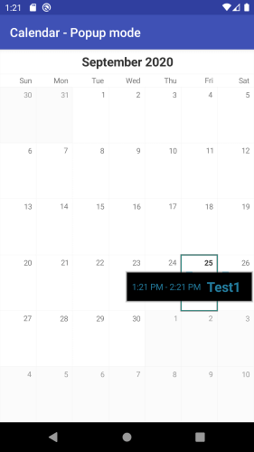

# RadCalendarView: Displaying events in the calendar

**RadCalendarView** can be used to display the events for a single cell, that is currently selected. There are currently two ways for displaying the events, which are being set by using a single property of the calendar.

## Inline events

In this mode the calendar will crack open below the selected cell and will display the events as a scrollable list, which will fill the entire width of the calendar. The height will be determined by the height and the number of events, that need to be displayed. It will however be limited to the height of 4 calendar rows.
```Java
	calendarView.setEventsDisplayMode(EventsDisplayMode.Inline);
```
```C#
	calendarView.EventsDisplayMode = EventsDisplayMode.Inline;
```


## Popup events
In this mode the events will be displayed as a popup window, which will load at most four of the cell's events inside a list view and will take place at the lower part of the cell's location.
```Java
	calendarView.setEventsDisplayMode(EventsDisplayMode.Popup);
```
```C#
	calendarView.EventsDisplayMode = EventsDisplayMode.Popup;
```


> Please note that both modes are only available when using **Single** selection mode. An exception will be thrown otherwise.

In both modes it is valid that all scrolling will be disabled and only selections will be permitted. Once the events are no longer displayed the calendar will restore its original behaviour.
Switching to year display mode is possible, but the events will be closed first, and then the switching will perform.

### Displaying Events Programmatically
You can programmatically show or hide events for a specific date/cell by using the following two methods:
- `toggleEventsVisibilityForDate(long date)`
- `toggleEventsVisibilityForCell(CalendarCell cell)`

You can additionally check if events are shown for a specific date/cell by using the following methods:
- `eventsForDateVisible(long date)`
- `eventsForCellVisible(CalendarCell cell)`

# Customizing the display of the events
Customization is being done using the calendar adapter for both modes. The properties for the two modes are different and are as follows:

* popupEventsWindowBackgroundColor - the background color for the events popup window;
* inlineEventsBackgroundColor - the background color for the inline events;
* popupEventTitleTextSize - the text size for the event title in popup mode;
* popupEventTimeTextSize - the text size for the event time in popup mode;
* inlineEventTitleTextSize - the text size for the event title in inline mode;
* inlineEventTimeStartTextSize - the text size for the event start time in inline mode;
* inlineEventTimeEndTextSize - the text size for the event end time in inline mode;
* inlineEventTimeStartTextColor - the text color for the event start time in inline mode;
* inlineEventTimeEndTextColor - the text color for the event end time in inline mode;

If this is not enough, you can further customize the events by setting a new adapter which extends ArrayAdapter for the inline events. Here's an example which shows how to use a single view to show both start and end time of an event:

```Java
public class MyInlineEventsAdapter extends ArrayAdapter<EventsManager.EventInfo> {
    private LayoutInflater layoutInflater;

    public MyInlineEventsAdapter(Context context) {
        super(context, R.layout.custom_inline_event_layout);
        this.layoutInflater = (LayoutInflater) context.
                getSystemService(Context.LAYOUT_INFLATER_SERVICE);
    }

    @Override
    public View getView(int position, View convertView, ViewGroup parent) {

        View view = convertView;
        ViewHolder holder;

        if (view == null) {
            view = layoutInflater.inflate(
                    R.layout.custom_inline_event_layout, parent, false);

            holder = new ViewHolder();
            holder.eventTitle = (TextView) view.findViewById(R.id.event_title);
            holder.eventTime = (TextView) view.findViewById(R.id.event_time);

            view.setTag(holder);
        } else {
            holder = (ViewHolder) view.getTag();
        }

        EventsManager.EventInfo eventInfo = getItem(position);
        Event event = eventInfo.originalEvent();
        holder.eventTitle.setTextColor(event.getEventColor());
        holder.eventTitle.setText(event.getTitle());
        String eventTime = String.format("%s - %s",
                eventInfo.startTimeFormatted(), eventInfo.endTimeFormatted());
        holder.eventTime.setText(eventTime);

        return view;
    }

    class ViewHolder {
        TextView eventTitle;
        TextView eventTime;
    }
}
```
```C#
public class MyInlineEventsAdapter : ArrayAdapter
{
    private LayoutInflater layoutInflater;

    public MyInlineEventsAdapter(Context context)
        : base(context, Resource.Layout.custom_inline_event_layout)
    {
        this.layoutInflater = LayoutInflater.From(context); ;
    }

    public override View GetView(int position, View convertView, ViewGroup parent)
    {
        View view = convertView;
        ViewHolder holder;

        if (view == null)
        {
            view = layoutInflater.Inflate(
                Resource.Layout.custom_inline_event_layout, parent, false);

            holder = new ViewHolder();
            holder.eventTitle = (TextView)view.FindViewById(Resource.Id.event_title);
            holder.eventTime = (TextView)view.FindViewById(Resource.Id.event_time);

            view.Tag = holder;
        }
        else {
            holder = (ViewHolder)view.Tag;
        }

        EventsManager.EventInfo eventInfo = (EventsManager.EventInfo)GetItem(position);
        Event event1 = eventInfo.OriginalEvent();
        holder.eventTitle.SetTextColor(new Color(event1.EventColor));
        holder.eventTitle.Text = event1.Title;
        String eventTime = String.Format("{0} - {1}", 
                                         eventInfo.StartTimeFormatted(), eventInfo.EndTimeFormatted());
        holder.eventTime.Text = eventTime;

        return view;
    }

    class ViewHolder : Java.Lang.Object
    {
        public TextView eventTitle;
        public TextView eventTime;
    }
}
```

This example is using a resource file with the following content:

```XML
<LinearLayout xmlns:android="http://schemas.android.com/apk/res/android"
    android:orientation="horizontal"
    android:layout_width="match_parent"
    android:layout_height="wrap_content"
    android:padding="12dp">

    <TextView
        android:id="@+id/event_time"
        android:layout_width="wrap_content"
        android:layout_height="wrap_content"
        android:minEms="4"
        android:textSize="12sp"
        android:padding="12dp"/>

    <TextView
        android:id="@+id/event_title"
        android:layout_width="match_parent"
        android:layout_height="wrap_content"
        android:layout_marginStart="12dp"
        android:layout_marginLeft="12dp"
        android:layout_marginEnd="12dp"
        android:layout_marginRight="12dp"
        android:textSize="18sp" />

</LinearLayout>
```

You can use an instance of the new adapter and set it to your calendar's event manager:

```Java
MyInlineEventsAdapter adapter = new MyInlineEventsAdapter(getContext());
calendarView.eventsManager().setAdapter(adapter);
```
```C#
MyInlineEventsAdapter adapter = new MyInlineEventsAdapter(Context);
calendarView.EventsManager().Adapter = adapter;
```

> Please note that the event manager exists only when the calendar's EventDisplayMode is Inline or Popup.  

# Handling event clicks

If you need to display additional information about events, you can listen for item clicks. Here's an example to show a toast that an event is clicked:

```Java
	calendarView.eventsManager().setOnItemClickListener(new AdapterView.OnItemClickListener() {
		@Override
		public void onItemClick(AdapterView<?> parent, View view, int position, long id) {
			Toast.makeText(getContext(), parent.getAdapter().getItem(position).toString() + 
				" clicked!", Toast.LENGTH_SHORT).show();
		}
	});
```
```C#
calendarView.EventsManager ().SetOnItemClickListener (new MyClickListener());

public class MyClickListener : Java.Lang.Object, AdapterView.IOnItemClickListener {
	public void OnItemClick (AdapterView parent, View view, int position, long id)
	{
		Toast.MakeText (parent.Context, (((ArrayAdapter)((ListView)parent).Adapter)).
			GetItem(position).ToString(), ToastLength.Short).Show ();
	}
}
```