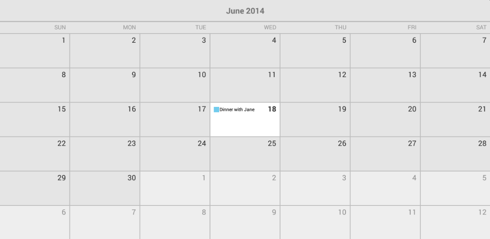

# RadCalendarView: Events

**RadCalendarView** has a built-in infrastructure for handling events. The events that are presented are handled by an **EventAdapter** and the way they are rendered is handled by an **EventRenderer**.
Both classes have their default implementation so that you can simply provide a list of events and the calendar will take care of the rest.

## Adding the events

The Event class that is used by the calendar contains the following information about an event:

* **Title**: The title of the event. You can get the current value and set a new one through the methods: **getTitle()** and **setTitle(String)**.
* **StartDate**: The time of the start of the event. You can get the current value and set a new one through the methods: **getStartDate()** and **setStartDate(long)**.
* **EndDate**: The time of the end of the event. You can get the current value and set a new one through the methods: **getEndDate()** and **setEndDate(long)**.
* **AllDay**: Whether this event is occurring during the whole day. You can get the current value and set a new one through the methods: **isAllDay()** and **setAllDay(boolean)**.
* **CalendarId**: The id of the calendar that contains this event. You can get the current value and set a new one through the methods: **getCalendarId()** and **setCalendarId(int)**.
* **EventColor**: The color of the event. You can get the current value and set a new one through the methods: **getEventColor()** and **setEventColor(int)**.

The first three are mandatory and must be provided as parameters of the event's constructor. Here's a simple example of how to create an event and add it to the instance of the calendar:


```C#
	Calendar calendar = Calendar.Instance;
	calendar.Set(CalendarField.HourOfDay, 20);
	calendar.Set(CalendarField.Minute, 0);
	calendar.Set(CalendarField.Second, 0);
	calendar.Set(CalendarField.Millisecond, 0);

	long eventStart = calendar.TimeInMillis;

	calendar.Add(CalendarField.Hour, 3);
	long eventEnd = calendar.TimeInMillis;

	Event event1 = new Event("Dinner with Jane", eventStart, eventEnd);

	List<Event> events = new List<Event>();
	events.Add(event1);

	calendarView.EventAdapter.Events = events;
```

Here's the result:



> You need to call notifyDataChanged() when the events' information is updated.

If you would like to present more information about the events for a certain cell when it's pressed, you can use a **RadCalendarView.OnCellClickListener** to get notified when this happens. Here's an example which demonstrates how to display more
information about the event that we have just added when the user taps on the cell that contains it:


```C#
	calendarView.SetOnCellClickListener(new CellClickListenerExample());
	
	...
	
	//CellClickListenerExample sample implementation
	class CellClickListenerExample : Java.Lang.Object, 
		Com.Telerik.Widget.Calendar.RadCalendarView.IOnCellClickListener
	{
		public void OnCellClick (CalendarCell calendarCell)
		{
			if (calendarCell.Class.SimpleName == "CalendarMonthCell") {
				return;
			}

			CalendarDayCell calendarDayCell = calendarCell.JavaCast<CalendarDayCell> ();
			if(calendarDayCell.Events != null && calendarDayCell.Events.Count > 0) {
				StringBuilder eventsInfo = new StringBuilder ();
				foreach (Event e in calendarDayCell.Events) {
					if (eventsInfo.Length > 0) {
						eventsInfo.AppendLine ();
					}
					eventsInfo.Append(String.Format("{0} - {1}: {2}",
						GetFormattedTime("{0:HH:mm}", e.StartDate),
						GetFormattedTime("{0:HH:mm}", e.EndDate),
						e.Title));
				}
				Toast.MakeText(Application.Context, eventsInfo.ToString(), 
					ToastLength.Short).Show();
			}
		}

		private String GetFormattedTime(String format, long time)
		{
			Calendar calendar = Calendar.Instance;
			calendar.TimeInMillis = time;
			DateTime dateTime = new DateTime(
				calendar.Get (CalendarField.Year), 
				calendar.Get (CalendarField.Month) + 1, 
				calendar.Get (CalendarField.DayOfMonth),
				calendar.Get (CalendarField.HourOfDay),
				calendar.Get (CalendarField.Minute),
				calendar.Get (CalendarField.Second));
			return String.Format (format, dateTime);
		}
	}
```

You can easily extend this logic so that the Toast contains information about all events from the pressed cell even if they are more than one. You can also choose a more appropriate way to present and format this information.

## Customizing the events

The default **EventRenderer** provides three way of presentation of the events, you can easily change them to the one that you like most or determine dynamically which one will be used depending on device's size, density and/or orientation.
The different modes are: `Text`, `Shape`, `ShapeAndText`. They are included in the **EventRenderMode** enumeration. It also contains `None` so you can decide not to show the events if certain conditions are (not) met.
The default value is `ShapeAndText`, which as you can see from the previous example means that the events are presented with a small shape (a square) and the text of their title. When the mode is `Text`, the events will be presented
simply with the text of their title written with their event color. When the mode is `Shape`, they will be presented with a rectangle which indicates their duration and the time of their occurrence. For example if one event
lasts longer than another, it will consume more space. Also, if time when one event is happening is before the time of another it will be drawn higher. Here's how to set the render mode to `Shape`:


```C#
	calendarView.EventAdapter.Renderer.EventRenderMode = EventRenderMode.Shape;
```

You can get the current mode by calling the renderer's **getEventRenderMode()** method.

If the modes provided by the default event renderer do not suit your needs, you can extend it and override its **renderEvents(Canvas, CalendarCell)** method. This method is responsible for the drawing of the event representation
of the events from the cell that is the second parameter to the canvas that is the first. Here's an example which draws a circle for each of the events:


```C#
public class MyEventRenderer : EventRenderer
{

    int shapeSpacing = 25;
    int shapeRadius = 10;
    Paint paint;


    public MyEventRenderer(Context context)
            : base(context)
    {

        paint = new Paint();
        paint.AntiAlias = true;
    }

    public override void RenderEvents(Canvas canvas, CalendarDayCell cell)
    {
        int startX = cell.Left + shapeSpacing;
        int startY = cell.Top + shapeSpacing;

        Rect drawTextRect = new Rect();
        if (cell.Text != null)
        {
            String text = cell.Text;
            cell.TextPaint.GetTextBounds(text, 0, text.Length, drawTextRect);
        }

        int x = startX;
        int y = startY;

        int spacingForDate = drawTextRect.Width();

        for (int i = 0; i < cell.Events.Count; i++)
        {
            Event e = cell.Events[i];
            paint.Color = new Color(e.EventColor);
            canvas.DrawCircle(x, y, shapeRadius, paint);
            x += shapeSpacing;
            if (x > cell.Right - spacingForDate - shapeSpacing)
            {
                x = startX;
                y += shapeSpacing;
            }
        }
    }
```

When your custom renderer is created you can set it to the **EventAdapter** by using its **setRenderer(EventRenderer)** method:


```C#
MyEventRenderer eventRenderer = new MyEventRenderer(Context);
calendarView.EventAdapter.Renderer = eventRenderer;
```

## Extending the events

If the provided event infrastructure is not enough to suit your needs you can easily extend the **Event** type and add your own properties.
You can also extend the **EventAdapter** class and set an instance of your adapter to the calendar by using its **setEventAdapter(EventAdapter)** method.
However, the default event adapter should be enough for most scenarios. The events for each date are returned by **EventAdapter**'s **getEventsForDate(long)** method. The default implementation
determines this list by each event's start date and end date, however, if you add some recurrence information to the events, you will probably want to use it when determining the list of events for a date.
This is when extending the **EventAdapter** may be useful as you will be able to provide your custom logic for the **getEventsForDate(long)** method and take your recurrence rules into consideration.
