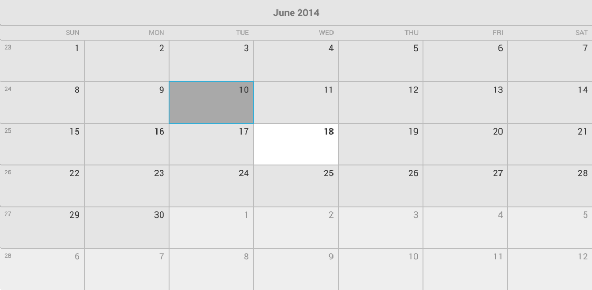

# RadCalendarView: Getting Started

In this article, you will learn how to get started with **RadCalendarView for Android**: how to initialize the calendar, how to set the dates that are displayed and how to create a calendar that looks like this one:



## Adding the calendar instance

You can easily add **RadCalendarView** in the layout file for the main activity of your project:

<RelativeLayout xmlns:android="http://schemas.android.com/apk/res/android"
    xmlns:tools="http://schemas.android.com/tools"
    android:layout_width="match_parent"
    android:layout_height="match_parent"
    tools:context=".MainActivity">

    <com.telerik.widget.calendar.RadCalendarView
        android:id="@+id/calendarView"
        android:layout_width="match_parent"
        android:layout_height="match_parent"/>

</RelativeLayout>

You can access the control from the activity in order to be able to apply further modifications:


```C#
	protected override void OnCreate (Bundle bundle)
	{
		base.OnCreate (bundle);
		SetContentView (Resource.Layout.Main);

		RadCalendarView calendarView = FindViewById<RadCalendarView> (
			Resource.Id.calendarView);
	}
```

## Display Date

By default when the calendar is loaded, it shows the current month. If you need to change the month that is currently visible, you can use the method **setDisplayDate(long)**. If you want the month that is visible to be January 2014, you need to set the display date to a time during this month. Here's an example:


```C#
	Calendar calendar = new GregorianCalendar(2014, Calendar.January, 1);
	calendarView.DisplayDate = calendar.TimeInMillis;
```

Here we used the 1st of January, but the result would have been the same if we had chosen another date from the same month. If you need to get the current display date, you can use the **getDisplayDate()** method.
Since the result will be of type long (just as the parameter for the method that sets the display date) which may not seem very meaningful, you can use it along with setTimeInMillis() of an instance of type `java.util.Calendar`, which provides more easily readable date representation.

## Week numbers

At this point the calendar already looks like the screen shot from the beginning of the article. The only difference is that we still don't see the week numbers.
**RadCalendarView** provides three options for the week numbers:

* **None**: Week numbers are not displayed
* **Inline**: Week numbers are displayed inside the first cell of each week
* **Block**: Week numbers are displayed inside a separate cell in the beginning of each week

By default the selected option is `None` which explains why the numbers are not currently visible. You can get the current value by using the **getWeekNumbersDisplayMode()** method and modify it with the method **setWeekNumbersDisplayMode(WeekNumbersDisplayMode)**. Here's how to make the calendar display the week numbers inside the cell of the first date of each week:


```C#
	calendarView.WeekNumbersDisplayMode = WeekNumbersDisplayMode.Inline;
```

You can also specify the display mode for the week numbers by using the XML attribute **weekNumberDisplayMode**:

	<RelativeLayout xmlns:android="http://schemas.android.com/apk/res/android"
		xmlns:tools="http://schemas.android.com/tools"
		xmlns:calendar="http://schemas.android.com/apk/res-auto"
		android:id="@+id/container"
		android:layout_width="match_parent"
		android:layout_height="match_parent"
		tools:context=".MainActivity">

		<com.telerik.widget.calendar.RadCalendarView
			android:id="@+id/calendarView"
			android:layout_width="match_parent"
			android:layout_height="match_parent"
			calendar:weekNumberDisplayMode="Inline"/>

	</RelativeLayout>

And that's all. Now when you run the application, you will see an instance of **RadCalendarView** displaying the current month and showing information about the week numbers for each week just as in the image from the beginning of the article.
