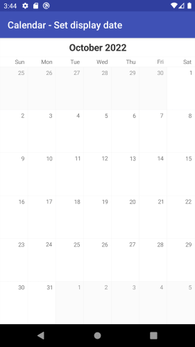

# CalendarView for Xamarin.Android: Getting Started

In this article, you will learn how to get started with **RadCalendarView for Android**: how to initialize the calendar, how to set the dates that are displayed and how to create a calendar that looks like this one:



## Project Setup

For **CalendarView** you will need the following Telerik references:

* Telerik.Xamarin.Android.Common
* Telerik.Xamarin.Android.Data
* Telerik.Xamarin.Android.Input
* Telerik.Xamarin.Android.List
* Telerik.Xamarin.Android.Primitives

## Adding the calendar instance

You can easily add **RadCalendarView** in the layout file for the main activity of your project:

```xml
<RelativeLayout xmlns:android="http://schemas.android.com/apk/res/android"
    xmlns:tools="http://schemas.android.com/tools"
    android:layout_width="match_parent"
    android:layout_height="match_parent"
    tools:context=".MainActivity">

    <com.telerik.widget.calendar.RadCalendarView
        android:id="@+id/calendarView"
        android:layout_width="match_parent"
        android:layout_height="match_parent"/>

</RelativeLayout>
```

You can access the control from the activity in order to be able to apply further modifications:

```C#
	protected override void OnCreate (Bundle bundle)
	{
		base.OnCreate (bundle);
		SetContentView (Resource.Layout.Main);

		RadCalendarView calendarView = FindViewById<RadCalendarView> (
			Resource.Id.calendarView);
	}
```

## Display Date

By default when the calendar is loaded, it shows the current month. If you need to change the month that is currently visible, you can use the `DisplayDate`(of type `long`) property.

Here is an example how to set the DisplayDate property:

```C#
RadCalendarView calendarView = new RadCalendarView (Activity);
calendarView.DisplayDate = new GregorianCalendar (2022, Calendar.October, 1).TimeInMillis;
```

## Week numbers

At this point the calendar already looks like the screen shot from the beginning of the article. The only difference is that we still don't see the week numbers. You can show the weeknumbers using the `WeekNumbersDisplayMode` property.

**RadCalendarView** provides three options for the week numbers:

* **None**: Week numbers are not displayed
* **Inline**: Week numbers are displayed inside the first cell of each week
* **Block**: Week numbers are displayed inside a separate cell in the beginning of each week

By default the selected option is `None` which explains why the numbers are not currently visible.

```C#
RadCalendarView calendarView = new RadCalendarView();
calendarView.WeekNumbersDisplayMode = WeekNumbersDisplayMode.Inline;
```
```xml
<RelativeLayout xmlns:android="http://schemas.android.com/apk/res/android"
	xmlns:tools="http://schemas.android.com/tools"
	xmlns:calendar="http://schemas.android.com/apk/res-auto"
	android:id="@+id/container"
	android:layout_width="match_parent"
	android:layout_height="match_parent"
	tools:context=".MainActivity">

	<com.telerik.widget.calendar.RadCalendarView
		android:id="@+id/calendarView"
		android:layout_width="match_parent"
		android:layout_height="match_parent"
		calendar:weekNumberDisplayMode="Inline"/>

</RelativeLayout>
```

and the final result:


