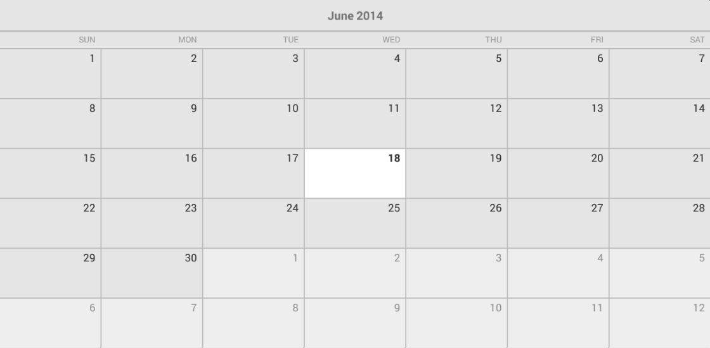
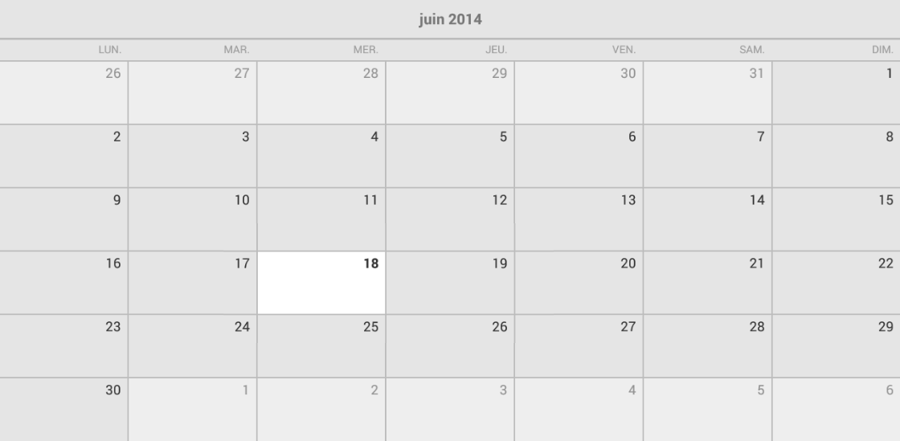

# CalendarView for Xamarin.Android: Localization

By default **RadCalendarView** uses the current device's locale to initialize the values that are displayed along with some other calendar specifics like which is the first day of the week. Here's an example with of the calendar
run on a device where the language is set to English (United States):



## Locale

If you want to provide a static locale which disregards the user's preferences, you can use the calendar's **Locale(Locale)** property and set the locale of your preference. Here's an example with the local `France`:


```C#
calendarView.Locale = Java.Util.Locale.France;
```

The result will be that the calendar will display the names of the days and the month in French and the first day of the week will not be `Sunday` as with the previous example but `Monday`:



## Calendar

**RadCalendarView** displays the dates in accordance with the `java.util.GregorianCalendar`. If you would like to use another `Calendar` implementation you can apply it with calendar's **Calendar(Calendar)** property.
