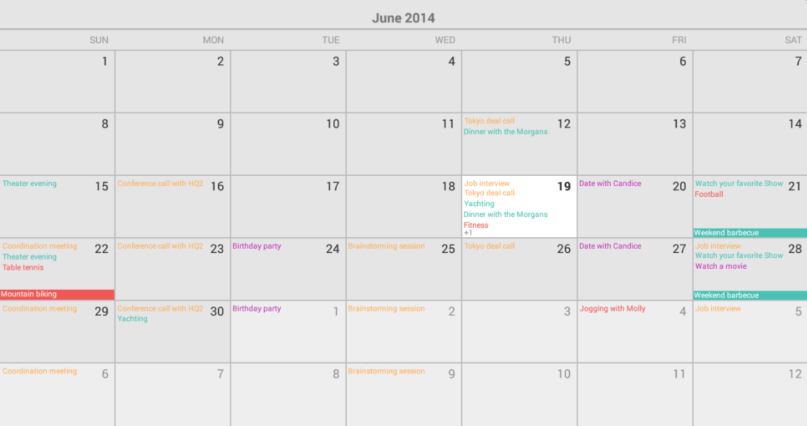
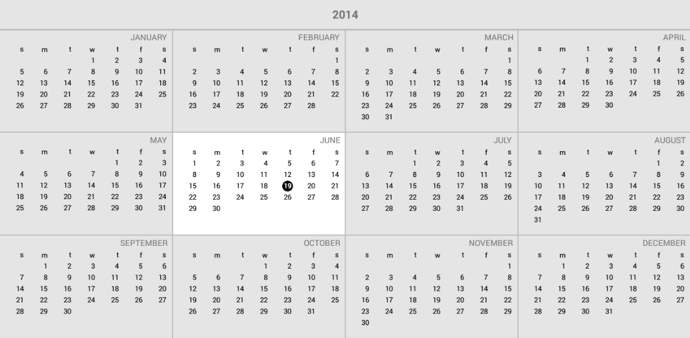

# RadCalendarView: Overview

**RadCalendarView** for Android is a calendar component that has been designed for the mobile environment. It offers great performance, powerful customization options and various features.
The dates in the calendar can be presented with different modes which visualize Month, Week or Year. The user can provide a selection in different selection modes - Single, Multiple or Range depending on the required results.
Different scroll modes are available including but not limited to: Sticky, Combo and Stacked.
The calendar also offers events integration.

## Display Modes

**RadCalendarView** provides three different [display modes]( "Read more about RadCalendarView's display modes"), which allow you to present dates from a month, a week or an year, depending on you preferences:

## Selection Modes

**RadCalendarView** can be setup to provide different selection capabilities to the user. Depending on the current scenario and the required input from the user, the selection can be Single (to pick just a single date),
multiple (to pick many dates) or range (to select a range of consecutive dates, for example to choose the period of a vacation). [Here]( "Read more about RadCalendarView's selection modes")
you can read more about the types of selection.

## Events

The control can present information about events related with each date. The event's information can be presented with various shapes and styles. You can read more about the events integration
[here]( "Read more about RadCalendarView's events").

## Disabled Dates

You can restrict the dates presented by **RadCalendarView** by setting values for min and max dates as well as marking specific dates as disabled. More about disabling dates is available [here]( "Read more about RadCalendarView's disabled dates").

## Customizations

**RadCalendarView** provides different ways for customizing its appearance. You can disable some of the visible elements like title, day names, grid lines, cell decorations or alter the way they look. You can also apply
customizations to the calendar cells depending on the dates they represent. [Here]( "Read more about RadCalendarView's customizations")'s a more descriptive information about the customizable options.

## Gestures and Transitions

The calendar control handles different manipulations performed by the user like swiping horizontally or vertically, pinching open or close, tapping or double tapping. You can easily select which of these gestures will
be handled in a way which changes the calendar's properties with nice transitions. You can also trigger the transitions programmatically. More information is available in
[this article]( "Read more about RadCalendarView's gestures and transitions").

## Localizations

**RadCalendarView** follows the locale information provided from the user's device settings. If you want, you can easily apply locale of your choice so that the information that is displayed is translated and formatted
according to your preferences. [Here]( "Read more about RadCalendarView's localization")'s more about the calendar's localizations capabilities.
