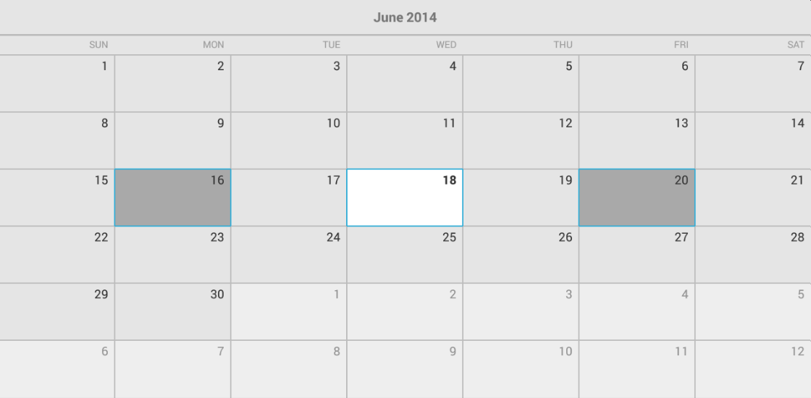
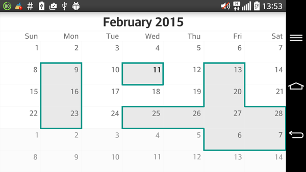
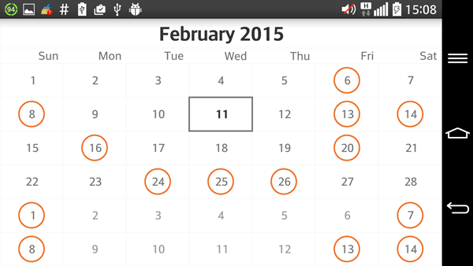
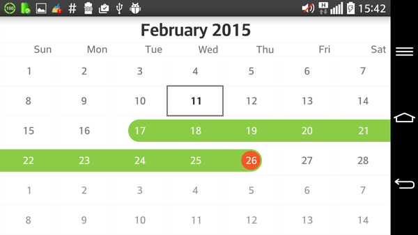
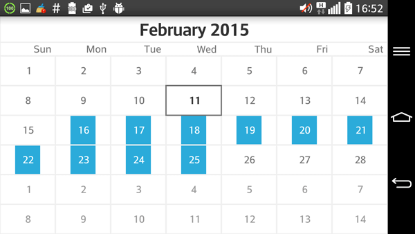

# RadCalendarView: Selection

**RadCalendarView** provides three different types of selection: Single, Multiple and Range. They are contained in the `CalendarSelectionMode` enumeration. You can get the current value through the method **getSelectionMode()**.
The default value is `Multiple` and you can change it either using the XML attribute **selectionMode** or using the method **setSelectionMode(CalendarSelectionMode)**.

The selected dates change when the user taps on a cell of the calendar. The selected dates can also be set by the **setSelectedDates(List<Long>)** method. The current selection can be obtained through **getSelectedDates()**.

## Multiple

This is the default calendar selection mode. When the calendar is using this mode each cell that is tapped changes its selected state, this means that when a cell is tapped for first time it gets added to the current selection and
when it is tapped again it is removed from the selection. Here's an example of how to select the Monday, Wednesday and Friday from the current week:

```Java
	Calendar calendar = Calendar.getInstance();
	List<Long> dates = new ArrayList<Long>();

	calendar.set(Calendar.DAY_OF_WEEK, Calendar.MONDAY);
	dates.add(calendar.getTimeInMillis());

	calendar.set(Calendar.DAY_OF_WEEK, Calendar.WEDNESDAY);
	dates.add(calendar.getTimeInMillis());

	calendar.set(Calendar.DAY_OF_WEEK, Calendar.FRIDAY);
	dates.add(calendar.getTimeInMillis());

	calendarView.setSelectedDates(dates);
```
```C#
	Calendar calendar = Calendar.Instance;
	List<Java.Lang.Long> dates = new List<Java.Lang.Long>();

	calendar.Set(CalendarField.DayOfWeek, Calendar.Monday);
	dates.Add((Java.Lang.Long)calendar.TimeInMillis);

	calendar.Set(CalendarField.DayOfWeek, Calendar.Wednesday);
	dates.Add((Java.Lang.Long)calendar.TimeInMillis);

	calendar.Set(CalendarField.DayOfWeek, Calendar.Friday);
	dates.Add((Java.Lang.Long)calendar.TimeInMillis);

	calendarView.SelectedDates = dates;
```

Here's the result:



## Single

When **RadCalendarView**'s selection mode is set to `Single`, each time a cell is tapped it becomes selected and if another cell has already been selected it is unselected. This means that every time the call to
**getSelectedDates()** returns a list which contains at most one date. If you execute the code from the previous example while the calendar's selection mode is `Single`, the selection will consist of only one date &mdash;
the next Monday. The other dates that were included in the list will be dismissed.

## Range

The Range selection mode allows the users to pick a range of consecutive dates, for example to book a hotel for this period. Here's how the control reacts to the user's gestures while in this mode. The first cell that is tapped
gets selected and is considered start of the range. When another cell is tapped, it is considered end of the range and all dates between the start and the end of the range become selected. In order to obtain or determine the
selected range programmatically, you can use the same methods as in the other modes: **getSelectedDates()** and **setSelectedDates(List<Long>)**. Your other option is to use the methods **getSelectedRange()** and
**setSelectedRange(DateRange)** to get or set the range that is selected. They use an object of type `DateRange` to represent the selection. This is a simple type which contains information about the start and the end of one range of dates.
Here's an example of how to use the `DateRange` to set the selection to the three dates which start from today:

```Java
	calendarView.setSelectionMode(CalendarSelectionMode.Range);

	Calendar calendar = Calendar.getInstance();
	long start = calendar.getTimeInMillis();

	calendar.add(Calendar.DATE, 2);
	long end = calendar.getTimeInMillis();

	DateRange dateRange = new DateRange(start, end);
	calendarView.setSelectedRange(dateRange);
```
```C#
	calendarView.SelectionMode = CalendarSelectionMode.Range;

	Calendar calendar = Calendar.Instance;
	long start = calendar.TimeInMillis;

	calendar.Add(CalendarField.Date, 2);
	long end = calendar.TimeInMillis;

	DateRange dateRange = new DateRange(start, end);
	calendarView.SelectedRange = dateRange;
```

It is also possible to use the range selection gesture to select a range of dates. It can be enabled by using the **setUsingDragToMakeRangeSelection(boolean)** method in the gesture manager. The gesture manager can be obtained from the calendar's method **getGestureManager()**.
Setting this to true will enable the range selection gesture and will prevent the calendar from scrolling. It is however recommended that you disable the scrolling manually to be extra safe. This is done by using the **setScrollMode(ScrollMode)** and passing `None` as current scroll mode.
You can read more about scroll modes [here]( "Read more about RadCalendarView's gestures and transitions")'s

> If you try to use the methods getSelectedRange or setSelectedRange(DateRange) while calendar's selection mode is not Range, an Exception will be thrown.

## Callback

You can use the **RadCalendarView.OnSelectedDatesChangedListener** to get notified about changes in the selection. For example here's how to show a Toast with the selected date:

```Java
	calendarView.setSelectionMode(CalendarSelectionMode.Single);
	calendarView.setOnSelectedDatesChangedListener(new RadCalendarView.
											OnSelectedDatesChangedListener() {
		@Override
		public void onSelectedDatesChanged(
			RadCalendarView.SelectionContext context) {
			
			Toast.makeText(getApplicationContext(), 
			  String.format("%tF", context.newSelection().get(0)), 
			  Toast.LENGTH_SHORT).show();
		}
	});
```
```C#
	calendarView.SelectionMode = CalendarSelectionMode.Single;
	calendarView.OnSelectedDatesChangedListener = 
		new SelectedDatesChangedListenerExample();
	
	...
	
	//SelectedDatesChagedListenerExample sample implementation:
	class SelectedDatesChangedListenerExample : Java.Lang.Object, 
		Com.Telerik.Widget.Calendar.RadCalendarView.IOnSelectedDatesChangedListener
	{
		public void OnSelectedDatesChanged (RadCalendarView.SelectionContext context)
		{
			if (context.NewSelection ().Count > 0) {
				Calendar calendar = Calendar.Instance;
				foreach(long item in context.NewSelection()) {
					calendar.TimeInMillis = item;
					DateTime selectedDateTime = new DateTime (
						calendar.Get (CalendarField.Year), 
						calendar.Get (CalendarField.Month) + 1, 
						calendar.Get (CalendarField.DayOfMonth));
						
					String formattedDateTime = 
						String.Format ("{0:yyyy-MM-dd}", selectedDateTime);
					Toast.MakeText (Application.Context, formattedDateTime, 
						ToastLength.Short).Show ();
				}
			}
		}
	}
```

In this example we used the `newSelection` list, part of the **SelectionContext**. The selection context also contains other information about the selection that is presented with four lists of dates:

* **oldSelection**: list of the items that were selected before the occurrence of this event; that is the result of calling **getSelectedDates()** before this event.
* **newSelection**: list of the items that are now selected; this is the result of calling **getSelectedDates()** now.
* **datesAdded**: list of the items that are currently being added to the selection.
* **datesRemoved**: list of items that are currently being removed from the selection.

In order to better understand the difference between these lists consider the following scenario. The calendar's selection mode is `Range` and the selected dates are January 1st, 2nd and 3rd. The user taps on January 15th.
At this point the **SelectionContext** will contain the following lists &mdash; **oldSelection**: January 1st, 2nd and 3rd; **newSelection**: January 15th; **datesAdded**: January 15th; **datesRemoved**: January 1st, 2nd and 3rd. As you can see
in this case there is a full match between the **datesAdded** and the **newSelection** and between the **datesRemoved** and the **oldSelection** lists. However, this is not always the case. Let's say now the user taps on January 17th. Here is
the content of the lists now: **oldSelection**: January 15th; **newSelection**: January 15th, 16th and 17th; **datesAdded**: January 16th and 17th; **datesRemoved** is empty. Usually you will not be interested in the content of all of the lists,
but depending on your desired experience you can use the information that you need.

# RadCalendarView: Selection Decorators

There are a few decorators offering the functionality of decorating the currently selected cells. The decorators are currently in three groups:
* Segmented decorators - decorators which draw borders around the selected cells.
* Cell decorators - decorators which draw directly on top of the selected cell.
* Range decorators - decorators which draw on top of the selected cells in a range selection by combining a shape for the range and an indicator for the last date in the selection.

## Segmented decorator


This is the default decorator of the **RadCalendarView**. It is used for any type of selection in the calendar. The way to set it is the following:
```Java
	SegmentDecorator decorator = new SegmentDecorator(calendarView);
	decorator.setColor(Color.parseColor("#009688"));
	decorator.setStrokeWidth(Util.getDimen(TypedValue.COMPLEX_UNIT_DIP, 3));

	calendarView.setCellDecorator(decorator);
```
```C#
	SegmentDecorator decorator = new SegmentDecorator(calendarView);
	decorator.Color = Android.Graphics.Color.ParseColor("#009688");
	decorator.StrokeWidth = 5;

	calendarView.CellDecorator = decorator;
```

## Cell decorators


The cell decorators are ideal for single selection mode. However they can be used in any of the available selection modes.

The current cell decorators are:

* **CircularCellDecorator** - renders a circle on top of the selected cell.
* **RectangularCellDecorator** - renders a rectangle on top of the selected cell.
* **SquareCellDecorator** - renders a square on top of the selected cell.

Here is an example of how the set one:

```Java
	calendarView.getAdapter().setDateTextPosition(CalendarElement.CENTER);
	calendarView.getAdapter().setDateCellBackgroundColor(Color.WHITE, Color.WHITE);
	calendarView.getAdapter().setSelectedCellBackgroundColor(Color.WHITE);

	CellDecorator decorator = new CircularCellDecorator(calendarView);
	decorator.setColor(Color.parseColor("#ed742c"));
	decorator.setStrokeWidth(Util.getDimen(TypedValue.COMPLEX_UNIT_DIP, 2));
	decorator.setScale(.75f);

	calendarView.setCellDecorator(decorator);
```
```C#
	calendarView.Adapter.DateTextPosition = CalendarElement.Center;
	calendarView.Adapter.SetDateCellBackgroundColor(Android.Graphics.Color.White, 
		Android.Graphics.Color.White);
		
	calendarView.Adapter.SelectedCellBackgroundColor = Android.Graphics.Color.White;

	CellDecorator decorator = new CircularCellDecorator(calendarView);
	decorator.Color = (Android.Graphics.Color.ParseColor("#ed742c"));
	decorator.StrokeWidth = 2;
	decorator.Scale = .75f;

	calendarView.CellDecorator = decorator;
```

Cell decorators can be either stroked or filled. This is determined by the stroked property:

```Java
	decorator.setStroked(false);
```
```C#
	decorator.Stroked = false;
```

This code will cause the decorator to draw its shapes filled instead of stroked.

## Range decorators


These decorators are only available for range selection mode. They are used to visualize the range selection with a shape going from the first date of the selection to the last one. They also have an indicator rendered on the last date of the selection.
The range decorators that are currently available are:

* **CircularRangeDecorator** - draws a rounded shape and a circular indicator.
* **SquareRangeDecorator** - draws a rectangular shape and a square indicator.

Here is an example of a circular decorator:
```Java
	calendarView.getAdapter().setDateTextPosition(CalendarElement.CENTER);
	calendarView.getAdapter().setDateCellBackgroundColor(Color.WHITE, Color.WHITE);
	calendarView.getAdapter().setSelectedCellBackgroundColor(Color.WHITE);
	calendarView.getAdapter().setSelectedCellTextColor(Color.WHITE);
	calendarView.setSelectionMode(CalendarSelectionMode.Range);

	RangeDecorator decorator = new CircularRangeDecorator(calendarView);
	decorator.setColor(Color.parseColor("#f85725"));
	decorator.setShapeColor(Color.parseColor("#8bcc46"));
	decorator.setStrokeWidth(Util.getDimen(TypedValue.COMPLEX_UNIT_DIP, 2));
	decorator.setScale(.65f);
	decorator.setShapeScale(.75f);
	decorator.setStroked(false);

	calendarView.setCellDecorator(decorator);
```
```C#
	calendarView.Adapter.DateTextPosition = CalendarElement.Center;
	calendarView.Adapter.SetDateCellBackgroundColor(Android.Graphics.Color.White, 
		Android.Graphics.Color.White);
		
	calendarView.Adapter.SelectedCellBackgroundColor = Android.Graphics.Color.White;
	calendarView.Adapter.SelectedCellTextColor = Android.Graphics.Color.White;
	calendarView.SelectionMode = CalendarSelectionMode.Range;

	RangeDecorator decorator = new CircularRangeDecorator(calendarView);
	decorator.Color = Android.Graphics.Color.ParseColor("#f85725");
	decorator.ShapeColor = Android.Graphics.Color.ParseColor("#8bcc46");
	decorator.StrokeWidth = 2;
	decorator.Scale = .65f;
	decorator.ShapeScale = .75f;
	decorator.Stroked = false;

	calendarView.CellDecorator = decorator;
```

## Extending the decorator


Every of the different types of decorators is designed for easy and seamless extension. Before deciding to extend one of them the developer must decide which functionality is needed and to turn to the one that is closer to the final goal.
In this case the desired decorator is a flag-like decorator, which goes all the way on the vertical axis, but has a little space on the sides. Since it will be applied to all cells separately it is a good idea to extend the CellDecorator:

```Java
	@Override
    protected void onCreate(Bundle savedInstanceState) {
        super.onCreate(savedInstanceState);

        RadCalendarView calendarView = new RadCalendarView(this);

        calendarView.getAdapter().setDateTextPosition(CalendarElement.CENTER);
        calendarView.getAdapter().setDateCellBackgroundColor(Color.WHITE, Color.WHITE);
        calendarView.getAdapter().setSelectedCellBackgroundColor(Color.WHITE);
        calendarView.getAdapter().setSelectedCellTextColor(Color.WHITE);
        calendarView.setSelectionMode(CalendarSelectionMode.Range);
        calendarView.getGridLinesLayer().setWidth(
			Util.getDimen(TypedValue.COMPLEX_UNIT_DIP, 2));

        CellDecorator decorator = new FlagCellDecorator(calendarView);
        decorator.setColor(Color.parseColor("#2babda"));
        decorator.setStrokeWidth(Util.getDimen(TypedValue.COMPLEX_UNIT_DIP, 2));
        decorator.setScale(.45f);
        decorator.setStroked(false);

        calendarView.setCellDecorator(decorator);

        setContentView(calendarView);
    }

	private class FlagCellDecorator extends CellDecorator {

        private float offsetVertical;

        public FlagCellDecorator(RadCalendarView owner) {
            super(owner);

            this.offsetVertical = owner.getGridLinesLayer().getWidth() / 2;
        }

        @Override
        protected void renderDecorationForCell(Canvas canvas, CalendarCell cell) {
            int offsetHorizontal = 
				(cell.getWidth() - (int)(cell.getWidth() * this.scale)) / 2;
				
            canvas.drawRect(
                    cell.virtualLeft() + offsetHorizontal,
                    cell.virtualTop() + this.offsetVertical,
                    cell.virtualRight() - offsetHorizontal,
                    cell.virtualBottom() - this.offsetVertical,
                  this.paint
            );

            canvas.drawText(cell.getText(),
                    cell.textPositionX() + cell.getVirtualOffsetX(),
                    cell.textPositionY() + cell.getVirtualOffsetY(),
                    cell.getTextPaint());
        }
    }
```
```C#
	public override View OnCreateView (LayoutInflater inflater, ViewGroup container, 
		Bundle savedInstanceState)
	{
		RadCalendarView calendarView = new RadCalendarView (Activity);

		calendarView.Adapter.DateTextPosition = CalendarElement.Center;
		calendarView.Adapter.SetDateCellBackgroundColor(Android.Graphics.Color.White, 
			Android.Graphics.Color.White);
			
		calendarView.Adapter.SelectedCellBackgroundColor = 
			Android.Graphics.Color.White;
			
		calendarView.Adapter.SelectedCellTextColor = Android.Graphics.Color.White;
		calendarView.SelectionMode = CalendarSelectionMode.Range;
		calendarView.GridLinesLayer.Width = 2;

		CellDecorator decorator = new FlagCellDecorator(calendarView);
		decorator.Color = Android.Graphics.Color.ParseColor("#2babda");
		decorator.StrokeWidth = 2;
		decorator.Scale = .45f;
		decorator.Stroked = false;

		calendarView.CellDecorator = decorator;

		return calendarView;
	}

	private class FlagCellDecorator : CellDecorator
	{
		private float offsetVertical;

		public FlagCellDecorator(RadCalendarView owner) : base(owner)
		{
			this.offsetVertical = owner.GridLinesLayer.Width / 2;
		}

		protected override void RenderDecorationForCell(Canvas canvas, 
			CalendarCell cell) {
			
			int offsetHorizontal = 
				(cell.Width - (int)(cell.Width * this.Scale)) / 2;
				
			canvas.DrawRect(
				cell.VirtualLeft() + offsetHorizontal,
				cell.VirtualTop() + this.offsetVertical,
				cell.VirtualRight() - offsetHorizontal,
				cell.VirtualBottom() - this.offsetVertical,
				this.Paint
			);

			canvas.DrawText(cell.Text,
				cell.TextPositionX() + cell.VirtualOffsetX,
				cell.TextPositionY() + cell.VirtualOffsetY,
				cell.TextPaint);
		}
	}
```