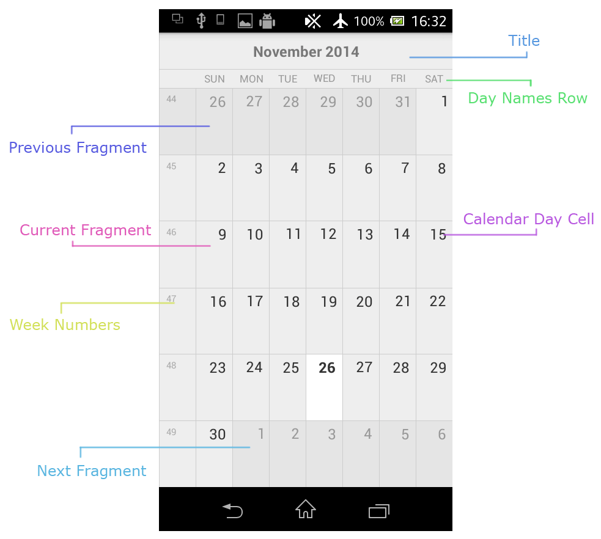

# RadCalendarView: Visual Structure

In this article, you will learn how the **RadCalendarView for Android** is structured and what manages its core functionality.

## 	Visual Structure

The calendar is constructed using the following elements:

 * Title - holds the title corresponding for the current date and display mode.
 * Day Names - displays the names of the days in a week.
 * Three fragments - previous fragment holding the date before the current date, current or active fragment holding the current date and next fragment holding the date after the current date.

### Title
The title holds information about the current display date. It differs according to the current display mode.

### Day Names
The day names are holding the current set of day names in a single week according to the current local.

### Fragments
The fragments are designed to hold a date and being able to snap to each other. This makes them perfect for scrolling. At the point of switching the current date to the previous or the next one, the corresponding
fragment is being updated with the new date and snapped on the opposite side of the current fragment. This virtualization ensures seamless transition between dates, optimizes the use of resources and minimizes the cpu calculations.
In some cases the fragments are not perfectly square and follow the shape of the cells of their current display date. This applies as seen in the picture above. This applies when the calendar is in month display mode, the scrolling is vertical and the scroll mode
is not set to `Overlap` or `Stack`. When the scroll mode is either `Overlap` or `Stack` or the scroll direction is horizontal, then the fragments are perfectly rectangular holding dates from both their display date as well as the previous and
the next one as well. This is done to ensure the correct behaviour when the months are 'linked' together in vertical scrolling.

## Managers
There are several managers that together ensure the proper behaviour of the calendar. They oversee the scrolling, the gestures and the animations.

 * Scrolling manager - responsible for applying scrolling, updating and positioning of the fragments as well as holding the biggest area of the calendar including all calendar cells.
 * Gestures manager - handles all the gestures performed on the calendar and triggers the scrolling and the animation managers.
 * Animations manager - performs all animations and transitions such as changing display modes and animating to next or previous date.
	

