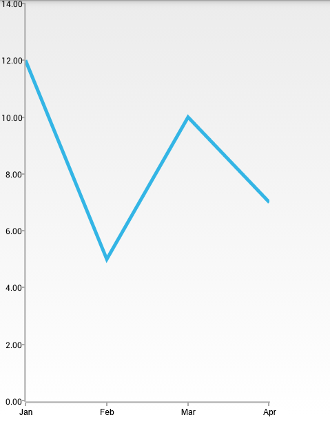

# RadChartView: CategoricalAxis

When **RadCartesianChartView** visualizes **CategoricalSeries**, it needs an axis that can represent the different categories. The **CategoricalAxis** extends the base **CartesianAxis** class and is used to displays a range of categories. Categories are built depending on the **Category** value of each **CategoricalDataPoint** present in the owning **CategoricalSeries** chart series. The axis is divided into discrete slots and each data point is visualized in the slot corresponding to its categorical value.

The **CategoricalAxis** extends the base **CartesianAxis** class and is used to displays a range of categories. Categories are built depending on the `Category` value of each `CategoricalDataPoint` present in the owning **CategoricalSeries** chart series. The axis is divided into discrete slots and each data point is visualized in the slot corresponding to its categorical value.

## Example

You can read from the [Getting Started]( "Read how to define the MonthResult type") page how to define the `MonthResult` type and declare the **initData()** method.

After you create the method for initialization of sample data, you can create a **RadCartesianChartView** with **LineSeries** by adding the following code to the **onCreate()** method of your Activity.


```C#
	InitData();

	RadCartesianChartView chartView = new RadCartesianChartView(this);

	LineSeries lineSeries = new LineSeries();
	lineSeries.CategoryBinding = new MonthResultDataBinding ("Month");
	lineSeries.ValueBinding = new MonthResultDataBinding ("Result");
	lineSeries.Data = (Java.Lang.IIterable)this.monthResults;

	chartView.Series.Add(lineSeries);

	CategoricalAxis horizontalAxis = new CategoricalAxis();
	chartView.HorizontalAxis = horizontalAxis;

	LinearAxis verticalAxis = new LinearAxis();
	chartView.VerticalAxis = verticalAxis;

	ViewGroup rootView = (ViewGroup)FindViewById(Resource.Id.container);
	rootView.AddView(chartView);
```

> This example assumes that you root container has id `container`

Here's the result:



## Features

### Plot Mode

The **CategoricalAxis** allows you to define how exactly the axis will be plotted on the viewport of the chart. The possible values are:

* **AxisPlotMode.BETWEEN_TICKS**: Points are plotted in the middle of the range, defined between each two ticks.
* **AxisPlotMode.ON_TICKS**: Points are plotted over each tick.
* **AxisPlotMode.ON\_TICKS\_PADDED**: Points are plotted over each tick with half a step padding applied on both ends of the axis.

You can get the current value with the **getPlotMode()** method and change the value with the **setPlotMode(AxisPlotMode)** method.

### Gap Length

Defines the distance (in logical units) between two adjacent categories. Default value is `0.3`. For example if you have **BarSeries**, you can decrease the space between the bars from the different categories by setting the Gap Length to a value lower than `0.3`. You can get the current value with **getGapLength()** and set a new value with **setGapLength(double)**. The possible values are from the `(0, 1)` interval.

### Major Tick Interval

Defines the step at which major ticks are generated. The default and also minimum value is 1. This property also affects axis labels as they are generated on a per major tick basis.
You can get the current value with the **getMajorTicksInterval()** method and set a new value with **setMajorTickInterval(int)**. For example, if you don't want to display all ticks, but instead only half of them (display the first, third, fifth, etc. ticks), you should set the major tick interval to `2`:


```C#
	horizontalAxis.MajorTickInterval = 2;
```
