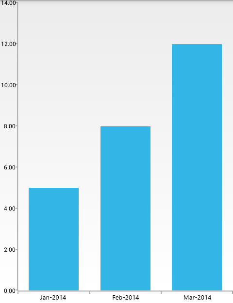

# RadChartView: DateTimeCategoricalAxis

When **RadCartesianChartView** visualizes **CategoricalSeries**, it needs an axis that can represent the different categories. The **CategoricalAxis** extends the base **CartesianAxis** class and is used to displays a range of categories. Categories are built depending on the **Category** value of each **CategoricalDataPoint** present in the owning **CategoricalSeries** chart series. The axis is divided into discrete slots and each data point is visualized in the slot corresponding to its categorical value.

The **DateTimeCategoricalAxis** is a special axis that extends the **CategoricalAxis** class and adds notation for the `java.util.Calendar` structure. The axis works with the **CategoricalSeries** and expects each **CategoricalDataPoint** to provide a valid `java.util.Calendar` value as its Category. Once built, the groups are sorted in chronological order.

## Example

Again, we will use the `MonthResult` type as defined in the [Getting Started]( "Read how to define the MonthResult type") page but this type we will extend this type
with additional field which will contain our `Calendar` component:

```Java
    public class ExtendedMonthResult extends MonthResult {
        private Calendar date;

        public ExtendedMonthResult(String month, double result, Calendar date) {
            super(month, result);
            this.setDate(date);
        }

        public Calendar getDate() {
            return this.date;
        }

        public void setDate(Calendar value) {
            this.date = value;
        }
    }
```
```C#
	public class ExtendedMonthResult : MonthResult
	{
		public Java.Util.Calendar Date { get; set;}

		public ExtendedMonthResult (String month, double result, Java.Util.Calendar date)
			:base(month, result)
		{
			this.Date = date;
		}
	}
```

We will also need a list of items from the new type and initialize it with proper data:

```Java
    private List<ExtendedMonthResult> extendedMonthResults;

    private void initCalendarData() {
        extendedMonthResults = new ArrayList<ExtendedMonthResult>();

        extendedMonthResults.add(new ExtendedMonthResult(
			"Jan", 5, new GregorianCalendar(2014, Calendar.JANUARY, 5)));
			
        extendedMonthResults.add(new ExtendedMonthResult(
			"Feb", 8, new GregorianCalendar(2014, Calendar.FEBRUARY, 8)));
			
        extendedMonthResults.add(new ExtendedMonthResult(
			"Mar", 3, new GregorianCalendar(2014, Calendar.MARCH, 3)));
		
        extendedMonthResults.add(new ExtendedMonthResult(
			"Mar", 12, new GregorianCalendar(2014, Calendar.MARCH, 22)));
    }
```
```C#
	private Java.Util.ArrayList extendedMonthResults;
	
	private void InitCalendarData() {
		extendedMonthResults = new Java.Util.ArrayList();

		extendedMonthResults.Add(new ExtendedMonthResult(
			"Jan", 5, new Java.Util.GregorianCalendar(2014, Java.Util.Calendar.January, 5)));
			
		extendedMonthResults.Add(new ExtendedMonthResult(
			"Feb", 8, new Java.Util.GregorianCalendar(2014, Java.Util.Calendar.February, 8)));
			
		extendedMonthResults.Add(new ExtendedMonthResult(
			"Mar", 3, new Java.Util.GregorianCalendar(2014, Java.Util.Calendar.March, 3)));
			
		extendedMonthResults.Add(new ExtendedMonthResult(
			"Mar", 12, new Java.Util.GregorianCalendar(2014, Java.Util.Calendar.March, 22)));
	}
	
	class ExtendedMonthResultDataBinding : DataPointBinding {

		private string propertyName;

		public ExtendedMonthResultDataBinding(string propertyName)
		{
			this.propertyName = propertyName;
		}

		public override Java.Lang.Object GetValue (Java.Lang.Object p0)
		{
			if(propertyName == "Date")
			{
				return ((ExtendedMonthResult)(p0)).Date;
			}
			return ((ExtendedMonthResult)(p0)).Result;
		}
	}
```

Now we can go to the Activity where we want to add a **RadCartesianChartView** with **DateTimeCategoricalAxis** and add the following code:

```Java
	initCalendarData();

	RadCartesianChartView chartView = new RadCartesianChartView(this);

	BarSeries barSeries = new BarSeries();
	barSeries.setCategoryBinding(new PropertyNameDataPointBinding("Date"));
	barSeries.setValueBinding(new PropertyNameDataPointBinding("Result"));
	barSeries.setData(this.extendedMonthResults);
	chartView.getSeries().add(barSeries);

	DateTimeCategoricalAxis horizontalAxis = new DateTimeCategoricalAxis();
	horizontalAxis.setDateTimeComponent(DateTimeComponent.MONTH);
	horizontalAxis.setDateTimeFormat(new SimpleDateFormat("MMM-yyyy"));
	chartView.setHorizontalAxis(horizontalAxis);

	LinearAxis verticalAxis = new LinearAxis();
	chartView.setVerticalAxis(verticalAxis);

	ViewGroup rootView = (ViewGroup)findViewById(R.id.container);
	rootView.addView(chartView);
```
```C#
	InitCalendarData();

	RadCartesianChartView chartView = new RadCartesianChartView(this);

	BarSeries barSeries = new BarSeries();
	barSeries.CategoryBinding = new ExtendedMonthResultDataBinding ("Date");
	barSeries.ValueBinding = new ExtendedMonthResultDataBinding ("Result");
	barSeries.Data = (Java.Lang.IIterable)this.extendedMonthResults;
	chartView.Series.Add(barSeries);

	DateTimeCategoricalAxis horizontalAxis = new DateTimeCategoricalAxis();
	horizontalAxis.DateTimeComponent = DateTimeComponent.Month;
	horizontalAxis.DateTimeFormat = new SimpleDateFormat("MMM-yyyy");
	chartView.HorizontalAxis = horizontalAxis;

	LinearAxis verticalAxis = new LinearAxis();
	chartView.VerticalAxis = verticalAxis;

	ViewGroup rootView = (ViewGroup)FindViewById(Resource.Id.container);
	rootView.AddView(chartView);
```

Here is the result:



## Features

The **DateTimeCategoricalAxis** extends **CategoricalAxis** so you can use the same features. Additionally, you can set the date time format and component.

### Date Time Component

Defines the component of each `Calendar` structure that participates in the grouping process. The possible values: YEAR, QUARTER, MONTH, WEEK, HOUR, MINUTE, SECOND, MILLISECOND, DATE, TIME\_OF\_DAY, DAY, DAY\_OF\_WEEK, DAY\_OF\_YEAR. To get the current value use **getDateTimeComponent()** and to change it, use **setDateTimeComponent(DateTimeComponent)**. You can see in the previous example we have added four items and they are in three groups, because the date time component is set to MONTH.

### Date Time Format

Defines the format of the `Calendar` structure that will be used for the categories. The default value is "M/d/yy h:mm a". To get the current value use **getDateTimeFormat()** and to change it, use **setDateTimeFormat(DateFormat)**. You can see in the previous example how we used the date time format in order to display only month and year.
