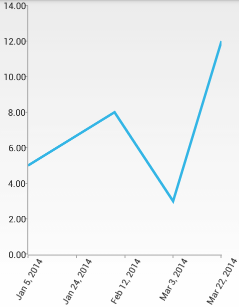

## ChartView for Xamarin.Android: DateTimeContinuousAxis

When **RadCartesianChartView** visualizes **CategoricalSeries**, it needs an axis that can represent the different categories. The **CategoricalAxis** extends the base **CartesianAxis** class and is used to displays a range of categories. Categories are built depending on the **Category** value of each **CategoricalDataPoint** present in the owning **CategoricalSeries** chart series. The axis is divided into discrete slots and each data point is visualized in the slot corresponding to its categorical value. These are the axes which can plot categorical data:

**DateTimeContinuousAxis** is a special axis that extends the base **CartesianAxis** class and may be considered as a hybrid between a categorical and a value axis. **DateTimeContinuousAxis** works with categorical data but instead of categories, the axis builds time slots depending on its **Minimum**, **Maximum** and **MajorStep** values. **DateTimeContinuousAxis** also expects valid `Calendar` values so that the data could be plotted correctly. Think of **DateTimeContinuousAxis** as a timeline where each data point has a certain position, depending on its `Calendar` value. The timeline range properties' values are automatically calculated if not set explicitly by the user: the default value of the major step is the smallest difference between any two `Calendar` values. Because this axis behaves like a numerical one, there might be empty time slots if no data falling into them is found.

## Example

We are going to use the **initCalendarData()** method and the `ExtendedMonthResult` type like in the example with [DateTimeCategoricalAxis]( "Read how to use the DateTimeCategoricalAxis"). But this time we will use the **LineSeries** in order to better indicate the continuity of the axis. Go to the Activity where we want to add a **RadCartesianChartView** with **DateTimeContinuousAxis** and add the following code:


```C#
InitCalendarData();

RadCartesianChartView chartView = new RadCartesianChartView(this);

LineSeries lineSeries = new LineSeries();
lineSeries.CategoryBinding = new ExtendedMonthResultDataBinding ("Date");
lineSeries.ValueBinding = new ExtendedMonthResultDataBinding ("Result");
lineSeries.Data = (Java.Lang.IIterable)this.extendedMonthResults;
chartView.Series.Add(lineSeries);

DateTimeContinuousAxis horizontalAxis = new DateTimeContinuousAxis();
horizontalAxis.LabelFitMode = AxisLabelFitMode.Rotate;
chartView.HorizontalAxis = horizontalAxis;

LinearAxis verticalAxis = new LinearAxis();
chartView.VerticalAxis = verticalAxis;

ViewGroup rootView = (ViewGroup)FindViewById(Resource.Id.container);
rootView.AddView(chartView);
```
	
And here is the result:



Notice how the ticks are not based on the actual values of the data items. Instead they aim to represent the actual time frames between the date values of the data items.

## Features

### Maximum Ticks

You can set a maximum number of ticks that will be used in a **DateTimeContinuousAxis** with the **MaximumTicks** property. This will not affect the way the series look, but it will change the number of labels on the axis.

### Gap Length

Defines the distance (in logical units) between two adjacent categories. Default value is `0.3`. For example if you have **BarSeries**, you can decrease the space between the bars from the different categories by setting the Gap Length to a value lower that `0.3`. You can specify the current value with **GapLength** property. The possible values are from the `(0, 1)` interval.

### Major Step

The major step represents the value difference between two visible ticks on the axis. The major step unit is used to determine what exactly the value of the major step represents. For example if you want to have 10 days between two ticks on the axis you need to use both **MajorStep** and **MajorStepUnit** properties:

```C#
horizontalAxis.MajorStepUnit = TimeInterval.Day;
horizontalAxis.MajorStep = 10;
```

### Minimum and Maximum

You can define explicitly the dates where the axis starts and ends. By default the start and end are determined by the values of the data items. If you want to change it, you can use **Minimum** and **Maximum** properties.

### PlotMode

**DateTimeContinuousAxis** allows you to define how exactly the axis will be plotted on the viewport of the chart through the **PlotMode** property. The possible values are:

* **AxisPlotMode.BetweenTicks**: Points are plotted in the middle of the range, defined between each two ticks.
* **AxisPlotMode.OnTicks**: Points are plotted over each tick.
* **AxisPlotMode.OnTicksPadded**: Points are plotted over each tick with half a step padding applied on both ends of the axis.
