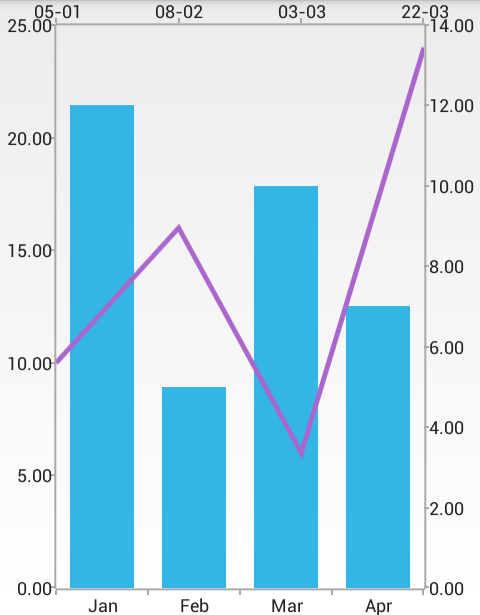

# RadChartView: Multiple Axes

**RadCartesianChartView** can visualize multiple axes simultaneously. You can add vertical and horizontal axes per chart basis and per series basis. This means that if you have two series in one chart instance, you can use different horizontal and vertical axes for each series. Depending on the requirements, the axes can be plot independently, or relatively to each other.

## Example

The image below illustrates a scenario in which we have two series - **LineSeries** and **BarSeries**. The **LineSeries** will use a **DateTimeCategoricalAxis** positioned on the `Top` and a **LinearAxis** on the `Left`. The **BarSeries** will use a **CategoricalAxis** positioned at the `Bottom` and another **LinearAxis** positioned on the `Right`:



In order to achieve this, you need to create two series and set their own axes. You also need to set their location. In this case you don't need to set axes to the whole chart. You can read from the [Getting Started]( "Read how to define the MonthResult type") page how to define the `MonthResult` type and declare the **initData()** and **initCalendarData()** methods. Then you can add the following code to your Activity:

```Java
	initData();
	initCalendarData();

	RadCartesianChartView chartView = new RadCartesianChartView(this);

	BarSeries barSeries = new BarSeries();
	barSeries.setCategoryBinding(new PropertyNameDataPointBinding("Month"));
	barSeries.setValueBinding(new PropertyNameDataPointBinding("Result"));
	barSeries.setData(this.monthResults);
	chartView.getSeries().add(barSeries);

	LineSeries lineSeries = new LineSeries();
	lineSeries.setCategoryBinding(new PropertyNameDataPointBinding("Date"));
	lineSeries.setValueBinding(new PropertyNameDataPointBinding("Result"));
	lineSeries.setData(this.extendedMonthResults);
	chartView.getSeries().add(lineSeries);

	CategoricalAxis horizontalAxisBar = new CategoricalAxis();
	horizontalAxisBar.setVerticalLocation(AxisVerticalLocation.BOTTOM);
	barSeries.setHorizontalAxis(horizontalAxisBar);

	LinearAxis verticalAxisBar = new LinearAxis();
	verticalAxisBar.setHorizontalLocation(AxisHorizontalLocation.RIGHT);
	barSeries.setVerticalAxis(verticalAxisBar);

	DateTimeCategoricalAxis horizontalAxisLine = new DateTimeCategoricalAxis();
	horizontalAxisLine.setDateTimeComponent(DateTimeComponent.DAY);
	horizontalAxisLine.setDateTimeFormat(new SimpleDateFormat("dd-MM"));
	horizontalAxisLine.setVerticalLocation(AxisVerticalLocation.TOP);
	lineSeries.setHorizontalAxis(horizontalAxisLine);

	LinearAxis verticalAxisLine = new LinearAxis();
	verticalAxisLine.setHorizontalLocation(AxisHorizontalLocation.LEFT);
	lineSeries.setVerticalAxis(verticalAxisLine);

	ViewGroup rootView = (ViewGroup)findViewById(R.id.container);
	rootView.addView(chartView);
```
```C#
	InitData();
	InitCalendarData();

	RadCartesianChartView chartView = new RadCartesianChartView(this);

	BarSeries barSeries = new BarSeries();
	barSeries.CategoryBinding = new MonthResultDataBinding ("Month");
	barSeries.ValueBinding = new MonthResultDataBinding ("Result");
	barSeries.Data = (Java.Lang.IIterable)this.monthResults;
	chartView.Series.Add(barSeries);

	LineSeries lineSeries = new LineSeries();
	lineSeries.CategoryBinding = new ExtendedMonthResultDataBinding ("Date");
	lineSeries.ValueBinding = new ExtendedMonthResultDataBinding ("Result");
	lineSeries.Data = (Java.Lang.IIterable)this.extendedMonthResults;
	chartView.Series.Add(lineSeries);

	CategoricalAxis horizontalAxisBar = new CategoricalAxis();
	horizontalAxisBar.VerticalLocation = AxisVerticalLocation.Bottom;
	barSeries.HorizontalAxis = horizontalAxisBar;

	LinearAxis verticalAxisBar = new LinearAxis();
	verticalAxisBar.HorizontalLocation = AxisHorizontalLocation.Right;
	barSeries.VerticalAxis = verticalAxisBar;

	DateTimeCategoricalAxis horizontalAxisLine = new DateTimeCategoricalAxis();
	horizontalAxisLine.DateTimeComponent = DateTimeComponent.Day;
	horizontalAxisLine.DateTimeFormat = new SimpleDateFormat("dd-MM");
	horizontalAxisLine.VerticalLocation = AxisVerticalLocation.Top;
	lineSeries.HorizontalAxis = horizontalAxisLine;

	LinearAxis verticalAxisLine = new LinearAxis();
	verticalAxisLine.HorizontalLocation = AxisHorizontalLocation.Left;
	lineSeries.VerticalAxis = verticalAxisLine;

	ViewGroup rootView = (ViewGroup)FindViewById(Resource.Id.container);
	rootView.AddView(chartView);
```
