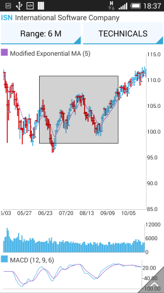

## ChartView for Xamarin.Android: PanAndZoomBehavior

With **PanAndZoomBehavior**, **RadCartesianChartView** handles the gestures drag, pinch open and pinch close which respectively cause panning, zooming in and zooming out of the associated chart plot area.

## Getting Started

You can read from the [Getting Started]( "Read how to define the MonthResult type") page how to define the `MonthResult` type and declare the **initData()** method.

After you create the method for initialization of sample data, you can create a **RadCartesianChartView** with **LineSeries** and add a **ChartPanAndZoomBehavior** by adding the following code to the **onCreate()** method of your Activity.


```C#
InitData();

RadCartesianChartView chartView = new RadCartesianChartView(this);

ChartPanAndZoomBehavior behavior = new ChartPanAndZoomBehavior();
chartView.Behaviors.Add(behavior);

LineSeries lineSeries = new LineSeries();
lineSeries.CategoryBinding = new MonthResultDataBinding ("Month");
lineSeries.ValueBinding = new MonthResultDataBinding ("Result");
lineSeries.Data = (Java.Lang.IIterable)this.monthResults;
chartView.Series.Add(lineSeries);

CategoricalAxis horizontalAxis = new CategoricalAxis();
chartView.HorizontalAxis = horizontalAxis;

LinearAxis verticalAxis = new LinearAxis();
chartView.VerticalAxis = verticalAxis;

ViewGroup rootView = (ViewGroup)FindViewById(Resource.Id.container);
rootView.AddView(chartView);
```
	
## Features

### Pan Mode and Zoom Mode

You can specify whether the Pan /Drag/ gesture will be handled for all directions, only for one, or for none. This behavior can be modified with **PanMode** property.
The same is applicable for the pinch in/out gesture, which can be modified with **ZoomMode** property. The possible values for both modes are:

* **ChartPanZoomMode.Both**: the default mode, where the chart can be panned and zoomed in both directions
* **ChartPanZoomMode.Horizontal**: the chart will be able to be panned or zoomed only horizontally
* **ChartPanZoomMode.Vertical**: the chart will be able to be panned or zoomed only vertically
* **ChartPanZoomMode.None**: the chart will NOT be panned or zoomed in either direction

### Zoom Strategy

ChartPanZoomBehavior supports two zoom strategies out of the box. These are *ChartZoomStrategy.Immediate* and *ChartZoomStrategy.Deferred*.

In Immediate mode, the chart reacts to every pinch gesture and redraws the chart accordingly. This can become troublesome if you need to zoom a lot, since you will have to do a lot of pinching to get to the desired zoom level. In this case the Deferred strategy would be more useful since you can simply pinch to create a zoom rectangle. This rectangle defines the area which will be stretched to fill the whole chart plot area, the smaller the chosen rectangle, the larger the zoom will be.

You can set the zoom strategy like so:

```C#
panZoomBehavior.ZoomStrategy = ChartZoomStrategy.Deferred;
```

Here is what the zoom rect looks like:



### Double Tap

By default, the pan and zoom behavior also provides zooming capabilities for the double tap gesture. This means that the chart will be zoomed in or zoomed out when this gesture occurs. This can be changed with the **HandleDoubleTap** property:

```C#
behavior.HandleDoubleTap = false;
```