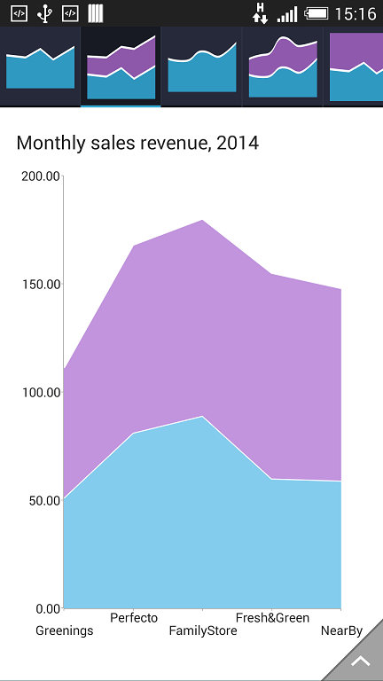
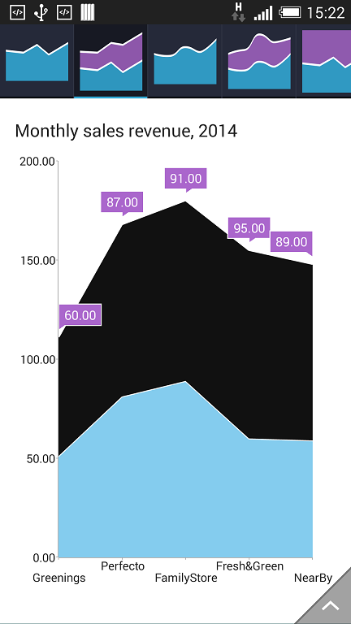

# RadChartView: ChartSelectionBehavior

**ChartSelectionBehavior** is responsible for selecting, deselecting and reporting the selection of either data points or series. In other words,
the selection behavior can target data points, series or both if required.

## Getting Started

ChartSelectionBehavior does not have any special intialization requirements. Simply create an instance of it and add it to the behaviors collection of
RadChartView.
For example:


```C#
	chartView.Behaviors.Add(new ChartSelectionBehavior());
```

This code example assumes that there is an existing instance of RadCartesianChartView which is initialized and populated with data. You
can see how to do this [here]( "Getting Started").

## Features
The selection behavior can be set to select data points, whole series or both. This can be done by using the setSeriesSelectionMode() and
setDataPointsSelectionMode(). The selection mode for both methods is the same enum which contains three values: SINGLE, MULTIPLE and NONE.
The selection always works in toggle mode. If you select a data point or a series, you can always deselect it as well. The end-user can never
end up with a selected series or data point that they can't deselect.
Here is an example of how to set the selection mode:


```C#
	selectionBehavior.SeriesSelectionMode = ChartSelectionMode.Multiple;
	selectionBehavior.DataPointsSelectionMode = ChartSelectionMode.None;
```




Developers can also listen for selection changes by calling the setSelectionChangeListener() method and providing an implementor of the
ChartSelectionChangeListener interface. For example:


```C#
	selectionBehavior.SetSelectionChangeListener (new MySelectionChangedListener ());
```

An simple implementation of ChartSelectionChangeListener would look like this:


```C#
	class MySelectionChangedListener : Java.Lang.Object, IChartSelectionChangeListener
	{
		public void OnSelectionChanged (ChartSelectionContext p0)
		{
			DataPoint selectedPoint = p0.SelectedDataPoint();
			if(selectedPoint == null) {
				return;
			}

			// Display some detailed information about the data point.
			// selectedPoint.DataItem would return the actual data object 
			// that the point represents.
		}
	}
```

>Note that selection context returns a selected data point. But if many points are selected and you need to get all of them, you will have to access the selection behavior
itself. It has two methods called selectedSeries() and selectedDataPoints(). A reference to the selection behavior is actually included in the selection context. For example:


```C#
	public void OnSelectionChanged (ChartSelectionContext p0)
	{
		public void OnSelectionChanged (ChartSelectionContext p0)
		{
			Java.Lang.IIterable selectedPoints = p0.SelectionBehavior().SelectedDataPoints();
			
			// Do something with the selected points.
		}
	}
```

Finally the selected state of all series and data points is defined within the chart palettes so customization of simple colors is quick an easy.
