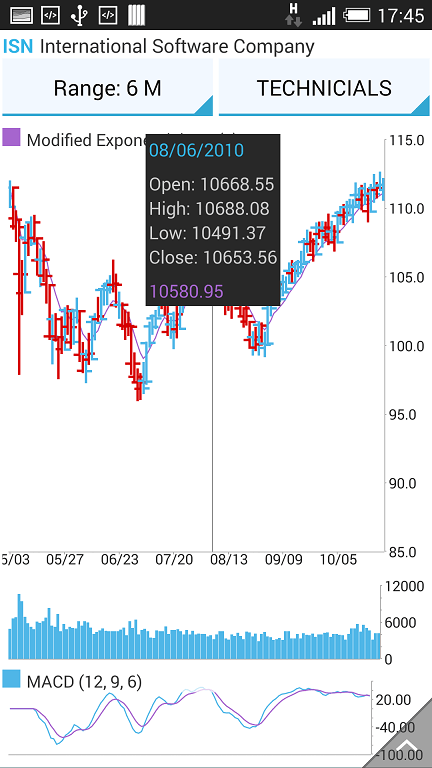
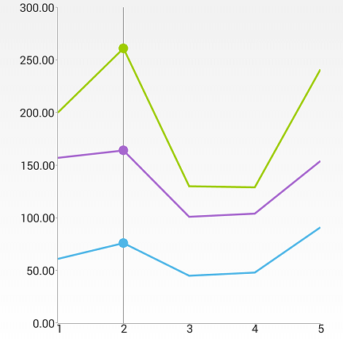

# RadChartView: ChartTrackBallBehavior

**ChartTrackBallBehavior** is responsible for rendering concise information about several data points in a small popup which displays over
its relevant data points. A horizontal or vertical line is also drawn through the data points for maximum clarity.



## Getting Started

ChartTrackballBehavior is used in the exact same way as ChartTooltipBehavior.
For example:

```Java
	ChartTrackBallBehavior trackballBehavior = new ChartTrackBallBehavior(context);
	cartesianChart.getBehaviors().add(trackballBehavior);
```
```C#
	ChartTrackBallBehavior trackballBehavior = new ChartTrackBallBehavior(this);
	chartView.Behaviors.Add(trackballBehavior);
```

This code example assumes that there is an existing instance of RadCartesianChartView which is initialized and populated with data. You
can see how to do this [here]( "Getting Started").

## Features
The trackball is always shown via the hold gesture. When the behavior detects a hold, it displays the trackball and hides it when the user stops touching the screen.
This is in contrast with the tooltip, since the tooltip remains shown even after the hold gesture has completed.

ChartTrackBallBehavior provides a setShowTrackInfo() method which allows developers to show or hide the popup information. Sometimes only a crosshair or point indicators
are necessary so the track info can be hidden. The aforementioned point indicators are small customizable visual cues that are displayed on top of the relevant data points.

```Java
	trackballBehavior.setShowIntersectionPoints(true);
```
```C#
	trackballBehavior.ShowIntersectionPoints = true;
```



```Java
	trackballBehavior.setShowTrackInfo(false); // set to false to hide track info since it's true by default
```
```C#
	trackballBehavior.ShowTrackInfo = false;
```


ChartTrackBallBehavior has two hittest modes - Logical and Physical. The logical mode finds and highlights points based on the closest category. This is the default mode.
The physical mode matches the datapoints by their physical location.

```Java
	trackballBehavior.setPointHitTestMode(TrackBallHitTestMode.PHYSICAL);
```
```C#
	trackballBehavior.PointHitTestMode = TrackBallHitTestMode.Physical;
```
