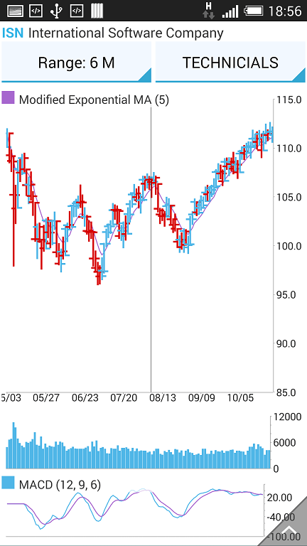

# ChartTrackBallBehavior

**ChartTrackBallBehavior** is responsible for rendering concise information about several data points in a small popup which displays over its relevant data points. A horizontal or vertical line is also drawn through the data points for maximum clarity.


## Getting Started

ChartTrackballBehavior is used in the exact same way as ChartTooltipBehavior, for example:

```C#
ChartTrackBallBehavior trackballBehavior = new ChartTrackBallBehavior(this);
chartView.Behaviors.Add(trackballBehavior);
```

This code example assumes that there is an existing instance of RadCartesianChartView which is initialized and populated with data. You can see how to do this [ChartView: Getting Started]( "Getting Started").

## Features

The trackball is always shown via the hold gesture. When the behavior detects a hold, it displays the trackball and hides it when the user stops touching the screen. This is in contrast with the tooltip, since the tooltip remains shown even after the hold gesture has completed.

ChartTrackBallBehavior provides a **ShowTrackInfo** property which allows you to show or hide the popup information. Sometimes only point indicators are necessary so the track info can be hidden. The aforementioned point indicators are small customizable visual cues that are displayed on top of the relevant data points.

```C#
trackballBehavior.ShowIntersectionPoints = true;
```


```C#
trackballBehavior.ShowTrackInfo = false;
```



ChartTrackBallBehavior has two hit test modes - Logical and Physical. The logical mode finds and highlights points based on the closest category. This is the default mode.cThe physical mode matches the datapoints by their physical location.

```C#
trackballBehavior.PointHitTestMode = TrackBallHitTestMode.Physical;
```
