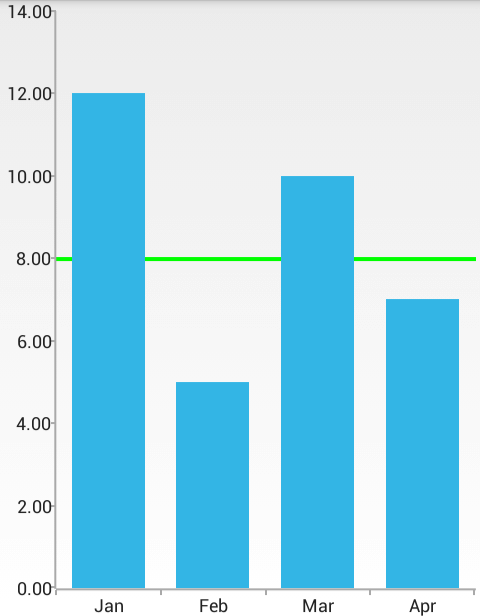
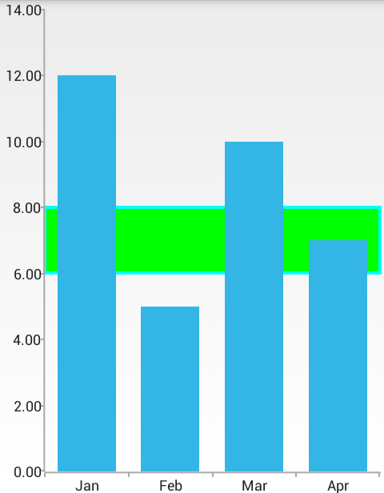
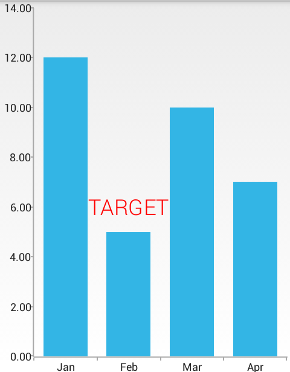

## ChartView for Xamarin.Android: Annotations

In this article, you will learn to use the annotations feature in **RadChartView for Xamarin.Android** and also how to create custom annotations.

## Overview

Annotations are visual elements used to highlight certain areas on the plot. They can be used as comments or as markers for specific values on the plot. You can practically use any visual element as template for the annotation.

RadChartView provides support for the following types of annotations:

* **GridLineAnnotations**: this annotation is visually represented by straight lines across the chart that marks a specific value on the associated Cartesian axis.
* **PlotBandAnnotations**: this annotation is visually represented by a band across the chart that marks a specific range on the associated Cartesian axis.
* **CustomAnnotations**: this annotation marks a specific point on the Cartesian chart. It requires both horizontal and vertical coordinates to be specified.

You can read from the [Bar Series]( "Read how to create a simple chart with BarSeries") page how to create a simple chart with **BarSeries** which we will now extend to include annotations.

## Grid Line Annotations

The **GridLineAnnotation** represents a vertical or horizontal line that crosses the entire plot area. 

Here is an example that demonstrates how to define a vertical **CartesianGridLineAnnotation** in the chart that [we have created]( "Read how to create a simple chart with BarSeries"). In the constructor of the annotation you need to specify the axis that will be annotated and the value which determines the position.


```C#
CartesianGridLineAnnotation annotation = new CartesianGridLineAnnotation(verticalAxis, 8);
	
chartView.Annotations.Add(annotation);
annotation.StrokeColor = Color.Green;
annotation.StrokeWidth = 4;
```

Here's the result:



You can modify the width and the color of the annotation with the **StrokeWidth** and **StrokeColor** properties of the annotation as shown in the example.

Optionally you can also provide a `PathEffect` that will be used for the line that is drawn by using the **StrokeEffect** property. For example if you want to have a dashed line, instead of solid, you can use the following approach:

```C#
annotation.StrokeEffect = new DashPathEffect (new float[] { 20, 10 }, 0);
```

## Plot Band Annotations

The **PlotBandAnnotation** represents a vertical or horizontal area that crosses the entire plot area. 

Here is an example that demonstrates how to define a vertical **CartesianPlotBandAnnotation** in the chart that [we have created]( "Read how to create a simple chart with BarSeries"). In the constructor of the annotation you need to specify the axis that will be annotated and the two values that will determine the range for the annotation.


```C#
CartesianPlotBandAnnotation annotation = new CartesianPlotBandAnnotation(verticalAxis, 6, 8);
	
chartView.Annotations.Add(annotation);
annotation.FillColor = Color.Green;
annotation.StrokeColor = Color.Cyan;
annotation.StrokeWidth = 4;
```

Here's the result:



You can modify the fill of the annotation as well as the width and the color of its stroke with the methods **FillColor**, **StrokeWidth** and **StrokeColor** properties as shown in the example. 

Additionally, you can also provide a **PathEffect** that will be used for the line that is drawn by using the **StrokeEffect** property.

## Custom Annotations

The **CustomAnnotation** provides a way to draw custom annotations. In the constructor of the annotation you need to specify both vertical and horizontal axes as well as values for both of them. They will be used to determine the position for the annotation. When the axis is numerical (Linear or Logarithmic) a numeric value is expected, and when it is categorical - a category is expected. You also need to set the content for the annotation. Here's an example which adds a text annotation to a specific position in the chart that [we have created]( "Read how to create a simple chart with BarSeries").

```C#
CartesianCustomAnnotation annotation = 
	new CartesianCustomAnnotation(verticalAxis, horizontalAxis, 6, "Feb", "TARGET");
	
chartView.Annotations.Add(annotation);
```

Now the annotation will be the text `TARGET` and it will be drawn where the vertical axis has value `6` and the horizontal axis has value `Feb`. Additionally, you can provide a custom renderer for the annotation with the property **ContentRenderer**. The custom renderer must implement the interface **CustomAnnotationRenderer**. 

Here is an example for such a renderer which draws a text annotation with custom style:


```C#
class CustomTextRenderer : Java.Lang.Object, ICustomAnnotationRenderer {

	Paint contentPaint = new Paint();

	public CustomTextRenderer()
	{
		contentPaint.TextSize = 36;
		contentPaint.Color = Color.Red;
		contentPaint.SetTypeface(
			Typeface.Create("sans-serif-light", TypefaceStyle.Normal));
	}

	public Com.Telerik.Android.Common.Math.RadSize MeasureContent (Java.Lang.Object content)
	{
		if (content == null) {
			return RadSize.Empty;
		}

		String text = content.ToString();
		Rect textBounds = new Rect();
		contentPaint.GetTextBounds(text, 0, text.Length, textBounds);

		return new RadSize(textBounds.Width(), textBounds.Height());
	}
	public void Render (Java.Lang.Object content, 
		Com.Telerik.Android.Common.Math.RadRect layoutSlot, 
		Canvas canvas, 
		Paint paint) {
		
		if (content == null) {
			return;
		}

		String text = content.ToString();
		canvas.DrawText(
			text, (float) layoutSlot.GetX() - (float) (layoutSlot.Width / 2.0),
			(float) layoutSlot.Bottom - (float)layoutSlot.Height / 2, contentPaint);
	}
}
```

After you set a new instance of our renderer to the chart from the previous example, you will see the formatted text annotation:

```C#
annotation.ContentRenderer = new CustomTextRenderer();
```

Here's the result:


