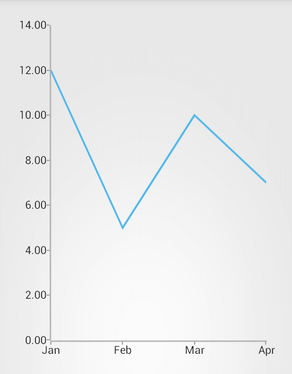

# Getting Started

In this article, you will learn how to get started with **RadChartView for Xamarin.Android**: how to initialize the chart, how to create the data series, how to use the different axes and how to create a chart that looks like this:



## Chart Initialization

The easiest way to add an instance of RadChartView is to find the root view by id and add the chart as a child view, for example in the method **onCreate()** of your Activity. Here's how to add a Cartesian chart, to the root view (with id `container`):


```C#
RadCartesianChartView chartView = new RadCartesianChartView(this);

ViewGroup rootView = (ViewGroup)FindViewById(Resource.Id.container);
rootView.AddView(chartView);
```

At this point that chart will be added to the view, but it will simply indicate that there is no data and no axes defined.

## Adding Data

Let's create a method that will initialize some data items:


```C#
private Java.Util.ArrayList monthResults;

private void InitData() {
	monthResults = new Java.Util.ArrayList();
	monthResults.Add(new MonthResult("Jan", 12));
	monthResults.Add(new MonthResult("Feb", 5));
	monthResults.Add(new MonthResult("Mar", 10));
	monthResults.Add(new MonthResult("Apr", 7));
}
```

Here, `MonthResult` is a custom type that we have defined as follows. Additionally, in C#, you will need a class that inherits from `DataPointBinding` that will be used for the proper data retrieval:


```C#
public class MonthResult : Java.Lang.Object {

	public string Month { get; set; }
	public double Result { get; set; }

	public MonthResult(string month, double result) {
		this.Month = month;
		this.Result = result;
	}
}

class MonthResultDataBinding : DataPointBinding {

	private string propertyName;

	public MonthResultDataBinding(string propertyName)
	{
		this.propertyName = propertyName;
	}

	public override Java.Lang.Object GetValue (Java.Lang.Object p0)
	{
		if(propertyName == "Month")
		{
			return ((MonthResult)(p0)).Month;
		}
		return ((MonthResult)(p0)).Result;
	}
}
```

Now that we have the data, we need to add it to a series instance.

## Creating Series

For this example we will create a chart with **LineSeries**. After we create the series, we need to define data point bindings for both value and category, which will determine how this information will be extracted from each of the data items.


```C#
InitData();

LineSeries lineSeries = new LineSeries();
lineSeries.CategoryBinding = new MonthResultDataBinding ("Month");
lineSeries.ValueBinding = new MonthResultDataBinding ("Result");
lineSeries.Data = (Java.Lang.IIterable)this.monthResults;
chartView.Series.Add(lineSeries);
```

All that's left is to define what will be type of the axes. For the **LineSeries**, we will need one axis that can visualize category and one that can visualize value.

## Creating Axes

In this example, we will use one **CategoricalAxis** and one **LinearAxis**.


```C#
CategoricalAxis horizontalAxis = new CategoricalAxis();
chartView.HorizontalAxis = horizontalAxis;

LinearAxis verticalAxis = new LinearAxis();
chartView.VerticalAxis = verticalAxis;
```

And that's all now when you run the application, you will see an instance of **RadCartesianChart** with one **CategoricalAxis** and one **LinearAxis** that visualizes **LineSeries** and looks like the image from the beginning of the article.

