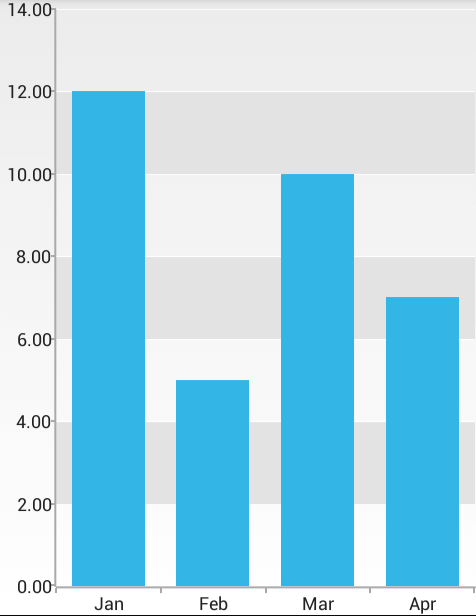

## ChartView for Xamarin.Android: Grid

In this article, you will learn how to display the grid lines in **RadChartView for Xamarin.Android**.

## CartesianChartGrid

The **CartesianChartGrid** represents a decoration over the plot area of RadCartesianChartView. Adds major and minor lines, connected to each Major and Minor tick of each axis. You can set a new grid by setting **Grid** property of your Chart instance.

## Example

Here's an example of grid lines on the Y-axis (actually horizontal lines) in a chart with bar series:



In order to create such a chart you can start from the [Bar Series Example]( "Read how to create a chart with BarSeries") and add the following code:

```C#
CartesianChartGrid grid = new CartesianChartGrid();
grid.MajorYLinesRenderMode = GridLineRenderMode.InnerAndLast;
grid.LineThickness = 1;
grid.LineColor = Color.White;
grid.MajorLinesVisibility = GridLineVisibility.Y;
grid.StripLinesVisibility = GridLineVisibility.Y;
ObservableCollection yBrushes = grid.YStripeBrushes;
yBrushes.Clear();
chartView.Grid = grid;
```

Let's check in more details the provided API related to CartesianChartGrid;

* **MajorYLinesRenderMode** property allows you to define which of the lines on the Y-axis will be drawn. You can choose from `GridLineRenderMode.First`, `GridLineRenderMode.Inner`, `GridLineRenderMode.Last` options and their combinations. **MajorXLinesRenderMode** property can be used in a similar way for the vertical lines. 
* **LineThickness** is used to change the thickness of the grid lines. 
* **LineColor** is used to change the color of the grid lines. 
* **MajorLinesVisibility** and **StripLinesVisibility** allow you to specify the visibility of the lines and the stripes, where stripe is the segment between two lines. The possible values for both properties are `GridLineVisibility.X`, `GridLineVisibility.Y`, `GridLineVisibility.None`, `GridLineVisibility.Xy`, which respectively set the display mode to: vertical lines, horizontal lines, no lines and lines in both directions. 
* You can use the **YStripeBrushes** property to access the collection of paint objects used to draw the stripes. You can clear the collection and/or add custom `Paint` objects. You can use **XStripeBrushes** in a similar way for the vertical stripes.
