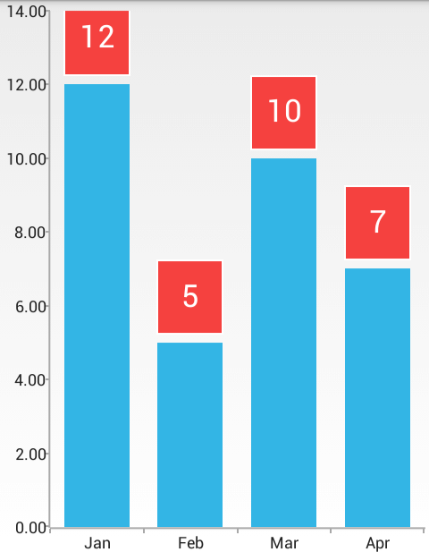

# RadChartView: Labels

In this article, you will learn to use the labels in **RadChartView for Android**: how to use the labels for the series and for the axes and how to customize them.

## Series Labels

All series have their default labels. In order to display them, you simply need to set show labels of the series to `true`:

```Java
	series.setShowLabels(true);
```
```C#
	series.ShowLabels = true;
```

## Axes Labels

All axes have their default labels. They are visible by default. In order to hide them, you simply need to set show labels of the axis to `false`:

```Java
	axis.setShowLabels(false);
```
```C#
	axis.ShowLabels = false;
```

## Customization

All axes and series have methods which provide various customization options for the labels:

* **setLabelColor(int)**: used to change the color of the label, has a counterpart &mdash; **getLabelColor()**
* **setLabelSize(float)**: used to change the size of the label, has a counterpart &mdash; **getLabelSize()**
* **setLabelMargin(float)**: used to change the margins of the label, has a counterpart &mdash; **getLabelMargin()**
* **setLabelFont(Typeface)**: used to change the font of the label, has a counterpart &mdash; **getLabelFont()**
* **setLabelFormat(string)**: used to change the format string of the label, has a counterpart &mdash; **getLabelFormat()**

Additionally, you can provide a custom label render in order to completely change the way the labels are rendered. 
In order to set the renderer you need to use the **setLabelRenderer(ChartLabelRenderer)** method. 
Here's an excerpt from a custom label renderer:

```Java
private class CustomLabelRenderer extends BaseLabelRenderer {
    private String labelFormat = "%s";
    private TextPaint paint = new TextPaint();
    private Paint strokePaint = new Paint();
    private Paint fillPaint = new Paint();
    private float labelMargin = 10.0f;
    private float labelPadding = 20.0f;
    public CustomLabelRenderer(ChartSeries series) {
        super(series);
        this.strokePaint.setStyle(Paint.Style.STROKE);
        this.strokePaint.setColor(Color.WHITE);
        this.strokePaint.setStrokeWidth(2);
        this.fillPaint.setColor(0xffF5413F);
        this.paint.setTextSize(35.0f);
        this.paint.setColor(Color.WHITE);
    }
    @Override
    public void renderLabel(Canvas canvas, ChartNode relatedLabelNode) {
        CategoricalDataPoint dataPoint = (CategoricalDataPoint) relatedLabelNode;
        RadRect dataPointSlot = dataPoint.getLayoutSlot();
        Double val = dataPoint.getValue();
        String labelText = String.format(this.labelFormat, val.intValue());
        StaticLayout textInfo = this.createTextInfo(labelText, dataPoint);
        this.renderLabel(canvas, dataPointSlot, labelText, textInfo);
    }
    private StaticLayout createTextInfo(String labelText, CategoricalDataPoint dataPoint) {
        return new StaticLayout(labelText,
                0,
                labelText.length(),
                this.paint,
                Math.round((float) dataPoint.getLayoutSlot().getWidth()),
                Layout.Alignment.ALIGN_CENTER,
                1.0f,
                1.0f,
                false);
    }
    private void renderLabel(Canvas canvas, RadRect dataPointSlot, String labelText, StaticLayout textBounds) {
        RectF labelBounds = new RectF();
        float height = textBounds.getHeight() + this.labelPadding * 2;
        float top = (float) dataPointSlot.getY() - this.labelMargin - height;
        labelBounds.set((float) dataPointSlot.getX(),
                top,
                (float) dataPointSlot.getRight(),
                top + height);
        canvas.drawRect(labelBounds.left, labelBounds.top, labelBounds.right, labelBounds.bottom, this.fillPaint);
        canvas.drawRect(labelBounds.left, labelBounds.top, labelBounds.right, labelBounds.bottom, this.strokePaint);
        canvas.drawText(labelText, (float) dataPointSlot.getX() + (float) (dataPointSlot.getWidth() / 2.0) - textBounds.getLineWidth(0) / 2.0f, 
		labelBounds.centerY() + textBounds.getLineBottom(0) - textBounds.getLineBaseline(0), paint);
    }
}
```
```C#
	class CustomLabelRenderer : BaseLabelRenderer {

		private String labelFormat = "{0}";
		private TextPaint paint = new TextPaint();
		private Paint strokePaint = new Paint();
		private Paint fillPaint = new Paint();
		private float labelMargin = 10.0f;
		private float labelPadding = 20.0f;

		public CustomLabelRenderer(ChartSeries owner)
			:base(owner) {

			this.strokePaint.SetStyle(Paint.Style.Stroke);
			this.strokePaint.Color = Color.White;
			this.strokePaint.StrokeWidth = 2;

			this.fillPaint.Color = Color.ParseColor("#F5413F");
			this.paint.TextSize = 35.0f;
			this.paint.Color = Color.White;
		}

		public override void RenderLabel (Canvas canvas, 
			Com.Telerik.Widget.Chart.Engine.ElementTree.ChartNode relatedLabelNode)	{
			
			CategoricalDataPoint dataPoint = 
				relatedLabelNode.JavaCast<CategoricalDataPoint>();
				
			RadRect dataPointSlot = dataPoint.LayoutSlot;
			Double val = dataPoint.Value;
			String labelText = String.Format(this.labelFormat, (int)val);

			StaticLayout textInfo = this.CreateTextInfo(labelText, dataPoint);
			this.RenderLabel(canvas, dataPointSlot, labelText, textInfo);
		}

		private StaticLayout CreateTextInfo(String labelText, 
			CategoricalDataPoint dataPoint) {
			
			return new StaticLayout(labelText,
				0,
				labelText.Length,
				this.paint,
				(int)Math.Round((float) dataPoint.LayoutSlot.Width),
				Layout.Alignment.AlignCenter,
				1.0f,
				1.0f,
				false);
		}

		private void RenderLabel(Canvas canvas, RadRect dataPointSlot, 
			String labelText, StaticLayout textBounds) {

			RectF labelBounds = new RectF();
			float height = textBounds.Height + this.labelPadding * 2;
			float top = (float) dataPointSlot.GetY() - this.labelMargin - height;

			labelBounds.Set(
				(float) dataPointSlot.GetX(),
				top,
				(float) dataPointSlot.Right,
				top + height);

			canvas.DrawRect(
				labelBounds.Left, 
				labelBounds.Top, 
				labelBounds.Right, 
				labelBounds.Bottom, 
				this.fillPaint);

			canvas.DrawRect(
				labelBounds.Left, 
				labelBounds.Top, 
				labelBounds.Right, 
				labelBounds.Bottom, 
				this.strokePaint);

			canvas.DrawText(
				labelText, 
				(float) dataPointSlot.GetX() + (float) (dataPointSlot.Width / 2.0) - 
					textBounds.GetLineWidth(0) / 2.0f, 
				labelBounds.CenterY() + textBounds.GetLineBottom(0) -
					textBounds.GetLineBaseline(0), 
				paint);
		}
	}
```
	
And the result:

 