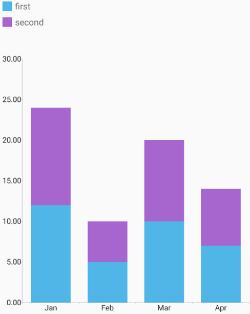

# RadChartView: Legend

In this article, you will learn to use the built-in legend in **RadChartView for Android**.

## Example

You can start from the [BarSeries]( "Read how to create a chart with BarSeries") example and add a second instance of the **BarSeries** with stack combine mode. Then you need to set their legend title and create a new instance of **RadLegendView**. **RadLegendView** needs a legend provider which will provide the data. You can use **RadCartesianChartView** as a **LegendProvider**:

```Java
	barSeries1.setCombineMode(ChartSeriesCombineMode.STACK);
	barSeries2.setCombineMode(ChartSeriesCombineMode.STACK);
	
	barSeries1.setLegendTitle("first");
	barSeries2.setLegendTitle("second");
	
	RadLegendView legendView = new RadLegendView(this);
	legendView.setLegendProvider(chartView);

	LinearLayout.LayoutParams params = new LinearLayout.LayoutParams(460,100);
	params.setMargins(10,10,10,10);
	legendView.setLayoutParams(params);

	LinearLayout linearLayout = new LinearLayout(this);
	linearLayout.setOrientation(LinearLayout.VERTICAL);

	linearLayout.addView(legendView);
	linearLayout.addView(chartView);
	
	ViewGroup rootView = (ViewGroup)findViewById(R.id.container);
	rootView.addView(linearLayout);
```
```C#
	barSeries1.CombineMode = ChartSeriesCombineMode.Stack;
	barSeries2.CombineMode = ChartSeriesCombineMode.Stack;

	barSeries1.LegendTitle = "first";
	barSeries2.LegendTitle = "second";

	RadLegendView legendView = new RadLegendView (this);
	legendView.LegendProvider = chartView;

	LinearLayout.LayoutParams layoutParams = new LinearLayout.LayoutParams(460,100);
	layoutParams.SetMargins(10,10,10,10);
	legendView.LayoutParameters = layoutParams;

	LinearLayout linearLayout = new LinearLayout(this);
	linearLayout.Orientation = Android.Widget.Orientation.Vertical;

	linearLayout.AddView(legendView);
	linearLayout.AddView(chartView);

	ViewGroup rootView = (ViewGroup)FindViewById(Resource.Id.container);
	rootView.AddView(linearLayout);
```
	
Here's the result:



### Orientation

The default behaviour of the RadLegendView is to show the legend items vertically. However you can change the orientation of the items to horizontal with:

```Java
   legendView.setLegendOrientation(LienarLayout.HORIZONTAL);
```
```C#
   legendView.LegendOrientation = LinearLayout.HORIZONTAL;
```


The posible values for the orientation are:

* LienarLayout.HORIZONTAL
* LienarLayout.VERTICAL

### Scrolling

By default the scroll of the legend items is **disabled**. In order to enable the horizontal and vertical scroll you can use:

```Java
   legendView.setCanScrollHorizontally(true);
   legendView.setCanScrollVertically(true);
```
```C#
   legendView.CanScrollHorizontally = true;
   legendView.CanScrollVertically = true;
```

Finally, the legend for the pie chart is a little bit different. The pie series does not have a legend title because each point
in the series means something different, the title is taken from the data points with a name binding. For example:

```Java
    PieSeries series = new PieSeries();
    // This assumes that the data models have a getter with
    // the signature public String getName().
    series.setNameBinding(new PropertyNameDataPointBinding("Name"));
```
```C#
    PieSeries series = new PieSeries();
    // This assumes that the data models have a property with
    // the signature public string Name { get; }.
    series.NameBinding = new PropertyNameDataPointBinding("Name");
``` 
