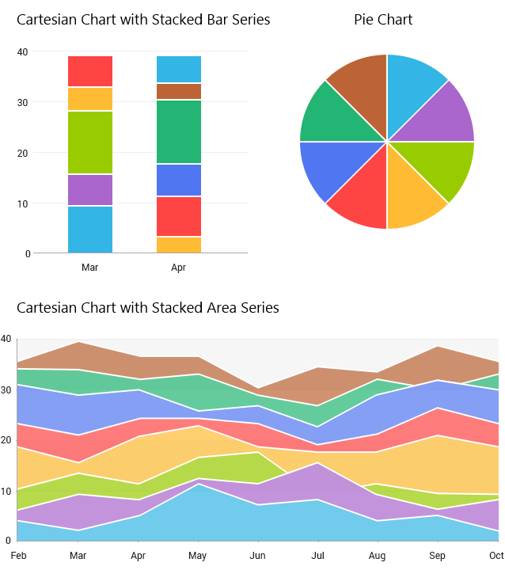

## ChartView for Xamarin.Android: Overview

**RadChartView for Xamarin.Android** is a charting component that has been designed for the mobile environment. It offers great performance in loading time, drawing capabilities and real-time updates. Its intuitive object model and public API allow you to easily setup complex chart objects and integrate them into your application. 

The control supports different chart types (and series) organized in hierarchies, depending on the coordinate system, used to plot the data points&mdash;for example Cartesian (**RadCartesianChartView**) and radial (**RadPieChartView**) coordinate systems.

A charting component in general is used to visualize (or plot) some data in a human-readable way through different representations like lines, areas, bars, pies, etc. Each series has a collection of data points&mdash;the data equivalent of a 2D point&mdash;and knows how to visualize them. Different series types may process certain types of data points&mdash;for example categorical series may contain categorical data points. An intuitive data binding mechanism transforms the raw data to appropriate data points depending on the chosen series.

## Chart Types

Depending on the coordinate system that you want to use for visualization of the data points, you can use the following chart types:

* [RadCartesianChartView]( "Read more about RadCartesianChartView"): As the name hints, this concrete chart control uses the Cartesian coordinate system to plot the data points in its chart series. The X and Y axes define how each point’s coordinates in the plot area are calculated.
* [RadPieChartView]( "Read more about RadPieChartView"): This concrete chart control visualizes its data points using radial coordinate system. Each data point is represented as a slice from a pie. The ratio between the space consumed by each slice and the space consumed by the whole chart is the same as the ratio between the value of the data point that it represents and the total value of all data points in the series.

### RadCartesianChartView

If you choose the Cartesian chart, you need to specify the type of each of the axes&mdash;horizontal and vertical&mdash;and the type of the series. Depending on the type of the series, you will need to choose axes that can visualize category or value (usually one axis to visualize the category and one to visualize value).

#### Axes that can visualize category

* [CategoricalAxis]( "Read more about CategoricalAxis"): Arranges the plotted data points in categories where the key of each category is the point's value (if available) for that axis or its index within the points collection. The point's coordinate, specified by this axis is discrete and is calculated depending on the size of the category slot where the point resides.
* [DateTimeCategoricalAxis]( "Read more about DateTimeCategoricalAxis"): This is a special categorical axis that expects each data point to provide a `java.util.Calendar` structure as its value for this axis. The points are grouped by a user-defined date-time component (Year, Month, Day, etc.) and then the groups are sorted chronologically.
* [DateTimeContinuousAxis]( "Read more about DateTimeContinuousAxis"): This is a special axis that expects each data point to provide a `java.util.Calendar` structure as its value for this axis. You can think of **DateTimeContinuousAxis** as a timeline where the coordinate of each data point is calculated depending on the position of its associated DateTime on the timeline. The base unit (or the timeline step) of the axis is calculated depending on the smallest difference between any two dates.

#### Axes that can visualize value

* [LinearAxis]( "Read more about LinearAxis"): Calculates the coordinate of each data point, depending on the actual numerical value this point provides for the axis. A **LinearAxis** exposes **Minimum** and **Maximum** properties to allow for explicit definition of the range of values visible on this axis. If these properties are not specified, the axis will automatically calculate the range, depending on the minimum and maximum data point values.
* [LogarithmicAxis]( "Read more about LogarithmicAxis"): Special linear axis that will transform each data point value using the logarithm function. Using **LogarithmicAxis** allows your app to show numerical data with huge delta between the minimum and the maximum to be visualized in a readable way.

#### Series supported by **RadCartesianChartView**

* [LineSeries]( "Read more about LineSeries"): Visualizes a collection of data points using a Line.
* [SplineSeries]( "Read more about SplineSeries"): Visualizes a collection of data points using a Curve.
* [AreaSeries]( "Read more about AreaSeries"): Represents a chart series that are visualized like an area figure in the Cartesian space.
* [SplineAreaSeries]( "Read more about SplineAreaSeries"): Represents series which define an area with smooth curves among points.
* [BarSeries]( "Read more about BarSeries"): Represents a chart series that plot their points using rectangular shapes, named "Bars". **RadCartesianChartView** can display **BarSeries** both horizontally and vertically. If the series are more than one, they can be stacked.
* [RangeBarSeries]( "Read more about RangeBarSeries"): Represents a chart range bar series. Both **BarSeries** and **RangeBarSeries** display its data points as bars. However the bars in **BarSeries** represent just a single value and the bars in **RangeBarSeries** represent low value and high value.

### RadPieChartView

The Pie chart doesn't have any axes. You just need to define the series that will contain the data. This chart supports these types of series:

* [PieSeries]( "Read more about PieSeries"): The **PieSeries** are used to visualize a single series of data in a pie chart. The sweep of a pie's slices is directly proportional to the magnitude of the data points' values.
* [DoughnutSeries]( "Read more about DoughnutSeries"): The **DoughnutSeries** are similar to the **PieSeries** with the difference that the data points are visualized in doughnut segments.

## Behaviors

Each chart can support different [behaviors]( "Read more about behaviors in Chart"), which allow a certain interactivity. A behavior is generally an abstraction that handles user input in a **RadChartView** instance and optionally provides visual feedback upon some action. Currently **RadChartView** supports the following behavior:

* [PanAndZoomBehavior]( "Read more about PanAndZoomBehavior"): This behavior handles touch events to enable panning and zooming of the associated chart plot area.
* [TrackballBehavior](): This behavior is responsible for rendering concise information about several data points in a small popup which displays over its relevant data points. A vertical line is also drawn through the data points for maximum clarity.
* [TooltipBehavior](): This behavior is used for rendering concise information about a data point in a small popup.
* [ChartSelectionBehavior](): Handles selecting and deselecting of either data points or series.

## Grid

RadChartView allows custom decoration over its plot area. You can add lines and stripes which connect the ticks of each axis. You can create a new **CartesianChartGrid** and set it to the **Grid** property of your Chart instance. Read the [Grid Section]( "Read more about Grid in RadChartView") for more information.

## Palettes

The [Chart Palettes]( "Read more about Palettes in Chart") are a set of predefined values that you can use to set colors of a chart. **RadChartView** gives you options to define your own palettes and to use the ones we have prepared for you as well: "Light" and "Dark".

## Annotations

Another feature of **RadChartView** is the ability to show [annotations]( "Read more about Annotations in Chart"). They are visual elements that can be used to highlight certain areas on the plot area and denote statistical significance. The provided types of annotations include:

* **CartesianGridLine**: In the case of the Cartesian chart, the grid line represents a vertical or horizontal line which crosses the entire plot area.
* **CartesianPlotBand**: The Cartesian Plot Band annotation is either a horizontal or a vertical stripe that crosses entirely the vertical or horizontal axis, respectively.
* **CartesianCustomAnnotation**: This class exposes the functionality of adding user-defined annotations to the **RadCartesianChart**.

## Labels

**RadChartView** can display different [labels]( "Read more about Labels in Chart") for the series and axes that are displayed. The labels can be fully customized according to your preferences.

## Legend

**RadChartView** supports a [legend]( "Read more about Legend in Chart") that facilitates the reading and understanding of the displayed information. The legend can be used to easily associate the displayed visualizations with the actual data.

## Xamarin.Android Examples

Xamarin.Android examples that show how to use RadChartView for Xamarin.Android are included in the Telerik UI for Xamarin zip file provided for manual installation. 

Telerik_UI_for_Xamarin_[version]_[license].zip, where [version] marks the release and [license] is replaced with Dev or Trial depending on the license, is available for download from the [Downloads section of your Telerik account](https://www.telerik.com/account/product-download?product=UIXAM). Unzip the archive and go to Examples/Android folder to access our Samples Xamarin.Android solution. 
