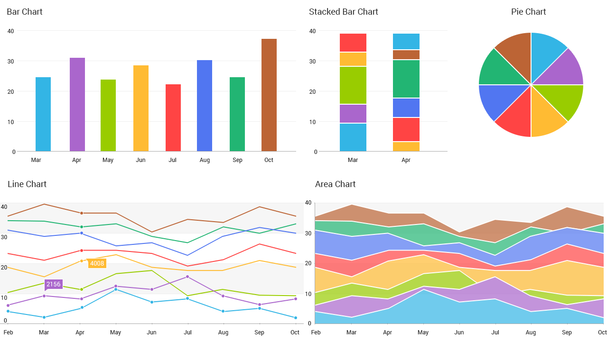
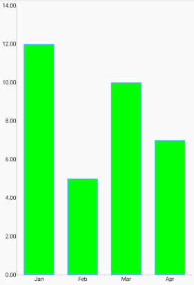

## ChartView for Xamarin.Android: Palettes

In this article you will learn to use the predefined palettes in **RadChartView for Xamarin.Android** and also how to create custom palettes.

## Default Palette

In order to provide the default styles for its series, RadChartView uses palettes. Each palette defines a set of styles for the different series and axes types. Here's a demonstration for some of the colors which are provided by the default palette:



## Creating Custom Palettes

All chart objects (RadPieChartView and RadCartesianChartView) have a **Palette** property which allows you to apply a new palette that you have defined. 

Here's an example of setting a custom palette to an instance of RadCartesianChartView.

Let's start with the chart created in the [Bar Series]( "Read how to create a chart with BarSeries") example:

```C#
// Use a copy of the existing palette in order to avoid redefining the whole palette.
// We are only interested in changing the color of the bar series.
ChartPalette customPalette = chartView.Palette.ClonePalette();

// Get the entry for the first bar series.
PaletteEntry barEntry = customPalette.GetEntry(ChartPalette.BarFamily);
barEntry.Fill = Color.Green;

// Also if there are more than one bar series we can get the entry for any of them with their index in the collection.
// Edit the entry for the second bar series.
barEntry = customPalette.GetEntry(ChartPalette.BarFamily, 1);
barEntry.Fill = Color.Cyan;

chartView.Palette = customPalette;
```

Here is the result:



> It is important to note that the chart palette will override all settings set manually by the developer. To prevent the chart palette from overriding the manual settings, developers must set the chartElement.CanApplyPalette to False. This prevents the palette from being applied to the given chart element (axis, series etc.) and the developer can take full control over the visual customization.

## Custom Palette Family

Finally, developers can take advantage of custom palette families. Each chart element (axis, series, etc.) has a PaletteFamily property that can be used to set a custom family. This is useful when we want to style different elements in the same way. 

For example in a scenario where we have multiple axes, each series can be paired with its relevant axis by using the same color. To apply the fill or stroke to both the axis and the series developers must call series.PaletteFamily = "CustomFamily" and axis.PaletteFamily = "CustomFamily".

