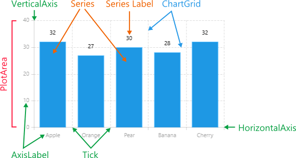

# RadChartView: Visual Structure

In this article, you will learn which are the visual elements and terms used in **RadChartView for Xamarin.Android**.

## Visual Structure

## Legend

* **PlotArea**: The area that contains the data series (on the image it is the area inside the rectangle defined by the axes).
* **Series**: The visual representation of the data.
* **SeriesLabel**: Labels that provide specific information about the data points in the series.
* **VerticalAxis/HorizontalAxis**: Axes that define the coordinate system used to plot the data.
* **Tick**: Marks specific values on the axes.
* **AxisLabel**: Labels for specific values on the axes.
* **ChartGrid**: Grid lines that mark specific values on the chart area.
