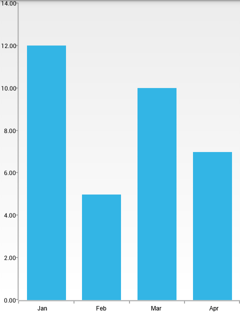

# RadChartView: BarSeries

**RadCartesianChartView** visualizes each data point from the **BarSeries** as a rectangle. These rectangles (or bars) can be displayed either horizontally, or vertically, depending on whether the **CategoricalAxis** is the vertical axis or the horizontal. When the horizontal axis is categorical, the rectangles are displayed vertically. This means that they have equal width while their height represents the numerical value of each of the data points. On the other hand, when the vertical axis is categorical, the rectangles have equal height, while their width represents the value of the data point. The **BarSeries** extend **CategoricalSeries** and require one **CategoricalAxis** and one **LinearAxis**.

## Example

You can read from the [Getting Started]( "Read how to define the MonthResult type") page how to define the `MonthResult` type and declare the **initData()** method.

After you create the method for initialization of sample data, you can create a **RadCartesianChartView** with **BarSeries** by adding the following code to the **onCreate()** method of your Activity.

```Java
	initData();

	RadCartesianChartView chartView = new RadCartesianChartView(this);

	BarSeries barSeries = new BarSeries();
	barSeries.setCategoryBinding(new PropertyNameDataPointBinding("Month"));
	barSeries.setValueBinding(new PropertyNameDataPointBinding("Result"));
	barSeries.setData(this.monthResults);
	chartView.getSeries().add(barSeries);

	CategoricalAxis horizontalAxis = new CategoricalAxis();
	chartView.setHorizontalAxis(horizontalAxis);

	LinearAxis verticalAxis = new LinearAxis();
	chartView.setVerticalAxis(verticalAxis);

	ViewGroup rootView = (ViewGroup)findViewById(R.id.container);
	rootView.addView(chartView);
```
```C#
	InitData();

	RadCartesianChartView chartView = new RadCartesianChartView(this);

	BarSeries barSeries = new BarSeries();
	barSeries.CategoryBinding = new MonthResultDataBinding ("Month");
	barSeries.ValueBinding = new MonthResultDataBinding ("Result");
	barSeries.Data = (Java.Lang.IIterable)this.monthResults;
	chartView.Series.Add(barSeries);

	CategoricalAxis horizontalAxis = new CategoricalAxis();
	chartView.HorizontalAxis = horizontalAxis;

	LinearAxis verticalAxis = new LinearAxis();
	chartView.VerticalAxis = verticalAxis;

	ViewGroup rootView = (ViewGroup)FindViewById(Resource.Id.container);
	rootView.AddView(chartView);
```

> This example assumes that your root container has id `container`

Here's the result:



## Properties and customization

### Rounded edges

The bars that are used to represent the data points in **BarSeries** can have their corners rounded. This can be achieved by using the **setAreBarsRounded(boolean)** method. When the value that is set is `true`, the corners are rounded. You can use **getAreBarsRounded()** in order to check the current value. The rounding radius can be checked and modified by using the **getRoundBarsRadius()** and **setRoundBarsRadius(float)**. If you try to set a negative value, an `IllegalArgumentException` will be thrown. Here's an example of **BarSeries** when their round bar radius is set to `10`:

```Java
	barSeries.setAreBarsRounded(true);
	barSeries.setRoundBarsRadius(10);
```
```C#
	barSeries.AreBarsRounded = true;
	barSeries.RoundBarsRadius = 10;
```

And here's the result:


## Customization

**BarSeries** provide the following way to change their style:

* **setStrokeColor(int)**: changes the color used to draw lines around the bars. In order to get the current value, use **getStrokeColor()**.
* **setStrokeWidth(float)**: changes the width of the lines around the bars. In order to get the current value, use **getStrokeWidth()**.
* **setFillColor(int)**: changes the color used to fill the bar shapes. In order to get the current value, use **getFillColor()**.

You can also customize the appearance of **BarSeries** by using [Palettes]( "Read how to use Palettes in RadChartView").
