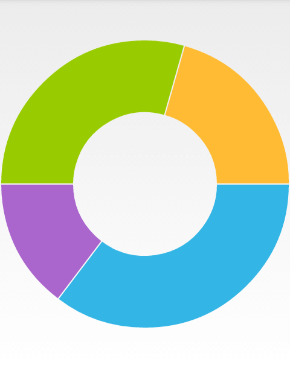
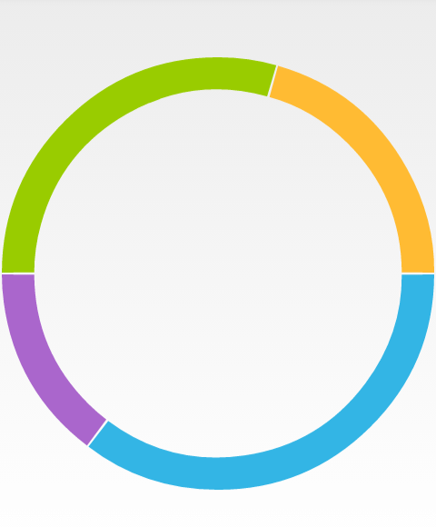
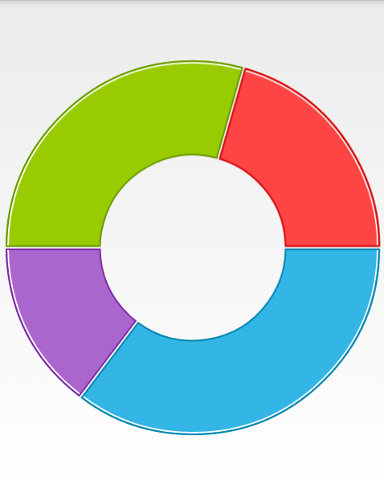

# DoughnutSeries

The **DoughnutSeries** class inherit from **PieSeries** and are also used to visualize series of data in a **RadPieChartView**. The difference between adding **DoughnutSeries** compared to adding **PieSeries** is that there will be a blank portion in center.

## Example

You can read from the [Getting Started]( "Read how to define the MonthResult type") page how to define the `MonthResult` type and declare the **initData()** method.

After you create the method for initialization of sample data, you can create a **RadPieChartView** with **DoughnutSeries** by adding the following code to the **onCreate()** method of your Activity.

```C#
InitData();

RadPieChartView chartView = new RadPieChartView(this);

DoughnutSeries doughnutSeries = new DoughnutSeries();

doughnutSeries.ValueBinding = new MonthResultDataBinding ("Result");
doughnutSeries.Data = (Java.Lang.IIterable)this.monthResults;
chartView.Series.Add(doughnutSeries);

ViewGroup rootView = (ViewGroup)FindViewById(Resource.Id.container);
rootView.AddView(chartView);
```

Here's the result:



## Properties and customization

The **DoughnutSeries** class inherit from [PieSeries]( "Read more about the PieSeries"), so you can use the same customization options. Additionally in **DoughnutSeries**, you can change the inner radius factor through **InnerRadiusFactor** property. The default value that you will get initially is `0.5`. This means that the radius of the blank segment in the center will be half as long as the radius of the **RadPieChartView** instance.

> The possible values for the inner radius factor are the values in the (0,1) interval.

Here's an example of how to enlarge the blank portion:

```C#
doughnutSeries.InnerRadiusFactor = 0.85f;
```

And the result is:



## Styles

The default colors used for **DoughnutSeries** come from the default palette, you can change the palette as described in [this article]( "Read how to use Palettes in RadChartView") or use the styles as demonstrated here

### Slice Styles

The **SliceStyle** class allow you to create a set of stroke and fill colors which you can easily apply to the slices in a pie chart. Here's one simple **SliceStyle**:


```C#
SliceStyle style1 = new SliceStyle();
style1.FillColor = Color.Argb(255, 51, 181, 229);
style1.StrokeColor = Color.Argb(255, 0, 130, 173);
style1.StrokeWidth = 2;
style1.ArcColor = Color.White;
style1.ArcWidth = 2;
```

As you can see, you can modify the color of the fill of the segments, their stroke color and width and additionally you can add an arc that is drawn between the stroke and the fill. Please note, that the arc is drawn not around the whole segment but only on its arc. Once you have create a few styles, you can add them in a `List<SliceStyle>` and set it to your **DoughnutSeries** instance:

```C#
List<SliceStyle> styles = new List<SliceStyle>();
styles.Add(style1);
doughnutSeries.SliceStyles = styles;
```

Here's the result when we add a collection of four styles similar to the one in the example:



### Slice Offset

As you may have noticed, there is a thin line between the segments. You can change its width through the **SliceOffset** property. If you set it to `0`, the line will be removed:

```C#
doughnutSeries.SliceOffset = 0;
```
