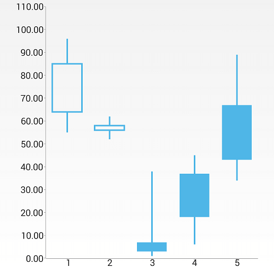

# Financial Series

The financial series are represented by the **OhlcSeries** and **CandlestickSeries** classes. They must be added to RadCartesianChartView and the chart must be configured with a CategoricalAxis and a NumericalAxis. Both financial series use OhlcDataPoint for data points internally and they only differ in the way they visualize the data point. OHLC stands for Open, High, Low and Close.

A more detailed explanation of an OHLC and a Candlestick chart can be found <a href="http://en.wikipedia.org/wiki/Open-high-low-close_chart" target="_blank">here</a> and <a href="http://en.wikipedia.org/wiki/Candlestick_chart" target="_blank">here</a> respectively. To populate a financial series with data developers need to set five bindings in contrast
with only two for a BarSeries for example. Like any categorical series both financial series need a category binding. In addition they need bindings for the financial components. These are an open binding, a high binding, a low binding and a close binding.

## Example

To initialize a sample financial chart the following code can be used:

```C#
RadCartesianChartView chartView = new RadCartesianChartView(this);

CandlestickSeries series = new CandlestickSeries();
series.CategoryBinding = new OhlcDataBinding("category");
series.OpenBinding = new OhlcDataBinding("open");
series.HighBinding = new OhlcDataBinding("high");
series.LowBinding = new OhlcDataBinding("low");
series.CloseBinding = new OhlcDataBinding("close");

series.Data = (Java.Lang.IIterable)this.GenerateOhlcData();
chartView.Series.Add(series);

CategoricalAxis horizontalAxis = new CategoricalAxis();
chartView.HorizontalAxis = horizontalAxis;

LinearAxis verticalAxis = new LinearAxis();
chartView.VerticalAxis = verticalAxis;

ViewGroup rootView = (ViewGroup)this.FindViewById(Resource.Id.container);
rootView.AddView(chartView);
```

Here are also the OhlcData class and the GenerateOhlcData() method:

```C#
public class OhlcData : Java.Lang.Object {
	public String category;
	public int open;
	public int high;
	public int low;
	public int close;
}

private Java.Util.ArrayList GenerateOhlcData() {
	Random r = new Random();
	Java.Util.ArrayList data = new Java.Util.ArrayList();
	int size = 10;

	for (int i = 1; i <= size; ++i) {
		OhlcData ohlc = new OhlcData();
		ohlc.category = i.ToString();
		ohlc.high = r.Next(100);
		if (ohlc.high < 2) {
			ohlc.high = 2;
		}

		ohlc.low = r.Next(ohlc.high - 1);
		ohlc.open = ohlc.low + r.Next(ohlc.high - ohlc.low);
		ohlc.close = ohlc.low + r.Next(ohlc.high - ohlc.low);

		data.Add(ohlc);
	}

	return data;
}

class OhlcDataBinding : DataPointBinding {

	private string propertyName;

	public OhlcDataBinding(string propertyName)
	{
		this.propertyName = propertyName;
	}

	public override Java.Lang.Object GetValue (Java.Lang.Object p0)
	{
		switch (propertyName) {
			case "category":
				return ((OhlcData)(p0)).category;
			case "open":
				return ((OhlcData)(p0)).open;
			case "high":
				return ((OhlcData)(p0)).high;
			case "low":
				return ((OhlcData)(p0)).low;
			case "close":
				return ((OhlcData)(p0)).close;
		}
		return null;
	}
}
```

Finally, here's the result:



> The OhlcSeries class is identical in terms of usage and initialization.

## Customization

You can also customize the appearance of the financial series by using [palettes]( "Read how to use Palettes in RadChartView").
