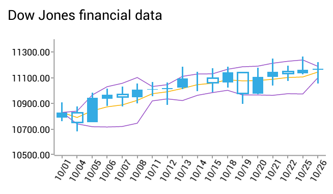

# RadChartView: Financial Indicators

**RadCartesianChartView** visualizes each data item from the **Indicator Series** using a LineRenderer. The **Indicator Series** extend **CartesianSeries** and they require one **CategoricalAxis** and one **LinearAxis**.

## Overview

The financial, or also called stock indicators, are mainly used for keeping track of stock prices and patterns of price changes over time. You can find further information about what indicators are and what they are being used for by following this link: <a href="http://www.investopedia.com/terms/t/technicalindicator.asp" target="_blank">Short information about financial indicators.</a>

In terms of using the indicators in the RadCartesianChartView you will need to add them as you would add any other Cartesian series. Every indicator has a related formula by which it calculates the expected result. All you need to do is provide the needed data.

There are two types of indicators in terms of setting their properties and getting them ready for displaying your stock data:

1. Indicators that have a category and a value(usually the close) bindings as well as one or more periods.
2. Indicators that have a category and high/low/close value bindings as well as none, one, or more periods.

There are some special cases which will be reviewed separately.

## Examples

The following examples will cover the common settings for every type as well as state the specific differences that some indicators require.

All the examples expect you to provide your own ohlc data. The class used in the examples is as follows:


```C#
	public class FinancialDataClass : Java.Lang.Object {

		public float open;
		public float high;
		public float low;
		public float close;
		public float volume;

		public Java.Util.Calendar date;

		public FinancialDataClass(
			Java.Util.Calendar date, 
			float open, float high, float low, float close, 
			float volume) {
			
			this.open = open;
			this.high = high;
			this.low = low;
			this.close = close;
			this.date = date;
			this.volume = volume;
		}
	}
```

### First type

Indicators from the first type are: **ExponentialMovingAverageIndicator, ModifiedExponentialMovingAverageIndicator, ModifiedMovingAverageIndicator, MomentumIndicator, MovingAverageIndicator, RateOfChangeIndicator, RelativeStrengthIndexIndicator, TrixIndicator, WeightedMovingAverageIndicator, AdaptiveMovingAverageKaufmanIndicator, BollingerBandsIndicator, RelativeMomentumIndexIndicator, MacdIndicator, OscillatorIndicator, RaviIndicator**

Initializing any of these is the same, so the next example shows the process with only one of them:


```C#
	MovingAverageIndicator indicator = new MovingAverageIndicator();
	indicator.Period = 5;
	indicator.CategoryBinding = new OhlcDataBinding("category");
	indicator.ValueBinding = new OhlcDataBinding("close");
	indicator.Data = (Java.Lang.IIterable)this.GenerateOhlcData();
	chartView.Series.Add(indicator);
```

The rest of the indicators from this category will need the same settings, but will behave accordingly to their own algorithms.

Exceptions in this category are in the following indicators:

1. **AdaptiveMovingAverageKaufmanIndicator** needs to have **setSlowPeriod(int);** and **setFastPeriod(int);**.
2. **BollingerBandsIndicator** needs **setStandardDeviations(int)**.
3. **RelativeMomentumIndexIndicator** needs **setMomentumPeriod(int);**.
4. **MacdIndicator** needs **setLongPeriod(int);**, **setShortPeriod(int);** and **setSignalPeriod(int);**
5. **OscillatorIndicator** needs **setLongPeriod(int);** and **setShortPeriod(int);**
6. **RaviIndicator** needs **setLongPeriod(int);** and **setShortPeriod(int);**

### Second type
Indicators of the second type are: **AverageTrueRangeIndicator, CommodityChannelIndexIndicator, StochasticFastIndicator, StochasticSlowIndicator, TrueRangeIndicator, UltimateOscillatorIndicator**

All indicators from the second type are binded to multiple values, instead of just one value(close). Some of them have multiple periods, some use one and some use no periods. The initialization for all of them includes setting the proper bindings:


```C#
	TrueRangeIndicator indicator = new TrueRangeIndicator();
	indicator.CategoryBinding = new OhlcDataBinding("category");
	indicator.CloseBinding = new OhlcDataBinding("close");
	indicator.HighBinding = new OhlcDataBinding("high");
	indicator.LowBinding = new OhlcDataBinding("low");
	chartView.Series.Add(indicator);
```

This will be enough for setting a TrueRangeIndicator, since it doesn't use a period.
Every other indicator from this category will need some additional period settings as follows:

1. StochasticFastIndicator needs setMainPeriod(int); and setSignalPeriod(int);
2. StochasticSlowIndicator needs setMainPeriod(int);, setSignalPeriod(int); and setSlowPeriod(int);
3. AverageTrueRangeIndicator needs setPeriod(int);
4. CommodityChannelIndexIndicator needs setPeriod(int);
5. UltimateOscillatorIndicator needs setPeriod(int);, setPeriod2(int); and setPeriod3(int);

### Full example code

Here are two indicators in action:



And here is the code for the example:


```C#
	RadCartesianChartView chart = new RadCartesianChartView(this);

	// This example assumes that your root container has id `container`
	ViewGroup rootView = (ViewGroup)this.FindViewById(Resource.Id.container);
	rootView.AddView(chart);

	DateTimeCategoricalAxis horizontalAxis = new DateTimeCategoricalAxis();
	horizontalAxis.DateTimeFormat = new SimpleDateFormat("MM/dd");
	horizontalAxis.DateTimeComponent = DateTimeComponent.Date;
	horizontalAxis.LabelFitMode = AxisLabelFitMode.Rotate;

	LinearAxis verticalAxis = new LinearAxis();

	DataPointBinding categoryBinding = new OhlcDataBinding("date");
	DataPointBinding openBinding = new OhlcDataBinding("open");
	DataPointBinding highBinding = new OhlcDataBinding("high");
	DataPointBinding lowBinding = new OhlcDataBinding("low");
	DataPointBinding closeBinding = new OhlcDataBinding("close");

	Java.Lang.IIterable data = (Java.Lang.IIterable)this.GenerateOhlcData ();

	CandlestickSeries series = new CandlestickSeries();
	series.CategoryBinding = categoryBinding;
	series.OpenBinding = openBinding;
	series.HighBinding = highBinding;
	series.LowBinding = lowBinding;
	series.CloseBinding = closeBinding;
	series.Data = data;

	BollingerBandsIndicator bollingerBands = new BollingerBandsIndicator();
	bollingerBands.CategoryBinding = categoryBinding;
	bollingerBands.ValueBinding = closeBinding;
	bollingerBands.Period = 5;
	bollingerBands.StandardDeviations = 2;
	bollingerBands.Data = data;

	MovingAverageIndicator movingAverage = new MovingAverageIndicator();
	movingAverage.CategoryBinding = categoryBinding;
	movingAverage.ValueBinding = closeBinding;
	movingAverage.Period = 5;
	movingAverage.Data = data;

	chart.VerticalAxis = verticalAxis;
	chart.HorizontalAxis = horizontalAxis;
	chart.Series.Add(series);
	chart.Series.Add(bollingerBands);
	chart.Series.Add(movingAverage);
	
	...
	
	private Java.Util.ArrayList GenerateOhlcData() {
		Random r = new Random();
		Java.Util.ArrayList data = new Java.Util.ArrayList();
		int size = 10;

		for (int i = 1; i <= size; ++i) {
			OhlcData ohlc = new OhlcData();
			ohlc.category = i.ToString();
			ohlc.high = r.Next(100);
			if (ohlc.high < 2) {
				ohlc.high = 2;
			}

			ohlc.date = new Java.Util.GregorianCalendar (2014, 9, i);
			ohlc.low = r.Next(ohlc.high - 1);
			ohlc.open = ohlc.low + r.Next(ohlc.high - ohlc.low);
			ohlc.close = ohlc.low + r.Next(ohlc.high - ohlc.low);

			data.Add(ohlc);
		}

		return data;
	}
	
	class OhlcDataBinding : DataPointBinding {

		private string propertyName;

		public OhlcDataBinding(string propertyName)
		{
			this.propertyName = propertyName;
		}

		public override Java.Lang.Object GetValue (Java.Lang.Object p0)
		{
			switch (propertyName) {
				case "category":
					return ((OhlcData)(p0)).category;
				case "open":
					return ((OhlcData)(p0)).open;
				case "high":
					return ((OhlcData)(p0)).high;
				case "low":
					return ((OhlcData)(p0)).low;
				case "close":
					return ((OhlcData)(p0)).close;
				case "date":
					return ((OhlcData)(p0)).date;
			}
			return null;
		}
	}
```

## Customization

**Financial Indicators** are using a **LineRenderer** which makes them LineSeries, that simply have a different algorithm when it comes to handling data points. They can be styled the same way you would style a LineSeries. The default palette styles are still being applied if not overriden by the user.

You can also customize the appearance of **Financial Series** by using [Palettes]( "Read how to use Palettes in RadChartView").
