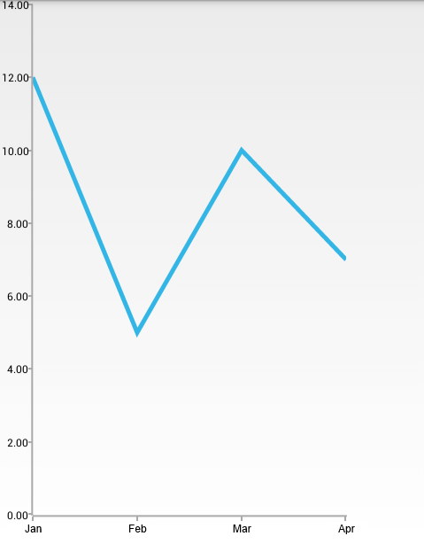

# LineSeries

**RadCartesianChartView** visualizes each data item from the **LineSeries** and connects them with straight line segments. The **LineSeries** extend **CategoricalStrokedSeries**, so they are also **CategoricalSeries** and require one **CategoricalAxis** and one **LinearAxis**.

## Example

You can read from the [Getting Started]( "Read how to define the MonthResult type") page how to define the `MonthResult` type and declare the **initData()** method.

After you create the method for initialization of sample data, you can create a **RadCartesianChartView** with **LineSeries** by adding the following code to the **onCreate()** method of your Activity.

```C#
InitData();

RadCartesianChartView chartView = new RadCartesianChartView(this);

LineSeries lineSeries = new LineSeries();
lineSeries.CategoryBinding = new MonthResultDataBinding ("Month");
lineSeries.ValueBinding = new MonthResultDataBinding ("Result");
lineSeries.Data = (Java.Lang.IIterable)this.monthResults;
chartView.Series.Add(lineSeries);

CategoricalAxis horizontalAxis = new CategoricalAxis();
chartView.HorizontalAxis = horizontalAxis;

LinearAxis verticalAxis = new LinearAxis();
chartView.VerticalAxis = verticalAxis;

ViewGroup rootView = (ViewGroup)FindViewById(Resource.Id.container);
rootView.AddView(chartView);
```

> This example assumes that your root container has id `container`

Here's the result:



## Customization

**LineSeries** extend **CategoricalStrokedSeries** which provide the following way to change their style:

* **StrokeColor**: changes the color used to draw lines.
* **StrokeThickness**: changes the width of the lines.

You can also customize the appearance of **LineSeries** by using [Palettes]( "Read how to use Palettes in RadChartView").
