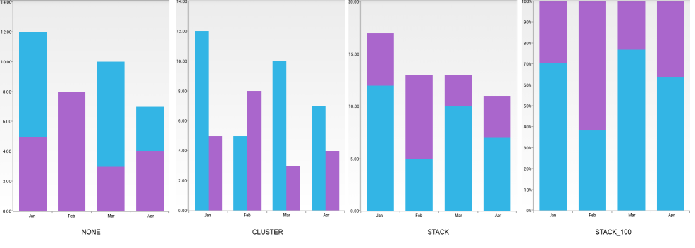

# RadChartView: Series Overview

The data visualization in **RadChartView** is done by a hierarchy of classes that inherit from the **ChartSeries** class. Each series has a collection of data items which provide the data. Concrete series types are available for specific charts. For example, there is a set of **CartesianSeries** applicable in the context of a **RadCartesianChartView**.

## Abstract Series:

These are the base series that are extended by the actual series implementations in order to provide a clear level of abstraction and define more clearly the common features among the different series types.

* **ChartSeries**: The **ChartSeries** class is a base class for all types of series used in **RadChartView**.
* **PointTemplateSeries**: The **PointTemplateSeries** class extends **ChartSeries** with capabilities for customization of the visualization.
* **CartesianSeries**: The **CartesianSeries** class extends **PointTemplateSeries** and it is the base class for series used by **RadCartesianChartView**.
* **CategoricalSeries**: The **CategoricalSeries** class extends **CartesianSeries**. These series present the data in a chart with Cartesian coordinates, where one of the axes is categorical and the other is linear. They can visualize categorical data that has category and value properties.
* **CategoricalStrokedSeries**: The **CategoricalStrokedSeries** extends **CategoricalSeries** and it is a base class for series that are visually represented by data points connected with strokes.
* **RangeSeriesBase**: The **RangeSeriesBase** extends **CartesianSeries** and it is a base class for range series which present categorical data with more than one value property.

### CategoricalSeries

The **CategoricalSeries** is an abstract class which is extended by series which can present categorical data. This data needs category and value properties which determine the Cartesian coordinates of each data point.

#### Bindings

The **CategoricalSeries** class contains **setCategoryBinding(DataPointBinding)** and **setValueBinding(DataPointBinding)** methods which accept a `DataPointBinding` object as a parameter which defines the way the 
necessary information will be extracted from each data item. For example if our data item type is defined as follows:

```Java
    public class MonthResult {
        private String month;
        private double result;

        public MonthResult(String month, double result) {
            this.setMonth(month);
            this.setResult(result);
        }

        public double getResult() {
            return this.result;
        }

        public void setResult(double value) {
            this.result = value;
        }

        public String getMonth() {
            return this.month;
        }

        public void setMonth(String value) {
            this.month = value;
        }
    }
```
```C#
	public class MonthResult : Java.Lang.Object {

		public double Result { get; set; }
		public String Month { get; set; }

		public MonthResult(String month, double result) {
			this.Month = month;
			this.Result = result;
		}
	}
```

If we want to use the result of the data item as a value for our data points that will be visualized by the chart, we can define the `DataPointBinding` object for the value like this:

```Java
	DataPointBinding valueBinding = new PropertyNameDataPointBinding("Result");
```
```C#
	class MonthResultDataBinding : DataPointBinding {

		private string propertyName;

		public MonthResultDataBinding(string propertyName)
		{
			this.propertyName = propertyName;
		}

		public override Java.Lang.Object GetValue (Java.Lang.Object p0)
		{
			if(propertyName == "Month")
			{
				return ((MonthResult)(p0)).Month;
			}
			return ((MonthResult)(p0)).Result;
		}
	}
```

Similarly, if we want to use the month of the data item as a category for our data points that will be visualized by the chart, we can define the `DataPointBinding` object for the category like this:

```Java
	DataPointBinding categoryBinding = new PropertyNameDataPointBinding("Month");
```
```C#	
	class MonthResultDataBinding : DataPointBinding {

		private string propertyName;

		public MonthResultDataBinding(string propertyName)
		{
			this.propertyName = propertyName;
		}

		public override Java.Lang.Object GetValue (Java.Lang.Object p0)
		{
			if(propertyName == "Month")
			{
				return ((MonthResult)(p0)).Month;
			}
			return ((MonthResult)(p0)).Result;
		}
	}
```

Then, we can use these objects with series that extend **CategoricalSeries**, for example **LineSeries**:

```Java
	LineSeries lineSeries = new LineSeries();
	lineSeries.setCategoryBinding(categoryBinding);
	lineSeries.setValueBinding(valueBinding);
```
```C#
	LineSeries lineSeries = new LineSeries();
	lineSeries.CategoryBinding = new MonthResultDataBinding ("Month");
	lineSeries.ValueBinding = new MonthResultDataBinding ("Result");
```

If you need to retrieve the current `DataPointBinding` objects for the value and category bindings, you can use the **getValueBinding()** and **getCategoryBinding()** respectively.

#### Combine Mode

When the series in a **RadCartesianChartView** are more than one, a few different drawing strategies can be used. The possible strategies are:

* **None**: The series are not combined - each series is plotted independently.
* **Cluster**: Series are combined next to each other (applicable for **BarSeries**).
* **Stack**: Series form stacks.
* **Stack100**: Series form stacks that occupy 100% of the plot area and the characteristic size of each series is proportional to its relative value.

The default combine mode is `None`. You can get the current value through the **getCombineMode()** method and set a new value through **setCombineMode(ChartSeriesCombineMode value)**. For example if you have two **BarSeries**, you need to set the combine mode to both of them if you want to make them stacked:

```Java
	barSeries1.setCombineMode(ChartSeriesCombineMode.STACK);
	barSeries2.setCombineMode(ChartSeriesCombineMode.STACK);
```
```C#
	barSeries1.CombineMode = ChartSeriesCombineMode.Stack;
	barSeries2.CombineMode = ChartSeriesCombineMode.Stack;
```

Here's how a chart with two **BarSeries** looks with the different combine modes:



### RangeSeriesBase

The **RangeSeriesBase** is an abstract class which is extended by series which can present categorical data with more than one value property. The data needs not only category, but also 2 value properties: low value and high value. The series visaulize the whole range between the low value and the high value.

The binding mechanizm in **RangeSeriesBase** is the same as in **CategoricalSeries**. The methods that set the bindings are **setCategoryBinding(DataPointBinding)**, **setHighBinding(DataPointBinding)** and **setLowBinding(DataPointBinding)**. These series need two value bindings &mdash; low and high &mdash; in order to determine the start point and the end point of each data point.

## **RadCartesianChartView** Series

**RadCartesianChartView** is a **RadChartView** which visualizes series as data points with Cartesian coordinates. Here is a list with the series types which provide data that can be plot on **RadCartesianChartView**:

* [LineSeries]( "Read more about LineSeries"): The **LineSeries** extend **CategoricalStrokedSeries**. **RadCartesianChartView** visualizes these series as data points connected with straight line segments.
* [SplineSeries]( "Read more about SplineSeries"): The **SplineSeries** extend **LineSeries**. **RadCartesianChartView** visualizes these series as data points connected with curved line segments.
* [AreaSeries]( "Read more about AreaSeries"): The **AreaSeries** also extend **CategoricalStrokedSeries**. **RadCartesianChartView** visualizes these series as the area on the chart that is enclosed by the coordinate axes and straight line segments that connect the data points represented by these series.
* [SplineAreaSeries]( "Read more about SplineAreaSeries"): The **SplineAreaSeries** extend **AreaSeries**. The difference with the **AreaSeries** is that the segments that connect the data points are connected with curved line segments.
* [BarSeries]( "Read more about BarSeries"): The **BarSeries** extend the **CategoricalSeries**, which means that they also need to have one categorical and one linear axis. The data points are represented by rectangle shapes.
* [RangeBarSeries]( "Read more about RangeBarSeries"): The **RangeBarSeries** extend the **RangeSeriesBase**. They represent the data by rectangle shapes in a way similar to **BarSeries**. The difference is that the bars are not necessarily drawn from the beginning of the categorical axis, unless the low value of the data point, that they represent, has a value of 0.

## **RadPieChartView** Series

* [PieSeries]( "Read more about PieSeries"): The **PieSeries** extend **ChartSeries** and are used by **RadPieChartView** to represent data in the shape of a pie. Each data item is visually represented by a pie slice. The ratio between the space consumed by each slice and the space consumed by the whole chart is the same as the ratio between the value of the data point that it represents and the total value of all data points in the series.
* [DoughnutSeries]( "Read more about DoughnutSeries"): The **DoughnutSeries** extend **PieSeries**. The difference is that an instance of **RadPieChartView** with **DoughnutSeries** will have a blank portion in the center.
