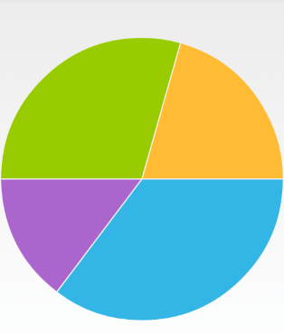
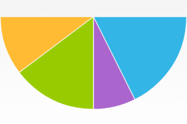

## ChartView for Xamarin.Android: PieSeries

**RadPieChartView** visualizes the **PieSeries** in the shape of a pie. Each data item is visually represented by a pie slice. The ratio between the space consumed by each slice and the space consumed by the whole chart is the same as the ratio between the value of the data point that it represents and the total value of all data points in the series.

## Example

You can read from the [Getting Started]( "Read how to define the MonthResult type") page how to define the `MonthResult` type and declare the **initData()** method.

After you create the method for initialization of sample data, you can create a **RadPieChartView** with **PieSeries** by adding the following code to the **onCreate()** method of your Activity.

```C#
InitData();

RadPieChartView chartView = new RadPieChartView(this);

PieSeries pieSeries = new PieSeries();

pieSeries.ValueBinding = new MonthResultDataBinding ("Result");
// The name binding is used in the legend to show what the given pie slice value means.
pieSeries.NameBinding = new MonthResultDataBinding ("Name");
pieSeries.Data = (Java.Lang.IIterable)this.monthResults;
chartView.Series.Add(pieSeries);

ViewGroup rootView = (ViewGroup)FindViewById(Resource.Id.container);
rootView.AddView(chartView);
```

Here's the result:



## Properties and customization

### Radius Factor

Before the **RadPieChartView** instance is drawn, its radius needs to be calculated. By default the radius is set to value so that the whole chart will fill the whole available space. Then the radius factor is applied. The default value for the radius factor is `1.0`. This means that the radius will remain to a value significant to fill the entire space that is available for **RadPieChartView**. You can use the **RadiusFactor** property in order to change it. For example, here's how to modify the radius factor, so that the pie consumes only half of the available space:

```C#
 pieSeries.RadiusFactor = 0.5;
```

### Angle Range

The default value of the angle range used to visualize the data from **PieSeries** is the range `[0, 360]`. If you want to change this, you can use the **AngleRange** property and specify a new range. For example, here's how you can set a new range so that the data is presented in a semicircle:

```C#
pieSeries.AngleRange = new AngleRange(0,180);
```

And this is the result:



## Styles

The default colors used for **PieSeries** come from the default palette, you can change the palette as described in [this article]( "Read how to use Palettes in RadChartView") or use the styles as demonstrated here

### Slice Styles

The **SliceStyle** class allow you to create a set of stroke and fill colors which you can easily apply to the slices in a pie chart. Here's one simple **SliceStyle**:

```C#
SliceStyle style1 = new SliceStyle();
style1.FillColor = Color.Argb(255, 51, 181, 229);
style1.StrokeColor = Color.Argb(255, 0, 130, 173);
style1.StrokeWidth = 2;
style1.ArcColor = Color.White;
style1.ArcWidth = 2;
```

As you can see, you can modify the color of the fill of the segments, their stroke color and width and additionally you can add an arc that is drawn between the stroke and the fill. Please note, that the arc is drawn not around the whole segment but only on its arc. Once you have create a few styles, you can add them in a `List<SliceStyle>` and set it to your **PieSeries** instance:

```C#
List<SliceStyle> styles = new List<SliceStyle>();
styles.Add(style1);
pieSeries.SliceStyles = styles;
```

Here's the result when we add a collection of four styles similar to the one in the example:


### Slice Offset

As you may have noticed, there is a thin line between the segments. You can change its width through the **SliceOffset** property. If you set it to `0`, the line will be removed:

```C#
pieSeries.SliceOffset = 0;
```