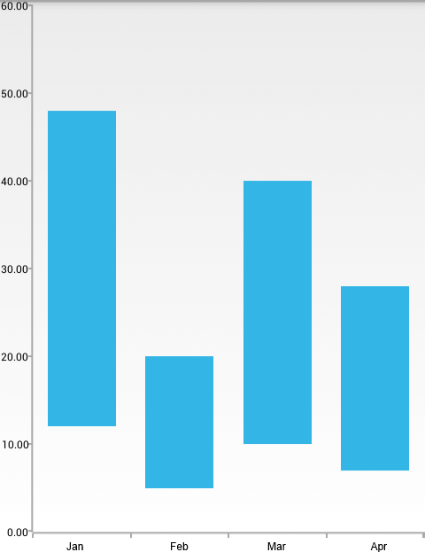
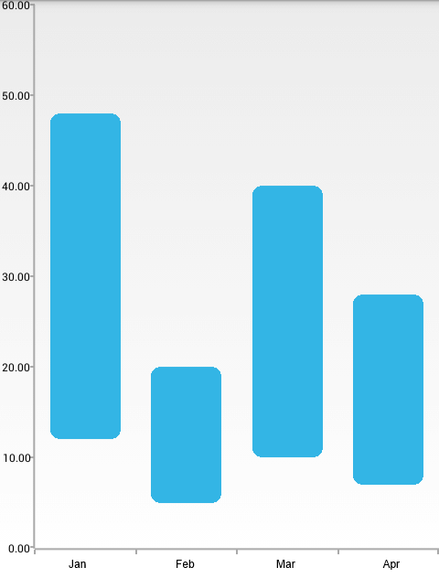

## ChartView for Xamarin.Android: RangeBarSeries

**RadCartesianChartView** visualizes each data point from the **RangeBarSeries** as a rectangle. These rectangles (or bars) can be displayed either horizontally, or vertically, depending on whether the **CategoricalAxis** is the vertical axis or the horizontal. When the horizontal axis is categorical, the rectangles are displayed vertically. This means that they have equal width while their height represents the difference between the numerical values of each of the data points. The low value is the rectangle's start point, while the high value is the end point. On the other hand, when the vertical axis is categorical, the rectangles have equal height, while their width represents the difference between the values of the data point. The **RangeBarSeries** extend **RangeSeriesBase** and are also require one **CategoricalAxis** and one **LinearAxis**.

## Example

You can read from the [Getting Started]( "Read how to define the MonthResult type") page how to define the `MonthResult` type and declare the **initData()** method.

After you create the method for initialization of sample data, you can create a **RadCartesianChartView** with **RangeBarSeries** by adding the following code to the **onCreate()** method of your Activity. For the purposes of the example, we are going to use the **Result** property of our data object for both low value and high value. In order to actually have different values so that bars that are visible, we will multiply the original value by a constant and the product will be our high value.

```C#
InitData();

RadCartesianChartView chartView = new RadCartesianChartView(this);

RangeBarSeries rangeBarSeries = new RangeBarSeries();
rangeBarSeries.CategoryBinding = new MonthResultDataBinding ("Month");
rangeBarSeries.LowBinding = new MonthResultDataBinding ("Result");
rangeBarSeries.HighBinding = new MonthResultHighBinding ("Result");
rangeBarSeries.Data = (Java.Lang.IIterable)this.monthResults;
chartView.Series.Add(rangeBarSeries);

CategoricalAxis horizontalAxis = new CategoricalAxis();
chartView.HorizontalAxis = horizontalAxis;

LinearAxis verticalAxis = new LinearAxis();
chartView.VerticalAxis = verticalAxis;

ViewGroup rootView = (ViewGroup)FindViewById(Resource.Id.container);
rootView.AddView(chartView);

...

// Usually RangeBarSeries will be used with data, where each data item contains 
// 2 values - one low and one high. However, since in this example we are using 
// data items which have only one value, in order to display range bars, we can
// create another binding which will retrieve a value which is higher than the 
// original.
class MonthResultHighBinding : MonthResultDataBinding {
	public MonthResultHighBinding(string propertyName) 
		:base(propertyName)	{
	}
	public override Java.Lang.Object GetValue (Java.Lang.Object p0)
	{
		return (double)base.GetValue (p0) * 4;
	}
}
```

> This example assumes that your root container has id `container`

Here's the result:



## Properties and customization

### Rounded edges

The bars that are used to represent the data points in **RangeBarSeries** can have their corners rounded. This can be achieved by using the **AreBarsRounded** property. When the value that is set is `true`, the corners are rounded. The rounding radius can be checked and modified by using the **RoundBarsRadius** property. If you try to set a negative value, an `IllegalArgumentException` will be thrown. 

Here's how the **RangeBarSeries** look when their round bar radius is set to `10`:

```C#
rangeBarSeries.AreBarsRounded = true;
rangeBarSeries.RoundBarsRadius = 10;
```

And here's the result:



## Customization

Similarly to **BarSeries**, **RangeBarSeries** provide the following way to change their style:

* **StrokeColor**: changes the color used to draw lines around the bars.
* **StrokeWidth**: changes the width of the lines around the bars.
* **FillColor**: changes the color used to fill the bar shapes.

You can also customize the appearance of **RangeBarSeries** by using [Palettes]( "Read how to use Palettes in RadChartView").
