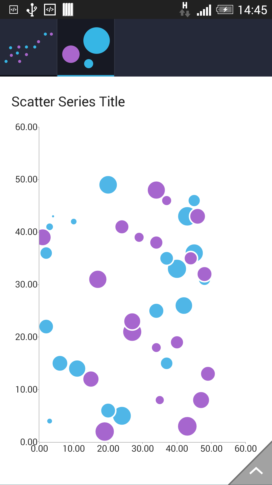

# RadChartView: ScatterBubbleSeries

**RadCartesianChartView** visualizes each data item from the **ScatterBubbleSeries** as individual bubbles on the plot area where each bubble has an individual size. The size is measured in pixels and represents the area of
the bubble. ScatterBubbleSeries like all other scatter series require two numerical axes to function propely. All scatter series are incompatible with all categorical axes.

The **ScatterBubbleSeries** are initialized much like **ScatterPointSeries** with only one addition: a bubble size binding that will tell the series how big each point should be. The number provided by the data source
should be the area of the bubble in pixels. More often than not the data will not have this exact property so developers will need to use a GenericDataPointBinding object in order to translate the incoming data to the bubble size.
To see the base ScatterPointSeries configuration see [here]( "Read how to configure ScatterPointSeries").

## Example


```C#
	public class ScatterBubblePoint : ScatterPoint
	{
		public ScatterBubblePoint(int x, int y, int area) : base(x, y)
		{	
			this.Area = area;
		}
		
		public int Area { get; set; }
	}
	
	public IIterable InitScatterBubbleData() {
		ArrayList data = new ArrayList();
		Random random = new Random();
		for(int i = 0; i < 20; ++i) {
			data.Add(new ScatterBubblePoint(random.Next(50), random.Next(50), random.Next(5000)));
		}
		
		return data;
		
	}
	
	public class BubbleDataPointBinding : DataPointBinding
	{
		public override Java.Lang.Object GetValue(Java.Lang.Object dataItem)
		{
			return ((ScatterBubblePoint)dataItem).Area;
		}
	}
```

Now with the bubble data intialization in place we can create our chart.


```C#
	RadCartesianChartView chartView = new RadCartesianChartView(this);

	ScatterBubbleSeries scatterSeries = new ScatterBubbleSeries();
	scatterSeries.XValueBinding = new MonthResultDataBinding("X");
	scatterSeries.YValueBinding = new MonthResultDataBinding("Y");
	
	// If the incoming data does not contain information about the bubble area, the lambda expression is a good place to calculate it.
	scatterSeries.BubbleSizeBinding = new BubbleDataPointBinding();
	scatterSeries.Data = InitScatterBubbleData();
	chartView.Series.Add(scatterSeries);

	LinearAxis horizontalAxis = new LinearAxis();
	chartView.HorizontalAxis = horizontalAxis;

	LinearAxis verticalAxis = new LinearAxis();
	chartView.VerticalAxis = verticalAxis;

	ViewGroup rootView = (ViewGroup)FindViewById(Resource.Id.container);
	rootView.AddView(chartView);
```

> This example assumes that your root container has id `container`

Here's the result:



## Customization

The **ScatterBubbleSeries** class exposes only one property and it is called BubbleScale. Developers can use the setBubbleScale() method to set a multiplier with which
the radius of the bubble will be multiplied immediately before rendering.

You can also customize the appearance of **ScatterBubbleSeries** by using [Palettes]( "Read how to use Palettes in RadChartView").