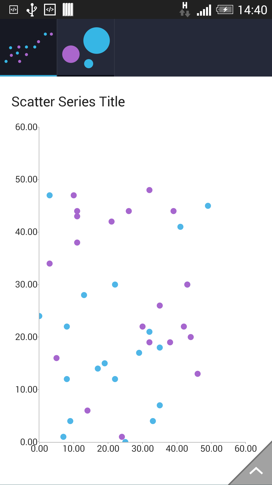

## ChartView for Xamarin.Android: ScatterPointSeries

**RadCartesianChartView** visualizes each data item from the **ScatterPointSeries** as individual points on the plot area. ScatterPointSeries like all other scatter series require two numerical axes to function properly. 

All scatter series are incompatible with all categorical axes.

## Example

To create a chart with scatter series you need to create a chart object, add horizontal and vertical axes and add a scatter series object populated with data. It must be noted that the chart must have a LinearAxis set for both the horizontal and vertical axes. 

Immediately below is the implementation of the **initScatterData()** method which is used to populate the scatter series with data along with the ScatterPoint class which serves as the actual chart data.

```C#
public class ScatterPoint : Java.Lang.Object 
{
       	public ScatterPoint(int x, int y)
	{
            this.X = x;
            this.Y = y;
       	}

            public int X { get; set; }

            public int Y { get; set; }
    }

    public Java.Lang.IIterable InitScatterData() 
{
    	Java.Util.ArrayList data = new Java.Util.ArrayList ();
        Random random = new Random();
        for(int i = 0; i < 20; ++i) 
	{
            data.Add(new ScatterPoint(random.Next(50), random.Next(50)));
        }

        return data;
    }
```

After you create the method for initialization of sample data, you can create a **RadCartesianChartView** with **ScatterPointSeries** by adding the following code to the **onCreate()** method of your Activity.

```C#
RadCartesianChartView chartView = new RadCartesianChartView(this);

ScatterPointSeries scatterSeries = new ScatterPointSeries();
scatterSeries.XValueBinding = new MonthResultDataBinding("X");
scatterSeries.YValueBinding = new MonthResultDataBinding("Y");
scatterSeries.Data = InitScatterData();
chartView.Series.Add(scatterSeries);

LinearAxis horizontalAxis = new LinearAxis();
chartView.HorizontalAxis = horizontalAxis;

LinearAxis verticalAxis = new LinearAxis();
chartView.VerticalAxis = verticalAxis;

ViewGroup rootView = (ViewGroup)FindViewById(Resource.Id.container);
rootView.AddView(chartView);
```

Here's the result:



## Customization

**ScatterPointSeries** provide the following API to change their style:

* **StrokePaint** (of type Paint): changes the color used to draw points' stroke.
* **FillPaint** (of type Paint): changes the fill of the scatter points.

You can also customize the appearance of **ScatterPointSeries** by using [Palettes]( "Read how to use Palettes in RadChartView").