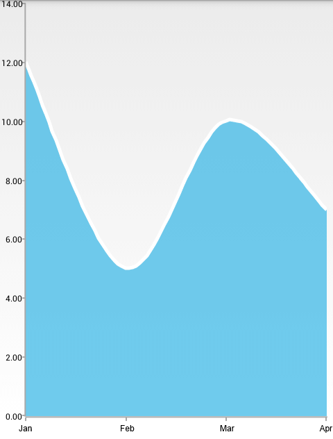

## ChartView for Xamarin.Android: SplineAreaSeries

**RadCartesianChartView** visualizes **SplineAreaSeries** as an area on the chart that is enclosed by the coordinate axes and curved line segments that connect the data points represented by these series. The **SplineAreaSeries** extend **AreaSeries**, so they are also **CategoricalSeries** and require one **CategoricalAxis** and one **LinearAxis**.

## Example

You can read from the [Getting Started]( "Read how to define the MonthResult type") page how to define the `MonthResult` type and declare the **initData()** method.

After you create the method for initialization of sample data, you can create a **RadCartesianChartView** with **SplineAreaSeries** by adding the following code to the **onCreate()** method of your Activity.

```C#
InitData();

RadCartesianChartView chartView = new RadCartesianChartView(this);

SplineAreaSeries splineAreaSeries = new SplineAreaSeries();
splineAreaSeries.CategoryBinding = new MonthResultDataBinding ("Month");
splineAreaSeries.ValueBinding = new MonthResultDataBinding ("Result");
splineAreaSeries.Data = (Java.Lang.IIterable)this.monthResults;
chartView.Series.Add(splineAreaSeries);

CategoricalAxis horizontalAxis = new CategoricalAxis();
chartView.HorizontalAxis = horizontalAxis;

LinearAxis verticalAxis = new LinearAxis();
chartView.VerticalAxis = verticalAxis;

ViewGroup rootView = (ViewGroup)FindViewById(Resource.Id.container);
rootView.AddView(chartView);
```

> This example assumes that your root container has id `container`

Here's the result:



## Customization

**SplineAreaSeries** extend **AreaSeries**, so they provide the same way to change their style &mdash; by using the following properties:

* **StrokeColor**: changes the color used to draw lines.
* **StrokeThickness**: changes the width of the lines.
* **FillColor**: changes the color used to fill the area shapes.

You can also customize the appearance of **AreaSeries** by using [Palettes]( "Read how to use Palettes in RadChartView").
