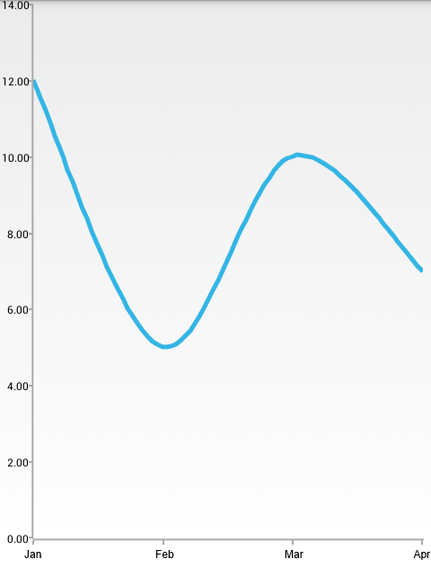

# RadChartView: SplineSeries

**RadCartesianChartView** visualizes each data item from the **SplineSeries** and connects them with curved line segments. The **SplineSeries** extend **LineSeries**, so they are also **CategoricalSeries** and require one **CategoricalAxis** and one **LinearAxis**.

## Example

You can read from the [Getting Started]( "Read how to define the MonthResult type") page how to define the `MonthResult` type and declare the **initData()** method.

After you create the method for initialization of sample data, you can create a **RadCartesianChartView** with **SplineSeries** by adding the following code to the **onCreate()** method of your Activity.

```Java
	initData();

	RadCartesianChartView chartView = new RadCartesianChartView(this);

	SplineSeries splineSeries = new SplineSeries();
	splineSeries.setCategoryBinding(new PropertyNameDataPointBinding("Month"));
	splineSeries.setValueBinding(new PropertyNameDataPointBinding("Result"));
	splineSeries.setData(this.monthResults);
	chartView.getSeries().add(splineSeries);

	CategoricalAxis horizontalAxis = new CategoricalAxis();
	chartView.setHorizontalAxis(horizontalAxis);

	LinearAxis verticalAxis = new LinearAxis();
	chartView.setVerticalAxis(verticalAxis);

	ViewGroup rootView = (ViewGroup)findViewById(R.id.container);
	rootView.addView(chartView);
```
```C#
	InitData();

	RadCartesianChartView chartView = new RadCartesianChartView(this);

	SplineSeries splineSeries = new SplineSeries();
	splineSeries.CategoryBinding = new MonthResultDataBinding ("Month");
	splineSeries.ValueBinding = new MonthResultDataBinding ("Result");
	splineSeries.Data = (Java.Lang.IIterable)this.monthResults;
	chartView.Series.Add(splineSeries);

	CategoricalAxis horizontalAxis = new CategoricalAxis();
	chartView.HorizontalAxis = horizontalAxis;

	LinearAxis verticalAxis = new LinearAxis();
	chartView.VerticalAxis = verticalAxis;

	ViewGroup rootView = (ViewGroup)FindViewById(Resource.Id.container);
	rootView.AddView(chartView);
```

> This example assumes that your root container has id `container`

Here's the result:



## Customization

**SplineSeries** extend **LineSeries**, so they provide the same way to change their style &mdash; by using the following methods:

* **setStrokeColor(int)**: changes the color used to draw lines. In order to get the current value, use **getStrokeColor()**.
* **setStrokeThickness(float)**: changes the width of the lines. In order to get the current value, use **getStrokeThickness()**.

You can also customize the appearance of **SplineSeries** by using [Palettes]( "Read how to use Palettes in RadChartView").
