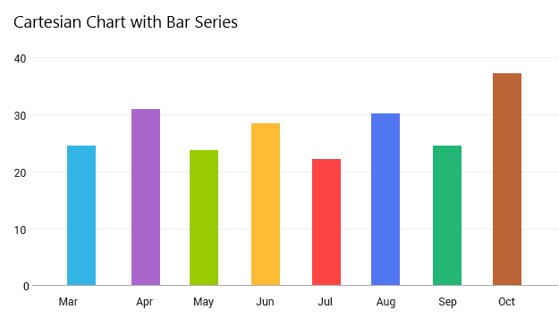

---
title: Cartesian
page_title: RadCartesianChartView  | Telerik UI for Xamarin.Android Documentation
description: An overview page of RadCartesianChartView for Android. This article explains the most important things you need to know before using RadCartesianChartView.
slug: chart-cartesian
tags: radchartview, radcartesianchartview, chart, cartesian
publish: true
---  

# RadCartesianChartView

**RadCartesianChartView** is one of the **RadChartView** types. This chart visualizes its data points using the Cartesian coordinate system. The X and Y axes define how the coordinates of each point in the plot area are calculated and the series type define the way these data points will be visualized.

 

## Supported Series

**RadCartesianChartView** can visualize the following types of series:

* [LineSeries]( "Read more about LineSeries"): Visualizes a collection of data points using a Line.
* [SplineSeries]( "Read more about SplineSeries"): Visualizes a collection of data points using a Curve.
* [AreaSeries]( "Read more about AreaSeries"): Represents a chart series that are visualized like an area figure in the Cartesian space.
* [SplineAreaSeries]( "Read more about SplineAreaSeries"): Represents series which define an area with smooth curves among points.
* [BarSeries]( "Read more about BarSeries"): Represents a chart series that plot their points using rectangular shapes, named "Bars". **RadCartesianChartView** can display **BarSeries** both horizontally and vertically. If the series are more than one, they can be stacked.
* [RangeBarSeries]( "Read more about RangeBarSeries"): Represents a chart range bar series. Both **BarSeries** and **RangeBarSeries** display its data points as bars. However the bars in **BarSeries** represent just a single value and the bars in **RangeBarSeries** represent low value and high value.

## Supported Axes

**RadCartesianChartView** needs to have two axes which will be used to calculate correctly the position of each data point. Usually one of the axes will be used to display the category of each data point and the other will represent its value. Here are the supported axes:

* **Category Axes**
	* [CategoricalAxis]( "Read more about CategoricalAxis"): Arranges the plotted data points in categories where the key of each category is the point's value (if available) for that axis or its index within the points collection. The point's coordinate, specified by this axis is discrete and is calculated depending on the size of the category slot where the point resides.
	* [DateTimeCategoricalAxis]( "Read more about DateTimeCategoricalAxis"): This is a special categorical axis that expects each data point to provide a `java.util.Calendar` structure as its value for this axis. The points are grouped by a user-defined date-time component (Year, Month, Day, etc.) and then the groups are sorted chronologically.
	* [DateTimeContinuousAxis]( "Read more about DateTimeContinuousAxis"): This is a special axis that expects each data point to provide a `java.util.Calendar` structure as its value for this axis. You can think of **DateTimeContinuousAxis** as a timeline where the coordinate of each data point is calculated depending on the position of its associated DateTime on the timeline. The base unit (or the timeline step) of the axis is calculated depending on the smallest difference between any two dates.
	
* **Value Axes**
	* [LinearAxis]( "Read more about LinearAxis"): Calculates the coordinate of each data point, depending on the actual numerical value this point provides for the axis. A **LinearAxis** exposes **Minimum** and **Maximum** properties to allow for explicit definition of the range of values visible on this axis. If these properties are not specified, the axis will automatically calculate the range, depending on the minimum and maximum data point values.
	* [LogarithmicAxis]( "Read more about LogarithmicAxis"): Special linear axis that will transform each data point value using the logarithm function. Using **LogarithmicAxis** allows your app to show numerical data with huge delta between the minimum and the maximum to be visualized in a readable way.

## Create RadCartesianChartView from scratch

In order to create a new instance of **RadCartesianChartView** you can follow the instructions from the [Getting Started]( "Read an example of basic chart initialization") page of **RadChartView**.