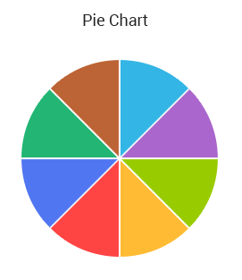

---
title: Pie
page_title: RadPieChartView  | Telerik UI for Xamarin.Android Documentation
description: An overview page of RadPieChartView for Android. This article explains the most important things you need to know before using RadPieChartView.
slug: chart-pie
tags: radchartview, radpiechartview, chart, pie
publish: true
---  

# RadPieChartView

**RadPieChartView** is one of the **RadChartView** types. This chart visualizes its data points using radial coordinate system. Each data point is represented as a slice from a pie. The ratio between the space consumed by each slice and the space consumed by the whole chart is the same as the ratio between the value of the data point that it represents and the total value of all data points in the series.

 

## Supported Series

**RadPieChartView** can visualize the following types of series:

* [PieSeries]( "Read more about PieSeries"): The **PieSeries** are used to visualize a single series of data in a pie chart. The sweep of a pie's slices is directly proportional to the magnitude of the data points' values. 
* [DoughnutSeries]( "Read more about DoughnutSeries"): The **DoughnutSeries** extend **PieSeries**. When the **RadPieChartView** visualizes the data from **DoughnutSeries**, it leaves a blank segment in the center. 

## Create RadPieChartView from scratch

Creating a new pie chart is very similar to creating a new Cartesian chart. Again we will need to initialize the data that we will use to visualize:

```Java
    private List<MonthResult> monthResults;

    private void initData() {
        monthResults = new ArrayList<MonthResult>();
        monthResults.add(new MonthResult("Jan", 12));
        monthResults.add(new MonthResult("Feb", 5));
        monthResults.add(new MonthResult("Mar", 10));
        monthResults.add(new MonthResult("Apr", 7));
    }

    public class MonthResult {
        private String month;
        private double result;

        public MonthResult(String month, double result) {
            this.setMonth(month);
            this.setResult(result);
        }

        public double getResult() {
            return this.result;
        }

        public void setResult(double value) {
            this.result = value;
        }

        public String getMonth() {
            return this.month;
        }

        public void setMonth(String value) {
            this.month = value;
        }
    }
```
```C#
	private Java.Util.ArrayList monthResults;
	
	private void InitData() {
		monthResults = new Java.Util.ArrayList();
		monthResults.Add(new MonthResult("Jan", 12));
		monthResults.Add(new MonthResult("Feb", 5));
		monthResults.Add(new MonthResult("Mar", 10));
		monthResults.Add(new MonthResult("Apr", 7));
	}
	
	public class MonthResult : Java.Lang.Object {

		public double Result { get; set; }
		public String Month { get; set; }

		public MonthResult(String month, double result) {
			this.Month = month;
			this.Result = result;
		}
	}
	
		class MonthResultDataBinding : DataPointBinding {

		private string propertyName;

		public MonthResultDataBinding(string propertyName)
		{
			this.propertyName = propertyName;
		}

		public override Java.Lang.Object GetValue (Java.Lang.Object p0)
		{
			if(propertyName == "Month")
			{
				return ((MonthResult)(p0)).Month;
			}
			return ((MonthResult)(p0)).Result;
		}
	}
```
	
And inside the activity that will visualize the chart, we need to find a container and create a new chart instance. **RadPieChartView** doesn't have any axes, so you need to simply add series:

```Java
	initData();
	
    RadPieChartView chartView = new RadPieChartView(this);

    PieSeries pieSeries = new PieSeries();
    pieSeries.setValueBinding(new DataPointBinding() {
        @Override
        public Object getValue(Object o) throws IllegalArgumentException {
            return ((MonthResult) o).getResult();
        }
    });
    pieSeries.setData(this.monthResults);

    chartView.getSeries().add(pieSeries);

    ViewGroup rootView = (ViewGroup)findViewById(R.id.container);
    rootView.addView(chartView);
```
```C#
	InitData();

	RadPieChartView chartView = new RadPieChartView(this);

	PieSeries pieSeries = new PieSeries();

	pieSeries.ValueBinding = new MonthResultDataBinding ("Result");
	pieSeries.Data = (Java.Lang.IIterable)this.monthResults;
	chartView.Series.Add(pieSeries);

	ViewGroup rootView = (ViewGroup)FindViewById(Resource.Id.container);
	rootView.AddView(chartView);
```