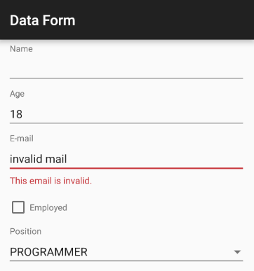
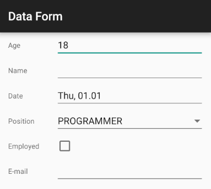
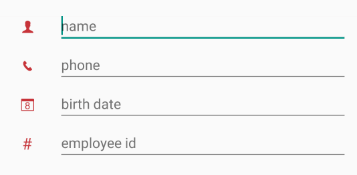

## DataForm for Xamarin.Android: Features

## Editors

Before the data form editors are explained it is important to define the concept of **properties**.
A property is a field of a class that has a public getter and, optionally, a setter method. For example if a Person class has a field that stores the age of the person, it should have
a public getter and setter with the following signature:

```C#
public int Age {
	get;
	set;
}
```

The field "age" in conjunction with the getter and setter define the "Age" property. Internally the data form does not care about what field the getter and setter are modifying, it just looks whether the methods exist.
It is important to note that the property name must begin with a capital letter, and the name should be preceded by "get" and "set" for the getter and setter respectively.
If the property only has a getter, the property will be read-only and a **property viewer** will be created instead of a **property editor**. If a field only has a setter it will be ignored by RadDataForm.

RadDataForm supports the basic data types for editing out of the box. Text, date and time, booleans, enums and numbers are all supported. Every editor is desiged to support one more
data types. For custom types more editors can be easily created by the developer. Also, the basic editors can be replaced by custom editors whenever necessary. 

RadDataForm has a priority list when it decides which editor to show for a given property or type. If the developer has defined [property metadata]( "Read more about the data form metadata.") for their object it will be used first. 

If the metadata does not define an editor, a special callback (editor provider) will be attempted next.
The callback is set by calling **dataForm.getAdapter().setEditorProvider()**. The callback is a function that accepts an EntityProperty and returns an EntityPropertyEditor. For example:

```C#
dataForm.Adapter.SetEditorProvider(new EditorProviderImpl(dataForm));

public class EditorProviderImpl : Java.Lang.Object, IFunction {
	RadDataForm dataForm;
	public EditorProviderImpl(RadDataForm dataForm) {
		this.dataForm = dataForm;
	}

	public Java.Lang.Object Apply(Java.Lang.Object argument) {
		XamarinEntityProperty property = (XamarinEntityProperty)argument;
		if(property.OriginalType == typeof(System.Boolean)) {
			return new DataFormSwitchEditor(dataForm, property);
		}

		return null;
	}
}
```

This callback replaces the default checkbox editor for booleans with the switch editor. For other types and properties it returns null. When the data form adapter gets null from this callback it proceeds
with the remaining options for editor resolution. 

The next option is the **editor registry**. The registry contains pre-defined editors for properties and types. First it looks if it has an editor for the specific
property provided. If it doesn't it finally tries to map the property type to a default editor. If an editor is not found at all, the property is not displayed for editing. Developers can modify the registry
as required. For example the default types can be mapped to custom editors and the editors for custom types can also be defined:


```C#
dataForm.Adapter.EditorRegistry.AddEditorForProperty(
	Java.Lang.Class.FromType(typeof(DataFormSwitchEditor)), "MyProperty");
```

Similarly to set a single editor for multiple types developers have to edit the registry like this:

```C#
dataForm.Adapter.EditorRegistry.AddEditorForTypes(Java.Lang.Class.FromType(
	typeof(MyCustomEditor)), new Java.Lang.Class[] {CustomType1.Type, CustomType2.Type});
```

When in **read-only** mode RadDataForm creates property viewers instead of property editors. Developers can use the exact same mechanism for viewer resolution: metadata, viewer provider callback and viewer registry modification. The editor registry of
the data form adapter has corresponding methods for registering viewers, just like the editors. For example:


```C#
dataForm.Adapter.EditorRegistry.AddViewerForTypes(Java.Lang.Class.FromType(
	typeof(MyCustomViewer)), new Java.Lang.Class[] {CustomType1.Type, CustomType2.Type});
```

For more information on how to create a custom editor or viewer see the [custom editors]( "Read more about how to create custom editors.") page.

## Validation

Every editor in RadDataForm can validate the entered data before it is committed to the object being edited. There are two ways to set a validator for a property. The first way is to specify it when defining the property
metadata. The second way is to get the editor for the required property during run-time and set a validator on the editor. For example:


```C#
MailValidator validator = new MailValidator();
dataForm.GetExistingEditorForProperty ("EMail").Property ().Validator = validator;
```

Any validator can be set this way provided it implements the **PropertyValidator** interface.
For example here is how MailValidator is implemented:

```C#
public class MailValidator : Com.Telerik.Widget.Dataform.Engine.PropertyValidatorBase {
	protected override bool ValidateCore(Java.Lang.Object input, String propertyName) {
		String mail = (String)input;
		return Android.Util.Patterns.EmailAddress.Matcher(mail).Matches();
	}
}
```

When an editor tries to commit its value, if the validation fails or succeeds, the validation view of the editor will be notified with the validation info produced in the process.
The validation view must be present inside the editor and will visually update itself to reflect the validation info that is passed to it. For example if the user enters a value for
the mail field that is not an e-mail, a validation error will be displayed like this:



## Property Value Converters

RadDataForm can associate property value converters with the properties of the edited object. For example the developer decides to use a text editor to display an integer, they will have to specify a way to convert
that integer to and from a string. For example:


```C#
dataForm.GetExistingEditorForProperty("Age").Property().Converter = 
	new IntegerToStringConverter();

public class IntegerToStringConverter : Java.Lang.Object, 
	Com.Telerik.Widget.Dataform.Engine.IPropertyConverter {
	
	public Java.Lang.Object ConvertTo(Java.Lang.Object source) {
		return source.ToString();
	}

	public Java.Lang.Object ConvertFrom(Java.Lang.Object source) {
		return Java.Lang.Integer.ParseInt(source.ToString());
	}
}
```

## Editor Relations

Some data entry forms contain editors that depend on each other. For example if there is an editor that displays a spinner with pre-defined items, the items might need to change if the value of another editor changes.
A practical case is when the user selects the country in which they live, then another editor can be enabled so that they can choose a city from the selected country and so on. 
An editor relation is just a callback method that is called when an editor value changes:


```C#
dataForm.AddEditorDependency("City", new Procedure2Impl());

public class Procedure2Impl : Java.Lang.Object, IProcedure2 {
	public void Apply(Java.Lang.Object form, Java.Lang.Object editor) {
		RadDataForm dataForm = (RadDataForm)form;
		EntityPropertyEditor cityEditor = (EntityPropertyEditor)editor;

		Spinner citiesSpinner = (Spinner)cityEditor.EditorView;
		String selectedCountry = 
			(String)(dataForm.GetExistingEditorForProperty("Country").
				JavaCast<EntityPropertyEditor>()).Value();
		citiesSpinner.Adapter = CreateAdapterForCountry(selectedCountry);
	}
}
```

In this example the editor for the City property depends on the value of the editor for the Country property. When the country changes, the callback gets invoked and the city spinner is populated with the cities from the
selected country.

## Property Metadata

When defining custom classes for RadDataForm to edit, developers have the option to annotate the properties of their classes with the [@DataFormProperty]( "Read more about the data form metadata.") annotation. It contains several attributes than can be used to customize
the functionality of the editor corresponding to the property.

## Commit Modes

RadDataForm supports three commit modes. These are **IMMEDIATE**, **ON_LOST_FOCUS** and **MANUAL**. Immediate mode validates and commits the property value of an editor immediately after the editor value changes. ON_LOST_FOCUS works only for
editors that can be focused, like a text field for example. Editors that can't be focused can work only in immediate or manual mode. Finally manual mode allows the developer to dictate when to validate and commit
all or some the edited properties by calling the dataForm.commitChanges() method. To commit a single property the EntityProperty object for the property must be obtained and then its commit() method must be called:


```C#
dataForm.GetExistingEditorForProperty("Age").Property().Commit();
```

>It is important to note that committing in this way will **not** validate the currently set value. 
To validate manually first call **setValueCandidate(someValue)** to the EntityProperty object and then call commit if no validation errors occur.
To listen for validation errors call **addValidationCompletedListener()** on the EntityProperty object.

## Customizing the editors layout

Supporting multiple screen sizes on android is a necessity so RadDataForm allows developers to specify a [layout manager]( "Read more the data form layout.") that will be used to arrange the editors. 
The default layout manager arranges the editors in a table layout.

## Read-Only mode

RadDataForm can simply display information about an object in read-only mode. To make RadDataForm read-only, simply call the **dataForm.setIsReadOnly(true)** method.
When in read-only mode, RadDataForm will disregard the property setters and will create non-interactive viewers for each property.

## Creating custom editors and viewers

RadDataForm can be extended by [creating custom editors]( "Read more how to create a custom editor.") or by modifying the existing ones.

## Label Position

RadDataForm has two options for layout of the labels and the editors. The default label position is on top of the editor, but with the **setLabelPosition** method you can change that so that the labels and the editors are on the same row. Here’s how:


```C#
dataForm.LabelPosition = LabelPosition.Left;
```

And here’s the result:



## Image Labels

RadDataForm allows you to use images as labels of your editor. You can supply the image resource through the [@DataFormProperty]( "Read more about the data form metadata.") annotation. Here's an example:


```C#
[DataFormProperty(Label = "", Hint = "name", Index = 0,
                  ImageResource = Resource.Drawable.ic_dataform_guest)]
public string Name
{
    get;
    set;
}
```

Here's the result:

