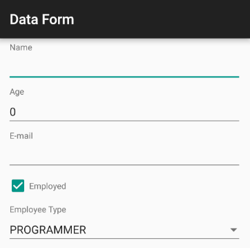

# RadDataForm: Getting Started

To use **RadDataForm** a reference to the **Input** and **Common** libraries must first be added. Then it's just a matter of creating a new RadDataForm instance, adding it to the Android UI tree and providing an object to edit. For example:

```Java
RadDataForm form = new RadDataForm(context);
form.setEntity(new Person());

layout.addView(form);
```

```C#
RadDataForm form = new RadDataForm(context);
form.SetEntity(new Person());

layout.AddView(form);
```

Here's the person class:
```Java
public class Person {
    private Integer age = 0;
    private boolean isEmployed = true;
    private EmployeeType employeeType;
    private String name;
    private String mail;
	
    @DataFormProperty(label = "Age", index = 1)
    public Integer getAge() {
        return age;
    }
    public void setAge(Integer value) {
        age = value;
    }
    @DataFormProperty(label = "Employee Type", index = 4)
    public EmployeeType getEmployeeType() {
        return employeeType;
    }
    public void setEmployeeType(EmployeeType value) {
        employeeType = value;
    }
    @DataFormProperty(label = "Name", index = 0)
    public String getName() {
        return name;
    }
    public void setName(String value) {
        name = value;
    }
    @DataFormProperty(label = "E-mail", index = 2)
    public String getMail() {
        return mail;
    }
    public void setMail(String value) {
        this.mail = value;
    }
    @DataFormProperty(label = "Employed", index = 3)
    public boolean getIsEmployed() {
        return isEmployed;
    }
    public void setIsEmployed(boolean value) {
        isEmployed = value;
    }
}
public enum EmployeeType {
    PROGRAMMER,
    MANAGER,
    TEAM_LEAD,
    MARKETING,
    SALES
}
```
```C#
public class Person : Java.Lang.Object
{
	[DataFormProperty(Label = "Age", Index = 1)]
	public int Age 
	{
		get;
		set;
	}

	[DataFormProperty(Label = "Employee Type", Index = 4)]
	public EmployeeType EmployeeType 
	{
		get;
		set;
	}

	[DataFormProperty(Label = "Name", Index = 0)]
	public string Name 
	{
		get;
		set;
	}

	[DataFormProperty(Label = "E-mail", Index = 2)]
	public string Mail 
	{
		get;
		set;
	}

	[DataFormProperty(Label = "Employed", Index = 3)]
	public bool IsEmployed 
	{
		get;
		set;
	}
}
public enum EmployeeType
{
	PROGRAMMER,
	MANAGER,
	SUPPORT,
	MARKETING
}
```

Now the data form should be ready to edit the fields of the person object:


To learn more about the @DataFormProperty annotation see the page about [property metadata]( "Read more about the data form metadata.").

## Editing JSON Objects

You can also use **RadDataForm** to edit Json Objects. For example, if you have a json file person with the following content:

	{
		"name": "John Doe",
		"age": 21,
		"email": "john.doe@example.com"
	}
	
You can edit it through RadDataForm, the following way:

```Java
// The file person.json is in the res/raw folder of the project
String json = loadJSONFromAsset(R.raw.person);

try {
	JSONObject jsonObject = new JSONObject(json);
	dataForm.setEntity(jsonObject);
} catch (JSONException e) {
	Log.e("json", "error parsing json", e);
}
```
```C#
// The file Person.json is in the Assets folder of the project
String json = LoadJSONFromAsset ("Person.json");
try {
	JSONObject jsonObject = new JSONObject (json);
	dataForm.SetEntity(jsonObject);
} catch(JSONException e) {
	Log.Error ("json", "error parsing json", e);
}
```

The loadJSONFromAsset simply returns the content of file with given name. Here's one sample implementation:

```Java
private String loadJSONFromAsset(int asset) {
	String json;
	try {
		InputStream is = getResources().openRawResource(asset);
		Writer writer = new StringWriter();
		char[] buffer = new char[1024];
		try {
			Reader reader = new BufferedReader(new InputStreamReader(is, "UTF-8"));
			int n;
			while ((n = reader.read(buffer)) != -1) {
				writer.write(buffer, 0, n);
			}
		} finally {
			is.close();
		}

		json = writer.toString();
	} catch (IOException ex) {
		ex.printStackTrace();
		return null;
	}
	return json;
}
```
```C#
private String LoadJSONFromAsset(String fileName)
{
	String json = null;
	try
	{
		using (StreamReader sr = new StreamReader (Activity.Assets.Open (fileName)))
		{
			json = sr.ReadToEnd ();
		}
	}
	catch (IOException ex)
	{
		Log.Error("error", ex.StackTrace);
	}
	return json;
}
```