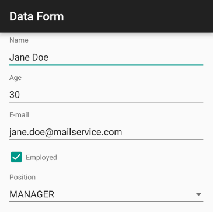

# DataForm for Xamarin.Android: Overview

**RadDataForm** for Xamarin.Android is an editing component that allows editing of any object at run-time. The component automatically generates editors for the different public properties exposed by the object being edited.

