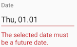
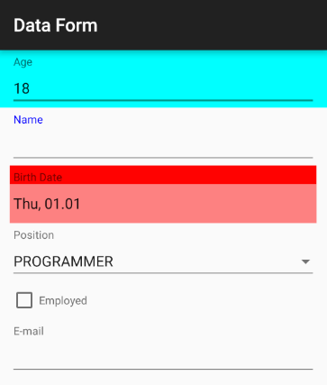

# Customizing RadDataForm's Editors

Each editor in RadDataForm consists of the following elements:

* Header
* Core editor
* Validation message
* Validation icon

Each of these elements can be customized individually for each editor. They (except core editor) can also be specified once to be used for every editor in the data form.

## Custom layouts

Specifying individual parts for a specific editor is done via the [@DataFormProperty]( "Read more about @DataFormProperty") annotation. For example:
```Java
@DataFormProperty(
		editorLayout = R.layout.editor_main_layout,
		coreEditorLayout = R.layout.core_editor,
		headerLayout = R.layout.editor_header_layout,
		validationLayout = R.layout.editor_validation_layout)
public String getName() {
	return name;
}
```
```C#
[DataFormProperty(
	EditorLayout = Resource.Layout.editor_main_layout,
	CoreEditorLayout = Resource.Layout.core_editor,
	HeaderLayout = Resource.Layout.editor_header_layout,
	ValidationLayout = Resource.Layout.editor_validation_layout)]
public string Name {
	get {
		return name;
	}
	set {
		name = value;
	}
}
```

Notice one additional attribute of the annotation, the **editorLayout**. This is the main layout of the editor which contains each of the sub-elements described above. This can be used
if the app design requires the header to be on the right of the editor or if the validation message should be on top of the core editor for example. The main layout's purpose is
allow custom positioning of the sub elements of each editor.

Finally along with the fine grained options above, one main layout can be specified and reused for every editor. For example:
```Java
// Set the same main layout for every editor.
dataForm.setEditorsMainLayout(R.layout.editors_main_layout); 

// Set the same header layout for every editor.
dataForm.setEditorsHeaderLayout(R.layout.editors_header_layout); 

// Set the same validation layout for every editor.
dataForm.setEditorsValidationLayout(R.layout.editors_validation_layout); 
```
```C#
// Set the same main layout for every editor.
dataForm.EditorsMainLayout = Resource.Layout.editors_main_layout;

// Set the same header layout for every editor.
dataForm.EditorsHeaderLayout = Resource.Layout.editors_header_layout;

// Set the same validation layout for every editor.
dataForm.EditorsValidationLayout = Resource.Layout.editors_validation_layout;
```

To illustrate the main layout and its sub elements consider this image:



Here "Date" is the header. The red highlighted text field is the core editor which is a date picker in this case and finally the red message below is the validation message.
When there is a validation icon specified it will be displayed to the right of the core editor.

## Editor customizations

Another way to customize the editors is with DataForm's **setEditorCustomization** method. It allows you to define a procedure that will be applied for each editor and you will get a chance to alter the appearance for the editors that meet a certain requirement. Here's an example:

```Java
dataForm.setEditorCustomizations(new Procedure<EntityPropertyViewer>() {
    @Override
    public void apply(EntityPropertyViewer entityPropertyViewer) {
        switch (entityPropertyViewer.property().name()) {
            case "Name":
                TextView headerView = (TextView)entityPropertyViewer.getHeaderView();
                headerView.setTextColor(Color.BLUE);
                EditText editorView = (EditText)entityPropertyViewer.getEditorView();
                editorView.setTextColor(Color.BLUE);
                break;
            case "Age":
                entityPropertyViewer.rootLayout().setBackgroundColor(Color.CYAN);
                break;
            case "BirthDate":
                entityPropertyViewer.getHeaderView().
                        setBackgroundColor(Color.RED);
                entityPropertyViewer.getEditorView().
                        setBackgroundColor(Color.parseColor("#AAFF4444"));
                break;
        }
    }
});
```
```C#
        dataForm.EditorCustomizations = new EditorCustomizationsExample ();
        // ...
class EditorCustomizationsExample : Java.Lang.Object, IProcedure {
    public void Apply (Java.Lang.Object p0)
    {
        EntityPropertyViewer entityPropertyViewer = (EntityPropertyViewer)p0;
        switch (entityPropertyViewer.Property().Name()) {
            case "Name":
                TextView headerView = (TextView)entityPropertyViewer.HeaderView;
                headerView.SetTextColor (Color.Blue);
                EditText editorView = (EditText)entityPropertyViewer.EditorView;
                editorView.SetTextColor (Color.Blue);
                break;
            case "Age":
                entityPropertyViewer.RootLayout().SetBackgroundColor(Color.Cyan);
                break;
            case "BirthDate":
                entityPropertyViewer.HeaderView.
                    SetBackgroundColor(Color.Red);
                entityPropertyViewer.EditorView.
                    SetBackgroundColor(Color.ParseColor("#AAFF4444"));
                break;
        }
    }
}
```
<snippet id='data-form-customizations-editor-styles-class'/>

And here's the result:


